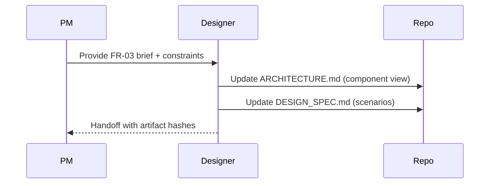

# Designer Flow Mockup

```mermaid
sequenceDiagram
  participant PM
  participant Designer
  participant Repo

  PM->>Designer: Provide FR-03 brief + constraints
  Designer->>Repo: Update ARCHITECTURE.md (component view)
  Designer->>Repo: Update DESIGN_SPEC.md (scenarios)
  Designer-->>PM: Handoff with artifact hashes
```

> High-level sequence the Designer follows when responding to PM directives.
