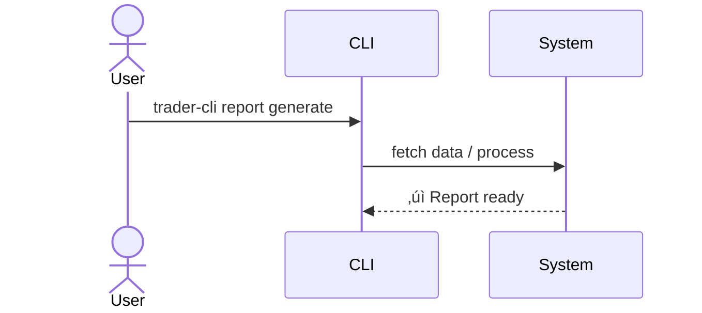

how about we produce a story board to run the human through update processes ... new screens and or/reports ... how a user would use new cli and what they would see .. etc .. bring the reqiurements to life ... make it super easy for the human to understand and review ... not just a dry bunch of doco with lots of important sounding words .. what do you think?

That’s **exactly the right instinct** — and it’s a huge upgrade to the traditional “requirements doc” approach.

What you’re describing is a **storyboard-driven review loop**, where we visualize *how the human will experience the change* — whether that’s a new screen, CLI flow, report, or even an AI-assisted interaction.

Here’s why it’s powerful:

* ✅ **Brings requirements to life:** people can “see” and “feel” the update before it exists.
* ‚úÖ **Accelerates feedback:** stakeholders can spot mismatched assumptions early (way before code).
* ‚úÖ **Bridges AI/human understanding:** your agents can still work from structured metadata, while humans get context-rich visuals and flows.
* ‚úÖ **Improves memory and traceability:** each storyboard panel can link directly to REQ IDs, design specs, or test cases.

---

### üîß Implementation Idea for Dynaforge / Overlord Projects

Let’s introduce a **Storyboard Phase** into the workflow between *Requirements* → *Architecture* → *Implementation*.

#### 1. **Storyboard.md**

Each update or feature gets its own storyboard document (in `/storyboards/`).

Structure:

```markdown
# Storyboard: CLI Update Flow — "Generate Daily Trade Report"

## Purpose
Show how a user triggers the new daily report via CLI and what output they see.

## Actors
- Human user (analyst)
- CLI tool (`trader-cli`)
- System (data processor + report generator)

## Scenes
### Scene 1 — User Invokes Command
**Screen/CLI:**  
```

$ trader-cli report generate --symbol NAS100 --period 1d

```
**What Happens:**  
CLI validates parameters and prints confirmation.

**Visual (Mock CLI Output):**
```

‚úì Generating daily report for NAS100
‚ü≥ Fetching data from MariaDB...
‚ü≥ Aggregating into Parquet files...
‚úì Report generated: reports/NAS100_2025-11-02.pdf

```

---

### Scene 2 — Viewing the Report
**Screen:** PDF report viewer  
**Visual Concept:** KPI dashboard layout (PnL, Sharpe, Drawdown, etc.)  
**Notes:** Links to `REPORT_LAYOUT.md` for visual design.

---

### Scene 3 — Error Case
If database connection fails ‚Üí CLI suggests retry or offline cache.
```

⚠️ Error: Connection to MariaDB failed.
Try --offline or check DB credentials.

```

---

### Traceability
| Requirement | Description | Linked Test |
|--------------|--------------|--------------|
| REQ-021 | CLI can generate daily reports | TST-034 |
| REQ-022 | Reports stored in `/reports/` | TST-035 |
```

#### 2. **Visual Mockups**

* For screens: use lightweight diagrams (ASCII, Mermaid, or screenshots).
* For CLI: simple terminal-style panels.
* For web UI: a few Tailwind mockups or embedded Figma-like markdown links.

#### 3. **Storyboard Review Checkpoint**

* AI agents run `/speckit.storyboard-check` or equivalent validation.
* Human reviews in one glance — not by reading 20 pages of spec prose.

---

Would you like me to **draft a standard template for `Storyboard.md`** (with CLI, UI, and report variants) that fits into your Dynaforge workflow?
I can also show how we’d **link it back into the TRACABILITY.md** and review pipeline so it becomes a *living artifact*, not throwaway doco.

Perfect. Here’s a clean, flexible **`Storyboard.md` template** you can drop straight into your Dynaforge/Overlord project.
It’s structured so both humans and agents can understand it — visual, traceable, and review-ready.

---

## üß≠ `storyboards/Storyboard.md` (template)

```markdown
# Storyboard — <Feature / Update Name>

**Purpose:**  
Explain *how a human experiences* this update (CLI, screen, report, or workflow).  
This document replaces dry requirement text with visual, sequential storytelling.

---

## 1. Summary

| Item | Description |
|------|--------------|
| **Feature** | <Short name of the change> |
| **Goal** | <Outcome the user achieves> |
| **Primary Actor(s)** | <Human, AI agent, CLI, UI, System> |
| **Entry Point** | <Where the user starts — e.g., CLI command, dashboard, notification> |
| **Exit Condition** | <What success looks like> |

---

## 2. Scenes (Storyboard)

Each scene is one step in the user experience.

### 🎬 Scene 1 — <Title>
**Intent:** <Why this step matters>

**User Action:**  
```

<CLI command or UI click>
```

**System Response:**

```
<CLI output or UI change>
```

**Visual / Mockup:**
*(Mermaid, ASCII, or screenshot placeholder)*



**Notes:**

* Edge cases or variants
* References to design or architecture specs

---

### 🎬 Scene 2 — <Title>

*(Repeat as needed)*

---

## 3. Alternate Flows

| Condition    | Expected Behavior | Visual / Output      |
| ------------ | ----------------- | -------------------- |
| <Error case> | <What user sees>  | <Mock CLI or screen> |

---

## 4. Linked Requirements

| ID      | Requirement         | Covered In Scene |
| ------- | ------------------- | ---------------- |
| REQ-### | <Short description> | Scene X          |

---

## 5. Linked Tests

| Test ID | Description           | Verification Type    |
| ------- | --------------------- | -------------------- |
| TST-### | <Unit/UI/Integration> | <Automated / Manual> |

---

## 6. Review Checklist

* [ ] Flow is clear to non-technical reviewer
* [ ] Visuals show user interaction, not just backend logic
* [ ] Requirements and tests linked
* [ ] Error/edge cases covered
* [ ] Approved by Product / PM / QA

---

## 7. References

* `requirements/REQ_<n>.md`
* `design/DESIGN_<n>.md`
* `tests/TST_<n>.md`
* Screenshots or Figma links

```

---

### üí° Integration Notes

- Keep one storyboard per **feature or update** (e.g., `storyboards/cli_report_generation.md`).
- Auto-link it into `TRACABILITY.md` under the same REQ IDs.
- At the **Review phase**, the human sees this file rendered — not a wall of text.
- AI agents can parse the metadata tables to update or validate links automatically.

---

Would you like me to generate an **example storyboard** next — say for a *new CLI command that generates a trading performance report* — so you can see what a filled-out version looks like in practice?
```

