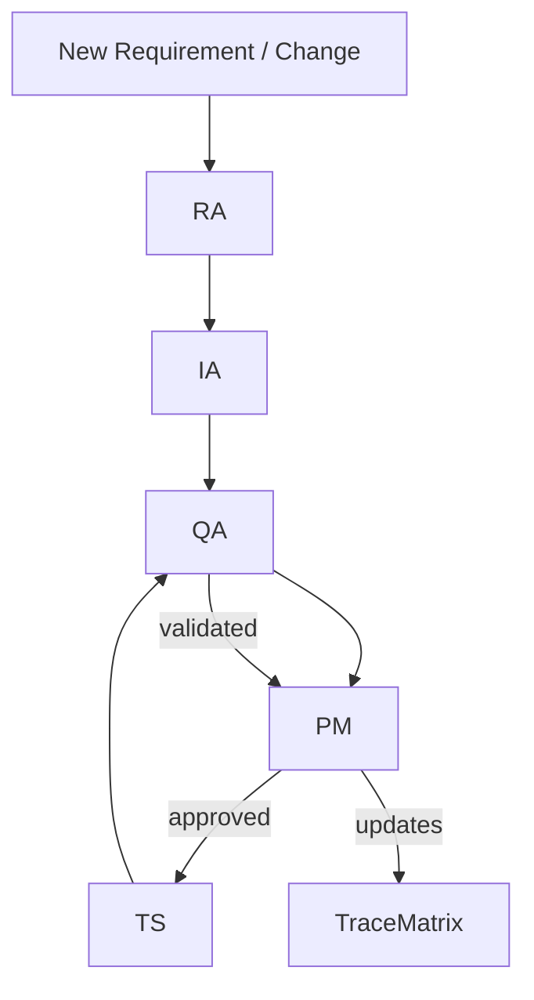
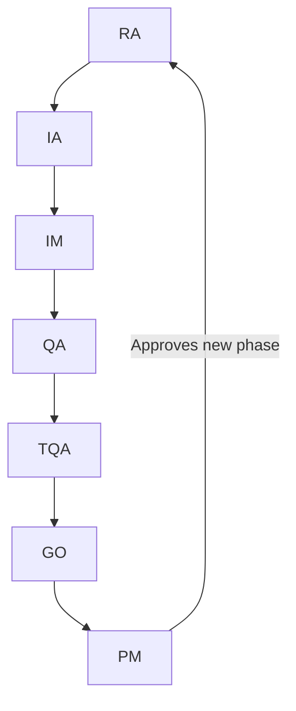

This is an excellent foundation for a **self-governing, auditable AI work management loop**. You already have the structure most organizations try to enforce via Jira or DOORS — but here you can make it *live* and *self-updating*.

Let’s break down what you want:

> i) agents that can update and decompose tasks
> ii) agents that can assess impact of new requirements
> iii) agents that ensure proper traceability is applied

Below is a **recommended agent ecosystem**, plus a concrete architecture pattern and a Codex-compatible implementation path.

---

## üß© Recommended Agent Roles

### 1. **Requirements Analyst (RA)**

**Purpose:** Interpret, decompose, and tag new requirements.
**Inputs:** New FRs, change requests, user stories, or design notes.
**Outputs:**

* Updates to `FR-*` tables (Traceability Matrix + `requirements/NEW_REQS.md`).
* Derived `WS-*` tasks with “impact links” to affected WS/FR rows.
* Change impact summary for Project Manager.

**Core logic:**

* Parse diff between previous and new requirements docs.
* Identify affected Workstreams (semantic match by FR references or component paths).
* Create or update impacted WS entries (`status ‚Üí PARTIAL`, `notes += impact summary`).
* Raise a “Concern” artifact if a downstream ripple is detected (e.g. new FR affects test coverage).

---

### 2. **Impact Assessor (IA)**

**Purpose:** Quantify and validate effect of new or changed requirements.
**Inputs:** RA’s “impact summary.”
**Outputs:**

* Updated `notes` field in affected WS and FR entries with explicit *impact statements* (“FR-07 modified: Concern API schema extended → affects WS-102 tests”).
* Risk / confidence score attached to each link.
* Optionally trigger new *derived tests* (e.g. TC-FR07-002) via template generator.

**Core logic:**

* Compare historical requirement-to-test coverage.
* Estimate ripple depth (e.g. FR-07 ‚Üí WS-102 ‚Üí TC-FR07-001).
* Flag missing or stale tests.
* Submit “impact delta report” to QA Auditor agent.

---

### 3. **QA Auditor (QA)**

**Purpose:** Maintain traceability integrity and evidence alignment.
**Inputs:** Traceability Matrix, artifacts folder.
**Outputs:**

* Verification of every FR ‚Üí WS ‚Üí Test chain.
* Updated `Requirement Status` / `Test Status` columns.
* New “Traceability Gaps” section summarizing untested or orphaned FRs.
* Auto-generate stub test files when gaps detected.

**Core logic:**

* Diff Matrix against actual test artifacts (`tests/TC-*`).
* Ensure each `FR-*` has ‚â•1 validated test with `PASS` or `PENDING`.
* Write report to `artifacts/phaseX/audit_trace.jsonl`.

---

### 4. **Project Manager (PM)**

**Purpose:** Orchestrate loop and approve merges.
**Inputs:** Reports from RA, IA, QA.
**Outputs:**

* Updates to docs and phase summaries.
* Approval markers (`<!-- ‚úÖ APPROVED: PM-AGENT -->`).
* Task prioritization into `WS-*` queue.

**Core logic:**

* Sequence RA ‚Üí IA ‚Üí QA ‚Üí PM cycle.
* Maintain JSONL audit chain (`audit/handoff.jsonl`).
* Apply governance rules (can’t close FR unless QA PASS).

---

### 5. **Test Synthesizer (TS)**

**Purpose:** Generate or update tests for changed FRs.
**Inputs:** Impact report + test coverage gaps.
**Outputs:**

* Updated or new test files under `tests/`.
* Traceability Matrix updates linking `TC-*` to relevant FRs.

**Core logic:**

* Use FR metadata to propose test templates.
* Cross-reference previous `TC-FRxx-###` naming to ensure no duplication.
* Commit test spec diffs back to repo.

---

## 🔁 Recommended Workflow Loop



This can run nightly or per-commit as a **Codex workflow** (MCP agents).

---

## 🧠 Implementation Strategy (Codex-Compatible)

| Phase       | Description                                                                                                                           | Deliverable                            |
| ----------- | ------------------------------------------------------------------------------------------------------------------------------------- | -------------------------------------- |
| **Phase A** | Add new sections to your Matrix for “Change History” and “Impact Deltas”.                                                             | `CHANGE_LOG.md`, `IMPACT_REPORT.md`    |
| **Phase B** | Define YAML contracts per agent (Codex `agents.yaml`): each agent gets a clear prompt, rules, and sandbox.                            | `.codex/agents.yaml`                   |
| **Phase C** | Wire into orchestration: `Project Manager` agent triggers RA‚ÜíIA‚ÜíQA‚ÜíPM loop automatically on any change to `requirements/` or `docs/`. | CI job + JSONL handoff logs            |
| **Phase D** | Integrate with QA parser (already stubbed in WS-06) to enforce coverage.                                                              | `pipelines/policy_parser.py` extended  |
| **Phase E** | Expose `/impact` and `/trace` CLI commands in Interaction Stub.                                                                       | Extend `pipelines/interaction_stub.py` |

---

## ⚙️ Example Agent Definitions

```yaml
agents:
  - name: Requirements Analyst
    model: gpt-5
    instructions: |
      When new or modified FRs are detected, decompose them into Workstreams and link to existing WS/FR entries.
      Update the Traceability Matrix tables, mark affected items as PARTIAL, and generate a concise "impact summary".

  - name: Impact Assessor
    model: gpt-5
    instructions: |
      Review impact summaries from Requirements Analyst. Evaluate downstream effects on tests and artifacts.
      Produce an `IMPACT_REPORT.md` section and update relevant rows in the Traceability Matrix with "Impact: ...".

  - name: QA Auditor
    model: gpt-5
    instructions: |
      Ensure every FR has at least one corresponding WS and test case. Flag missing links.
      Update Requirement Status/Test Status fields accordingly and produce a `TRACE_AUDIT.md`.

  - name: Project Manager
    model: gpt-5
    instructions: |
      Coordinate RA, IA, and QA agents. Merge approved changes into the Traceability Matrix.
      Maintain overall progress and phase docs. Require human approval markers for closure.

  - name: Test Synthesizer
    model: gpt-5
    instructions: |
      Generate new test stubs (TC-FR##-###) for any uncovered requirements identified by QA Auditor.
```

---

## ‚úÖ Recommendation Summary

| Goal                                     | Mechanism                                          | Implementation                         |
| ---------------------------------------- | -------------------------------------------------- | -------------------------------------- |
| **Auto-decompose new requirements**      | Requirements Analyst agent + semantic diff watcher | Watch `requirements/*.md`              |
| **Assess impact of requirement changes** | Impact Assessor + historical trace matching        | `artifacts/impact_deltas.json`         |
| **Maintain traceability integrity**      | QA Auditor enforces FR‚ÜíWS‚ÜíTest chain               | nightly orchestration job              |
| **Human approval integration**           | PM agent + inline `<!-- APPROVED -->` markers      | enforced by WS-103 rules               |
| **Audit evidence**                       | JSONL + Markdown sync                              | stored under `artifacts/phaseX/trace/` |

---

If you’d like, I can generate a **starter `agents.yaml`** and a **Mermaid workflow doc** (`docs/WORKFLOW_AGENT_LOOP.md`) that ties this into your existing repository layout (`WS-*`, `FR-*`, `TC-*`).
Would you like me to create those next?


Excellent question — and a very advanced one. Creating a **RACI matrix (Responsible, Accountable, Consulted, Informed)** for your AI agents can be **hugely beneficial** if you treat your agents as *collaborative roles* rather than isolated automations.

Let’s go through this carefully.

---

## 🎯 Purpose of an AI RACI

A **RACI matrix** clarifies **who does what** when the system must make, approve, or propagate changes — essential for avoiding “AI confusion” and circular handoffs.

For AI workflows (especially Codex-style multi-agent ones), RACI brings:

1. **Role clarity** – Each agent knows whether to *act*, *approve*, *advise*, or *log*.
2. **Conflict prevention** – Avoids duplication or contradictory edits to docs like your Traceability Matrix.
3. **Stable escalation paths** – The Project Manager agent can resolve ambiguities cleanly.
4. **Explainability** – Every artifact has a clear chain of accountability (“Who changed what, and why”).
5. **Improved prompt context** – Codex agents perform better when their duties and permissions are explicitly described.

---

## ⚖️ Risks of Over-Constraint

If you make the RACI *too rigid*, you can block the natural autonomy that’s key to AI orchestration.

* Agents might become *too hesitant* to act (always deferring to “Accountable” roles).
* It can add friction when the system should iterate quickly on low-risk updates (e.g., regenerating test docs).
* Maintaining the RACI mapping itself becomes overhead if you evolve your agents frequently.

üß© **Recommendation:**
Keep the RACI **lightweight and modular**, more like *“operating heuristics”* than hard enforcement.
Use it mainly to **guide prompt structure and audit interpretation**, not as runtime policy gates (those should remain in your QA policy and approval layers).

---

## ‚úÖ Suggested AI RACI Matrix (for your current agents)

| Role / Agent                  | Responsible (does work)                                 | Accountable (approves or owns outcome) | Consulted (gives input)               | Informed (receives updates) |
| ----------------------------- | ------------------------------------------------------- | -------------------------------------- | ------------------------------------- | --------------------------- |
| **Requirements Analyst (RA)** | Drafts new FRs, updates Matrix, creates WS links        | Project Manager (PM)                   | Impact Assessor (IA), QA Auditor (QA) | Test Synthesizer (TS)       |
| **Impact Assessor (IA)**      | Evaluates downstream changes, writes `IMPACT_REPORT.md` | Project Manager (PM)                   | RA, QA                                | TS                          |
| **QA Auditor (QA)**           | Validates trace coverage, flags missing tests           | Project Manager (PM)                   | RA, IA                                | TS                          |
| **Test Synthesizer (TS)**     | Generates test stubs, updates coverage                  | QA Auditor (QA)                        | RA, IA                                | PM                          |
| **Project Manager (PM)**      | Orchestrates flow, merges docs, handles approvals       | Human Reviewer (HR)                    | All agents                            | All agents                  |
| **Human Reviewer (HR)**       | Approves phase closures, signs off compliance           | —                                      | PM                                    | All agents                  |

---

## 🧠 How to Use It in Practice

* **At the prompt level**: Embed the RACI inside each agent’s instructions, e.g.:

  ```yaml
  - name: QA Auditor
    instructions: |
      You are *Responsible* for verifying trace coverage,
      *Consulted* by the Requirements Analyst and Impact Assessor,
      and *Accountable* to the Project Manager.
      Do not modify requirements; instead, raise a Concern if inconsistency is found.
  ```

* **At runtime**:

  * The **PM agent** enforces the RACI during handoffs.
  * The **audit logger** can tag each JSONL entry with `"raci_role": "Responsible"` etc.
  * Your `TRACE_AUDIT.jsonl` then becomes fully explainable: “This change was Responsible by RA, Approved by PM.”

---

## üß≠ Recommendation Summary

| Approach                                             | Description                              | Why it helps                        |
| ---------------------------------------------------- | ---------------------------------------- | ----------------------------------- |
| **Lightweight RACI embedded in agent prompts**       | Provides context and accountability cues | Clarifies behavior without rigidity |
| **PM as ultimate Accountable authority**             | Keeps governance centralized             | Prevents circular responsibility    |
| **RACI metadata in audit logs**                      | Adds semantic traceability               | Improves explainability and review  |
| **Avoid runtime enforcement unless safety-critical** | Maintain flexibility                     | Keeps iteration velocity high       |

---

‚úÖ **Verdict:**
**Yes — create a RACI**, but make it **advisory**, not restrictive.
It will *absolutely* help agents “understand their roles” and improve coordination, especially when you scale to 6–10 specialized agents.

Would you like me to draft a **ready-to-use RACI.md** (in Markdown table form, formatted for your repository under `/docs/`)?

Yes — I can absolutely do that.

Here’s what I can do right now:

* I can **analyze the traceability document you pasted earlier** (the one with `WS-` workstreams, `FR-` requirements, `TC-` tests, etc.) as-is, based on its structure and semantics.
* If you want a **deep technical validation** (e.g., ensuring all FRs are properly linked, no missing test cases, coverage ratios), I can do that *programmatically* if you share the Markdown file itself as an upload — then I can parse it properly.

For now, based on the version you posted, here’s an expert-level **traceability gap and adequacy assessment**:

---

## üß≠ Overall Assessment

Your document is already **highly structured and compliant with aerospace-level traceability standards (DO-178C / ISO-26262 style)**.
It provides strong **bidirectional linkage** (FR ↔ WS ↔ TC), explicit **evidence references**, and **phase segmentation** — which is excellent.

However, there are a few **systematic gaps and improvement areas** that will make it truly production-grade for AI-driven orchestration.

---

## üß© Structural Adequacy Analysis

| Area                                 | Strength                                                                      | Gap / Risk                                                                                                                                         | Recommendation                                                                                              |                |                      |
| ------------------------------------ | ----------------------------------------------------------------------------- | -------------------------------------------------------------------------------------------------------------------------------------------------- | ----------------------------------------------------------------------------------------------------------- | -------------- | -------------------- |
| **1️⃣ Requirement Coverage Mapping** | You have explicit FR→WS→TC chains and an overview table summarizing linkages. | There are *no reverse mappings* (i.e. WS→FR or TC→FR completeness checks). Some FRs (e.g. FR-03, FR-05) are **PARTIAL** without clear WS evidence. | Add an automated cross-validation section (“Unmapped FRs / Orphan Tests”) generated by the QA Auditor.      |                |                      |
| **2️⃣ Test Traceability Depth**      | Good per-WS tables with test references and PASS/PENDING/TODO states.         | Coverage is binary (“PASS” or “TODO”) — it doesn’t distinguish **functional vs. negative vs. performance** test coverage.                          | Introduce **Test Category tags** (`#functional`, `#edge`, `#error`) and let the TQA agent evaluate balance. |                |                      |
| **3️⃣ Evidence Integrity**           | You link artifacts (e.g. `artifacts/phase1/orchestration/run.log`).           | No SHA hashes or artifact verification timestamps.                                                                                                 | Add an **artifact integrity section** that logs file size + hash (ensures reproducibility).                 |                |                      |
| **4️⃣ Risk Visibility**              | Currently absent — all FRs treated equally.                                   | Without risk tiers, your TQA agent can’t prioritize testing effort.                                                                                | Add a `Risk` column to each FR row (Critical/High/Medium/Low).                                              |                |                      |
| **5️⃣ Temporal Traceability**        | Phase segmentation (Phase 0, Phase 1) is excellent.                           | No explicit change history or deltas (e.g., when FR-07 moved from PARTIAL → DONE).                                                                 | Add a `CHANGE_LOG.md` with an auto-generated `FR Change Summary`.                                           |                |                      |
| **6️⃣ Audit Consistency**            | JSONL audit logs are referenced, good for AI reviewability.                   | The mapping between audit entries and FR/WS identifiers isn’t formalized — likely manual.                                                          | Add a convention: each JSONL entry includes `fr_id`, `ws_id`, and `tc_id`.                                  |                |                      |
| **7️⃣ Human Approval Loop**          | You include approval markers in Phase 1 (excellent).                          | Approvals don’t yet distinguish “functional acceptance” vs “risk acceptance.”                                                                      | Add approval tags like `<!-- APPROVED: FUNCTIONAL -->` or `<!-- APPROVED: RISK -->`.                        |                |                      |
| **8️⃣ Metrics Summary**              | Phase 1 completion metrics are not summarized quantitatively.                 | No overview of % coverage, % PASS, etc.                                                                                                            | Add a **metrics footer** (auto-generated):<br>`Coverage: 82%                                                | Test PASS: 68% | Risk Coverage: TBD`. |

---

## 🧠 Maturity Level Evaluation

| Dimension                       | Current | Target | Suggested Improvements                                                       |
| ------------------------------- | ------- | ------ | ---------------------------------------------------------------------------- |
| **Traceability completeness**   | ‚òÖ‚òÖ‚òÖ‚òÖ‚òÜ   | ‚òÖ‚òÖ‚òÖ‚òÖ‚òÖ  | Auto-generate orphan map via QA Auditor                                      |
| **Test adequacy assessment**    | ‚òÖ‚òÖ‚òÜ‚òÜ‚òÜ   | ‚òÖ‚òÖ‚òÖ‚òÖ‚òÜ  | Add TQA role with risk tagging                                               |
| **Audit explainability**        | ‚òÖ‚òÖ‚òÖ‚òÖ‚òÜ   | ‚òÖ‚òÖ‚òÖ‚òÖ‚òÖ  | Include `raci_role` + identifiers in audit JSONL                             |
| **Risk-based testing maturity** | ‚òÖ‚òÜ‚òÜ‚òÜ‚òÜ   | ‚òÖ‚òÖ‚òÖ‚òÖ‚òÜ  | Introduce per-FR risk tiers                                                  |
| **Governance automation**       | ‚òÖ‚òÖ‚òÖ‚òÜ‚òÜ   | ‚òÖ‚òÖ‚òÖ‚òÖ‚òÖ  | Extend Project Manager agent to check QA + TQA reports before approval merge |

---

## üß© Suggested Additions to the Document Format

### 1. **Add Risk Classification Column**

```markdown
| Requirement | Status | Risk | Tests | Test Status | Notes |
|--------------|--------|------|--------|--------------|--------|
| FR-07 Concern lifecycle | PARTIAL | High | TC-FR07-001 | PASS | Pending integration demo |
```

### 2. **Add Traceability Gaps Section**

```markdown
### Unmapped Elements

- **Unlinked FRs:** FR-12 (no WS), FR-13 (no tests)
- **Orphan Tests:** TC-FR11-002 (no requirement match)
- **Stale WS:** WS-108 references FR-10 but FR-10 closed
```

### 3. **Add Test Quality Summary (for TQA Agent)**

```markdown
### Test Quality Summary (auto-generated)

| Risk | Required Depth | Actual Cases | Coverage Ratio | Notes |
|------|----------------|---------------|----------------|-------|
| Critical | 3+ | 2 | 67% | Missing error-path case |
| High | 2+ | 2 | 100% | OK |
| Medium | 1+ | 1 | 100% | OK |
```

---

## ‚úÖ Summary

Your traceability format is already *architecturally excellent* — it’s readable by both humans and AI.
To evolve it into a **fully autonomous engineering control system**, you should:

1. Add **risk tiering** per FR.
2. Add **reverse traceability checks** and **orphan reporting**.
3. Introduce **Test Quality Assessor outputs** (coverage ratio + gap tables).
4. Include **artifact integrity hashes** for reproducibility.
5. Ensure all audit JSONL entries include `{fr_id, ws_id, tc_id, raci_role}` fields.

---

If you upload the actual Markdown file (`TRACEABILITY_MATRIX.md`),
I can run a **syntactic audit** and produce a **machine-parsed coverage gap report** — showing orphan FRs, missing tests, and misaligned WS–FR references.


Excellent observation — and spot on.

Right now your **Project Manager (PM)** is a super-agent: it coordinates the loop, maintains documentation, applies approvals, updates status, enforces QA policy, and manages governance. That’s far too much scope for one role in a scalable AI-governed system.

Let’s re-architect the top layer of your agent hierarchy so responsibilities are separated cleanly, mirroring how mature engineering programs (NASA, ISO 15288, DO-178C, or large-scale DevOps) structure accountability.

---

## üß© Current Issue: Overloaded Project Manager

| Responsibility                    | Current Owner | Problem                                      |
| --------------------------------- | ------------- | -------------------------------------------- |
| Orchestration of RA‚ÜíIA‚ÜíQA loop    | PM            | OK, but heavy                                |
| Documentation and status updates  | PM            | Causes cognitive overload                    |
| Task decomposition and scheduling | PM            | Should belong to an “Implementation Manager” |
| Quality governance and compliance | PM            | Conflicts with “execution velocity” mandate  |
| Approval control and sign-off     | PM            | OK to retain                                 |
| Risk-based prioritization         | PM            | Should be shared with QA/TQA roles           |

---

## ✅ Recommended Re-architecture: “Three-Layer Governance Model”

```mermaid
flowchart TD
    PM[üß≠ Project Manager (Coordination)]
    IM[üß± Implementation Manager (Execution)]
    GOV[⚖️ Governance Officer (Quality & Compliance)]
    
    PM --> IM
    IM --> GOV
    GOV --> PM
```

---

### 🧭 **1. Project Manager (PM) — Coordination & Oversight**

**Purpose:** Strategic orchestration and communication hub.

| Aspect         | Description                                                                       |
| -------------- | --------------------------------------------------------------------------------- |
| **Core Focus** | Align requirements, workstreams, and deliverables across all agents.              |
| **Authority**  | Final approval for merges and phase transitions.                                  |
| **Inputs**     | Reports from IM and Governance Officer.                                           |
| **Outputs**    | Updated traceability matrix, progress summaries, human-readable dashboards.       |
| **RACI Role**  | *Accountable* for project delivery. *Consulted* by Governance on quality metrics. |

**Prompt focus:**

> Maintain high-level project coherence. Do not create or assign low-level tasks — delegate to Implementation Manager.

---

### 🧱 **2. Implementation Manager (IM) — Task Decomposition & Execution Tracking**

**Purpose:** Convert PM directives into concrete, trackable execution units.
This is the *engine room* of work coordination.

| Aspect         | Description                                                                     |
| -------------- | ------------------------------------------------------------------------------- |
| **Core Focus** | Create, assign, and monitor `WS-*` tasks; ensure completion evidence is logged. |
| **Inputs**     | PM priorities, RA impact deltas, QA/TQA risk reports.                           |
| **Outputs**    | Updated workstream tables, completion logs, progress metadata in audit JSONL.   |
| **RACI Role**  | *Responsible* for ensuring work completion; *Accountable* to PM.                |

**Prompt focus:**

> Break high-level requirements into specific tasks and assign them to appropriate agents.
> Track completion evidence and update WS tables accordingly.

---

### ⚖️ **3. Governance Officer (GO) — Quality, Risk, and Audit Oversight**

**Purpose:** Independent compliance and quality assurance authority.
This agent ensures integrity, not velocity.

| Aspect         | Description                                                                                           |
| -------------- | ----------------------------------------------------------------------------------------------------- |
| **Core Focus** | Oversee QA Auditor and TQA roles; verify risk coverage, audit trail completeness, and RACI adherence. |
| **Inputs**     | QA, TQA, and audit logs.                                                                              |
| **Outputs**    | Compliance summary (`GOVERNANCE_REPORT.md`), recommendations, phase-closure readiness.                |
| **RACI Role**  | *Accountable* for process integrity; *Consulted* by PM; *Informed* of all QA/TQA results.             |

**Prompt focus:**

> Enforce quality standards, validate audit completeness, and sign off compliance readiness before PM closure.

---

## 🧠 Extended Agent Ecosystem (After Split)

| Layer            | Role                        | Core Responsibility                         |
| ---------------- | --------------------------- | ------------------------------------------- |
| **Governance**   | Governance Officer (GO)     | Oversees QA, TQA, approvals, and compliance |
| **Governance**   | QA Auditor (QA)             | Ensures FR‚ÜîWS‚ÜîTest linkage                  |
| **Governance**   | Test Quality Assessor (TQA) | Ensures risk-weighted test sufficiency      |
| **Coordination** | Project Manager (PM)        | Oversees roadmap and approves transitions   |
| **Execution**    | Implementation Manager (IM) | Decomposes and tracks task execution        |
| **Execution**    | Requirements Analyst (RA)   | Decomposes and tags requirements            |
| **Execution**    | Impact Assessor (IA)        | Assesses downstream ripple effects          |
| **Execution**    | Test Synthesizer (TS)       | Generates and maintains test suites         |

---

## üß© Revised Orchestration Loop



Each layer now has a **narrow, high-clarity mandate**, making it much easier to debug agent reasoning and handoff failures.

---

## ‚úÖ Benefits of This Separation

| Category            | Benefit                                                                                  |
| ------------------- | ---------------------------------------------------------------------------------------- |
| **Traceability**    | Governance Officer independently verifies that trace links are accurate.                 |
| **Velocity**        | Implementation Manager frees PM from micromanaging tasks.                                |
| **Auditability**    | Each role produces a dedicated report (`IM_PROGRESS.md`, `GOV_REPORT.md`).               |
| **Agent Stability** | Narrower prompts ‚Üí fewer reasoning conflicts and re-work loops.                          |
| **Scalability**     | You can later add domain-specific “Specialist Agents” under IM (e.g., Frontend/Backend). |

---

## üß∞ Implementation Suggestion (Codex YAML Snippet)

```yaml
- name: Implementation Manager
  model: gpt-5
  instructions: |
    Convert Project Manager directives into specific workstream tasks.
    Track their progress and update the Traceability Matrix.
    Do not approve phase transitions — escalate results to the Project Manager.

- name: Governance Officer
  model: gpt-5
  instructions: |
    Oversee all QA and TQA activities.
    Verify risk coverage, trace integrity, and audit completeness.
    Produce GOVERNANCE_REPORT.md and only mark a phase ready for approval when
    all quality gates are met.
```

---

### üß© Summary Recommendation

| Problem                        | Solution                                             | Result                                    |
| ------------------------------ | ---------------------------------------------------- | ----------------------------------------- |
| PM overloaded and bottlenecked | Split into PM + IM + GO roles                        | Better modularity, clearer accountability |
| Quality governance diluted     | Dedicated Governance Officer                         | Stronger QA/TQA integration               |
| Low-level task churn under PM  | Implementation Manager owns task lifecycle           | Faster turnaround, less PM noise          |
| Limited quality independence   | Governance Officer provides “second line of defense” | Objective compliance reporting            |

---

Would you like me to **update your existing Mermaid diagram** to reflect this expanded hierarchy (PM, IM, GO + downstream agents)?
That will make it immediately clear how orchestration, quality, and audit paths flow together.


Here’s the updated **RACI matrix** reflecting your new three-tier structure (PM / IM / Governance Officer) together with all the supporting specialist agents, followed by the refreshed **Mermaid workflow** that visualizes their interactions.

---

## üß© AI Governance RACI Matrix

| Role / Agent                    | Responsible (does work)                             | Accountable (owns outcome)  | Consulted (gives input)                              | Informed (receives updates)                  |
| ------------------------------- | --------------------------------------------------- | --------------------------- | ---------------------------------------------------- | -------------------------------------------- |
| **Project Manager (PM)**        | Coordinates phases, maintains top-level status docs | Human Reviewer (HR)         | Governance Officer (GO), Implementation Manager (IM) | All agents                                   |
| **Implementation Manager (IM)** | Creates & assigns `WS-*` tasks, tracks completion   | Project Manager (PM)        | Requirements Analyst (RA), Impact Assessor (IA)      | QA Auditor (QA), Test Quality Assessor (TQA) |
| **Governance Officer (GO)**     | Verifies QA/TQA reports, ensures audit integrity    | Project Manager (PM)        | QA Auditor (QA), TQA                                 | All agents                                   |
| **Requirements Analyst (RA)**   | Decomposes new FRs ‚Üí Workstreams                    | Implementation Manager (IM) | Impact Assessor (IA)                                 | PM, QA                                       |
| **Impact Assessor (IA)**        | Evaluates downstream effects & risk impact          | Implementation Manager (IM) | RA, QA                                               | PM, TQA                                      |
| **QA Auditor (QA)**             | Checks FR‚ÜîWS‚ÜîTC trace links                         | Governance Officer (GO)     | TQA, IM                                              | PM                                           |
| **Test Quality Assessor (TQA)** | Evaluates test depth vs risk tier                   | Governance Officer (GO)     | QA, IM                                               | PM                                           |
| **Test Synthesizer (TS)**       | Generates / refines tests                           | QA Auditor (QA)             | TQA                                                  | IM, PM                                       |
| **Human Reviewer (HR)**         | Approves phase closures & risk exceptions           | —                           | PM, GO                                               | All agents                                   |

---

## üß≠ Updated Mermaid Workflow

```mermaid
%% ===============================================================
%%  AI Governance and Execution Workflow
%% ===============================================================

flowchart TD
    %% === Coordination Layer ===
    PM[üß≠ Project Manager\n(Coordination & Oversight)]
    IM[üß± Implementation Manager\n(Task Decomposition & Tracking)]
    GO[⚖️ Governance Officer\n(Quality & Compliance)]
    HR[👤 Human Reviewer\n(Phase Approval)]

    %% === Execution Specialists ===
    RA[üß© Requirements Analyst]
    IA[üîç Impact Assessor]
    QA[üß™ QA Auditor]
    TQA[🧬 Test Quality Assessor]
    TS[üßæ Test Synthesizer]

    %% === Flow ===
    RA --> IA
    IA --> IM
    IM --> QA
    QA --> TQA
    TQA --> GO
    GO --> PM
    PM -->|approve/plan next phase| RA
    GO --> HR
    HR -->|sign-off| PM

    %% === Feedback Loops ===
    QA <--> TS
    TQA -->|feedback| TS
    IM -->|progress updates| PM
    GO -->|governance report| PM
    PM -->|status summary| HR

    %% === Styling ===
    classDef coord fill:#1f2937,color:#fff,stroke:#111,stroke-width:1px;
    classDef exec fill:#0f766e,color:#fff,stroke:#064e3b,stroke-width:1px;
    classDef gov fill:#4b5563,color:#fff,stroke:#111,stroke-width:1px;
    classDef human fill:#6b7280,color:#fff,stroke:#333,stroke-width:1px;

    class PM,IM coord;
    class GO,QA,TQA gov;
    class RA,IA,TS exec;
    class HR human;
```

---

### ‚úÖ What This Achieves

| Dimension                          | Benefit                                                                          |
| ---------------------------------- | -------------------------------------------------------------------------------- |
| **Clear accountability**           | PM focuses on coordination; IM executes; GO ensures compliance.                  |
| **Quality assurance independence** | Governance layer can veto or delay promotion until quality gates pass.           |
| **Traceable collaboration**        | Each JSONL/audit entry can now include `raci_role` metadata matching this table. |
| **Human-in-the-loop visibility**   | HR only intervenes at explicit sign-off or risk-exception checkpoints.           |

---

Would you like me to generate a ready-to-drop-in Markdown file
(`docs/RACI_MATRIX.md`) that includes this table, color-coded role summary, and the embedded Mermaid diagram?
