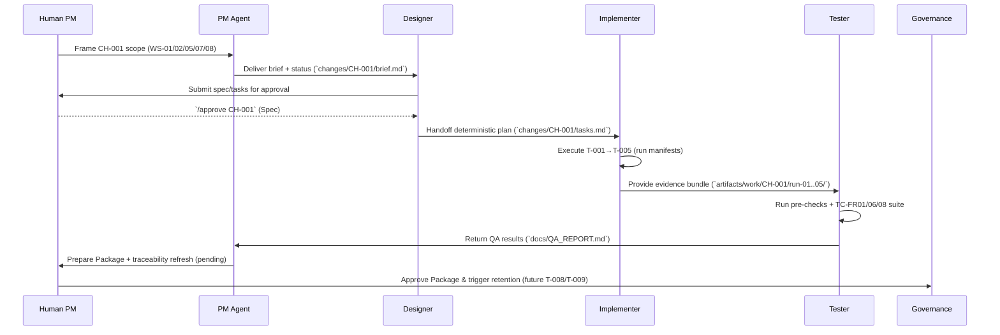

# MS-01 Phase 0 Demo Overview (CH-001)

## 1. Scenario Context
- **Milestone**: MS-01 — POC Spike  
- **Change ID**: `CH-001`  
- **Objective**: Regenerate Phase 0 foundation (WS-01, WS-02, WS-05, WS-07, WS-08) so the PM → Designer → Implementer → Tester loop can be demonstrated end-to-end with deterministic evidence.  
- **Seed / Metadata**: `MS01-P0-2025-11-02`, all audit entries tagged with `change_id="CH-001"` and `phase="0"`.  
- **Primary artifacts**:  
  - Frame/Spec: `changes/CH-001/brief.md`, `changes/CH-001/spec.md`, `changes/CH-001/tasks.md`, `changes/CH-001/status.md`  
  - Demo bundle: `artifacts/phase0/demo/2025-11-02/` (handoff/status/commands/notes)  
  - QA results: `tests/results/CH-001.json`, `docs/QA_REPORT.md`  
  - Audit trails: `audit/handoff.jsonl`, `audit/handoff_ms01_phase0.jsonl`, `audit/commands.jsonl`

## 2. Swimlane Flow

## 3. Run Steps & Outputs
| Stage | Key Commands / Actions | Outputs | Evidence Links |
| --- | --- | --- | --- |
| Frame | Human PM confirms scope; PM Agent captures brief/status | `changes/CH-001/brief.md`, `changes/CH-001/status.md` (Frame) | Handoff logged in `audit/handoff.jsonl` (PM→Designer) |
| Spec | Designer drafts deterministic spec & task list | `changes/CH-001/spec.md`, `changes/CH-001/tasks.md` | Spec approval `/approve CH-001` captured in `audit/commands.jsonl` |
| Execute | Implementer runs tasks T-001→T-005 with seed | `artifacts/work/CH-001/run-01..05/manifest.json`, docs refreshed (`docs/PROJECT_OVERVIEW.md`, etc.), demo bundle (`artifacts/phase0/demo/2025-11-02/`) | Execute handoff `audit/handoff.jsonl` entry (implementer→tester) |
| Validate | Tester performs pre-validation checks + unit tests via `python3 -m unittest` | `artifacts/work/CH-001/run-05/` validation files, `tests/results/CH-001.json`, `docs/QA_REPORT.md` | QA handoff recorded in `audit/handoff.jsonl` (tester→PM) |
| Package* | PM updates traceability & docs for stakeholder review | Pending (T-008) | To be captured before approval |
| Cleanup* | Governance records retention & closes workspace | Pending (T-009) | To be captured after Package |

\*Work planned; execution occurs post-package approval.

## 4. Tests Executed (Validate Stage)
| Test ID | Purpose | Command | Status |
| --- | --- | --- | --- |
| TC-FR01-001 | PM integration refresh | `python3 -m unittest tests.test_agents_workflow.ProjectManagerIntegrationTest.test_run_writes_documents_and_audit_handoff` | ✅ PASS |
| TC-FR01-002 | Orchestrator end-to-end loop | `python3 -m unittest tests.test_agents_workflow.Phase1OrchestratorIntegrationTest.test_orchestrate_writes_summary_and_expected_artifacts` | ✅ PASS |
| TC-FR06-001 | Audit logger schema compliance | `python3 -m unittest tests.test_logger` | ✅ PASS |
| TC-FR08-001 | Interaction stub command coverage | `python3 -m unittest tests.test_interaction_stub` | ✅ PASS |
- **Pre-validation checklist** (recorded in `artifacts/work/CH-001/run-05/`): demo checksum, audit metadata validation, documentation reference scan, command log verification.

## 5. Data & Evidence Snapshot
| Artifact | Description | Path |
| --- | --- | --- |
| Demo handoff log | Sequence of MS-01 Phase 0 handoffs | `artifacts/phase0/demo/2025-11-02/handoff.jsonl` |
| Demo status | Task completion snapshot | `artifacts/phase0/demo/2025-11-02/status.json` |
| CLI commands | `/status`, `/clarify`, `/approve` events | `artifacts/phase0/demo/2025-11-02/commands.json` |
| Validation checksum | Deterministic SHA256 for demo | `artifacts/work/CH-001/run-05/demo_checksum.txt` |
| Audit verification | Count of CH-001 entries in audit logs | `artifacts/work/CH-001/run-05/audit_validation.json` |
| QA summary | Consolidated validation report | `docs/QA_REPORT.md` |

## 6. Next Steps (Package & Cleanup)
1. **PM Agent**: Update `TRACEABILITY.md`, `docs/PROJECT_OVERVIEW.md`, and milestone notes with validation evidence (T-008).  
2. **Human PM**: Review QA report, approve Package stage, and log outcome in `changes/CH-001/status.md`.  
3. **Governance Officer**: Once approved, record retention action (`audit/retention.jsonl`) and mark workspace closed (T-009).  
4. **Demo Prep**: For live demo, replay command sequence from `artifacts/phase0/demo/2025-11-02/README.md` using seed `MS01-P0-2025-11-02`.  

This document remains the reference for stakeholders who need a concise view of what the Phase 0 demo included, how it flowed across agents, and where to find the supporting artifacts and test results.
