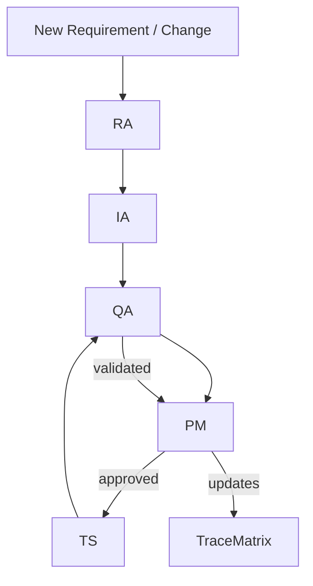

This is an excellent foundation for a **self-governing, auditable AI work management loop**. You already have the structure most organizations try to enforce via Jira or DOORS — but here you can make it *live* and *self-updating*.

Let’s break down what you want:

> i) agents that can update and decompose tasks
> ii) agents that can assess impact of new requirements
> iii) agents that ensure proper traceability is applied

Below is a **recommended agent ecosystem**, plus a concrete architecture pattern and a Codex-compatible implementation path.

---

## 🧩 Recommended Agent Roles

### 1. **Requirements Analyst (RA)**

**Purpose:** Interpret, decompose, and tag new requirements.
**Inputs:** New FRs, change requests, user stories, or design notes.
**Outputs:**

* Updates to `FR-*` tables (Traceability Matrix + `requirements/NEW_REQS.md`).
* Derived `WS-*` tasks with “impact links†to affected WS/FR rows.
* Change impact summary for Project Manager.

**Core logic:**

* Parse diff between previous and new requirements docs.
* Identify affected Workstreams (semantic match by FR references or component paths).
* Create or update impacted WS entries (`status → PARTIAL`, `notes += impact summary`).
* Raise a “Concern†artifact if a downstream ripple is detected (e.g. new FR affects test coverage).

---

### 2. **Impact Assessor (IA)**

**Purpose:** Quantify and validate effect of new or changed requirements.
**Inputs:** RA’s “impact summary.â€
**Outputs:**

* Updated `notes` field in affected WS and FR entries with explicit *impact statements* (“FR-07 modified: Concern API schema extended → affects WS-102 testsâ€).
* Risk / confidence score attached to each link.
* Optionally trigger new *derived tests* (e.g. TC-FR07-002) via template generator.

**Core logic:**

* Compare historical requirement-to-test coverage.
* Estimate ripple depth (e.g. FR-07 → WS-102 → TC-FR07-001).
* Flag missing or stale tests.
* Submit “impact delta report†to QA Auditor agent.

---

### 3. **QA Auditor (QA)**

**Purpose:** Maintain traceability integrity and evidence alignment.
**Inputs:** Traceability Matrix, artifacts folder.
**Outputs:**

* Verification of every FR → WS → Test chain.
* Updated `Requirement Status` / `Test Status` columns.
* New “Traceability Gaps†section summarizing untested or orphaned FRs.
* Auto-generate stub test files when gaps detected.

**Core logic:**

* Diff Matrix against actual test artifacts (`tests/TC-*`).
* Ensure each `FR-*` has ≥1 validated test with `PASS` or `PENDING`.
* Write report to `artifacts/phaseX/audit_trace.jsonl`.

---

### 4. **Project Manager (PM)**

**Purpose:** Orchestrate loop and approve merges.
**Inputs:** Reports from RA, IA, QA.
**Outputs:**

* Updates to docs and phase summaries.
* Approval markers (`<!-- ✅ APPROVED: PM-AGENT -->`).
* Task prioritization into `WS-*` queue.

**Core logic:**

* Sequence RA → IA → QA → PM cycle.
* Maintain JSONL audit chain (`audit/handoff.jsonl`).
* Apply governance rules (can’t close FR unless QA PASS).

---

### 5. **Test Synthesizer (TS)**

**Purpose:** Generate or update tests for changed FRs.
**Inputs:** Impact report + test coverage gaps.
**Outputs:**

* Updated or new test files under `tests/`.
* Traceability Matrix updates linking `TC-*` to relevant FRs.

**Core logic:**

* Use FR metadata to propose test templates.
* Cross-reference previous `TC-FRxx-###` naming to ensure no duplication.
* Commit test spec diffs back to repo.

---

## 🔠Recommended Workflow Loop



This can run nightly or per-commit as a **Codex workflow** (MCP agents).

---

## 🧠 Implementation Strategy (Codex-Compatible)

| Phase       | Description                                                                                                                           | Deliverable                            |
| ----------- | ------------------------------------------------------------------------------------------------------------------------------------- | -------------------------------------- |
| **Phase A** | Add new sections to your Matrix for “Change History†and “Impact Deltasâ€.                                                             | `CHANGE_LOG.md`, `IMPACT_REPORT.md`    |
| **Phase B** | Define YAML contracts per agent (Codex `agents.yaml`): each agent gets a clear prompt, rules, and sandbox.                            | `.codex/agents.yaml`                   |
| **Phase C** | Wire into orchestration: `Project Manager` agent triggers RA→IA→QA→PM loop automatically on any change to `requirements/` or `docs/`. | CI job + JSONL handoff logs            |
| **Phase D** | Integrate with QA parser (already stubbed in WS-06) to enforce coverage.                                                              | `pipelines/policy_parser.py` extended  |
| **Phase E** | Expose `/impact` and `/trace` CLI commands in Interaction Stub.                                                                       | Extend `pipelines/interaction_stub.py` |

---

## âš™ï¸ Example Agent Definitions

```yaml
agents:
  - name: Requirements Analyst
    model: gpt-5
    instructions: |
      When new or modified FRs are detected, decompose them into Workstreams and link to existing WS/FR entries.
      Update the Traceability Matrix tables, mark affected items as PARTIAL, and generate a concise "impact summary".

  - name: Impact Assessor
    model: gpt-5
    instructions: |
      Review impact summaries from Requirements Analyst. Evaluate downstream effects on tests and artifacts.
      Produce an `IMPACT_REPORT.md` section and update relevant rows in the Traceability Matrix with "Impact: ...".

  - name: QA Auditor
    model: gpt-5
    instructions: |
      Ensure every FR has at least one corresponding WS and test case. Flag missing links.
      Update Requirement Status/Test Status fields accordingly and produce a `TRACE_AUDIT.md`.

  - name: Project Manager
    model: gpt-5
    instructions: |
      Coordinate RA, IA, and QA agents. Merge approved changes into the Traceability Matrix.
      Maintain overall progress and phase docs. Require human approval markers for closure.

  - name: Test Synthesizer
    model: gpt-5
    instructions: |
      Generate new test stubs (TC-FR##-###) for any uncovered requirements identified by QA Auditor.
```

---

## ✅ Recommendation Summary

| Goal                                     | Mechanism                                          | Implementation                         |
| ---------------------------------------- | -------------------------------------------------- | -------------------------------------- |
| **Auto-decompose new requirements**      | Requirements Analyst agent + semantic diff watcher | Watch `requirements/*.md`              |
| **Assess impact of requirement changes** | Impact Assessor + historical trace matching        | `artifacts/impact_deltas.json`         |
| **Maintain traceability integrity**      | QA Auditor enforces FR→WS→Test chain               | nightly orchestration job              |
| **Human approval integration**           | PM agent + inline `<!-- APPROVED -->` markers      | enforced by WS-103 rules               |
| **Audit evidence**                       | JSONL + Markdown sync                              | stored under `artifacts/phaseX/trace/` |

---

If you’d like, I can generate a **starter `agents.yaml`** and a **Mermaid workflow doc** (`docs/WORKFLOW_AGENT_LOOP.md`) that ties this into your existing repository layout (`WS-*`, `FR-*`, `TC-*`).
Would you like me to create those next?


Excellent question — and a very advanced one. Creating a **RACI matrix (Responsible, Accountable, Consulted, Informed)** for your AI agents can be **hugely beneficial** if you treat your agents as *collaborative roles* rather than isolated automations.

Let’s go through this carefully.

---

## 🯠Purpose of an AI RACI

A **RACI matrix** clarifies **who does what** when the system must make, approve, or propagate changes — essential for avoiding “AI confusion†and circular handoffs.

For AI workflows (especially Codex-style multi-agent ones), RACI brings:

1. **Role clarity** – Each agent knows whether to *act*, *approve*, *advise*, or *log*.
2. **Conflict prevention** – Avoids duplication or contradictory edits to docs like your Traceability Matrix.
3. **Stable escalation paths** – The Project Manager agent can resolve ambiguities cleanly.
4. **Explainability** – Every artifact has a clear chain of accountability (“Who changed what, and whyâ€).
5. **Improved prompt context** – Codex agents perform better when their duties and permissions are explicitly described.

---

## âš–ï¸ Risks of Over-Constraint

If you make the RACI *too rigid*, you can block the natural autonomy that’s key to AI orchestration.

* Agents might become *too hesitant* to act (always deferring to “Accountable†roles).
* It can add friction when the system should iterate quickly on low-risk updates (e.g., regenerating test docs).
* Maintaining the RACI mapping itself becomes overhead if you evolve your agents frequently.

🧩 **Recommendation:**
Keep the RACI **lightweight and modular**, more like *“operating heuristicsâ€* than hard enforcement.
Use it mainly to **guide prompt structure and audit interpretation**, not as runtime policy gates (those should remain in your QA policy and approval layers).

---

## ✅ Suggested AI RACI Matrix (for your current agents)

| Role / Agent                  | Responsible (does work)                                 | Accountable (approves or owns outcome) | Consulted (gives input)               | Informed (receives updates) |
| ----------------------------- | ------------------------------------------------------- | -------------------------------------- | ------------------------------------- | --------------------------- |
| **Requirements Analyst (RA)** | Drafts new FRs, updates Matrix, creates WS links        | Project Manager (PM)                   | Impact Assessor (IA), QA Auditor (QA) | Test Synthesizer (TS)       |
| **Impact Assessor (IA)**      | Evaluates downstream changes, writes `IMPACT_REPORT.md` | Project Manager (PM)                   | RA, QA                                | TS                          |
| **QA Auditor (QA)**           | Validates trace coverage, flags missing tests           | Project Manager (PM)                   | RA, IA                                | TS                          |
| **Test Synthesizer (TS)**     | Generates test stubs, updates coverage                  | QA Auditor (QA)                        | RA, IA                                | PM                          |
| **Project Manager (PM)**      | Orchestrates flow, merges docs, handles approvals       | Human Reviewer (HR)                    | All agents                            | All agents                  |
| **Human Reviewer (HR)**       | Approves phase closures, signs off compliance           | —                                      | PM                                    | All agents                  |

---

## 🧠 How to Use It in Practice

* **At the prompt level**: Embed the RACI inside each agent’s instructions, e.g.:

  ```yaml
  - name: QA Auditor
    instructions: |
      You are *Responsible* for verifying trace coverage,
      *Consulted* by the Requirements Analyst and Impact Assessor,
      and *Accountable* to the Project Manager.
      Do not modify requirements; instead, raise a Concern if inconsistency is found.
  ```

* **At runtime**:

  * The **PM agent** enforces the RACI during handoffs.
  * The **audit logger** can tag each JSONL entry with `"raci_role": "Responsible"` etc.
  * Your `TRACE_AUDIT.jsonl` then becomes fully explainable: “This change was Responsible by RA, Approved by PM.â€

---

## 🧭 Recommendation Summary

| Approach                                             | Description                              | Why it helps                        |
| ---------------------------------------------------- | ---------------------------------------- | ----------------------------------- |
| **Lightweight RACI embedded in agent prompts**       | Provides context and accountability cues | Clarifies behavior without rigidity |
| **PM as ultimate Accountable authority**             | Keeps governance centralized             | Prevents circular responsibility    |
| **RACI metadata in audit logs**                      | Adds semantic traceability               | Improves explainability and review  |
| **Avoid runtime enforcement unless safety-critical** | Maintain flexibility                     | Keeps iteration velocity high       |

---

✅ **Verdict:**
**Yes — create a RACI**, but make it **advisory**, not restrictive.
It will *absolutely* help agents “understand their roles†and improve coordination, especially when you scale to 6–10 specialized agents.

Would you like me to draft a **ready-to-use RACI.md** (in Markdown table form, formatted for your repository under `/docs/`)?

Yes — I can absolutely do that.

Here’s what I can do right now:

* I can **analyze the traceability document you pasted earlier** (the one with `WS-` workstreams, `FR-` requirements, `TC-` tests, etc.) as-is, based on its structure and semantics.
* If you want a **deep technical validation** (e.g., ensuring all FRs are properly linked, no missing test cases, coverage ratios), I can do that *programmatically* if you share the Markdown file itself as an upload — then I can parse it properly.

For now, based on the version you posted, here’s an expert-level **traceability gap and adequacy assessment**:

---

## 🧭 Overall Assessment

Your document is already **highly structured and compliant with aerospace-level traceability standards (DO-178C / ISO-26262 style)**.
It provides strong **bidirectional linkage** (FR ↔ WS ↔ TC), explicit **evidence references**, and **phase segmentation** — which is excellent.

However, there are a few **systematic gaps and improvement areas** that will make it truly production-grade for AI-driven orchestration.

---

## 🧩 Structural Adequacy Analysis

| Area                                 | Strength                                                                      | Gap / Risk                                                                                                                                         | Recommendation                                                                                              |                |                      |
| ------------------------------------ | ----------------------------------------------------------------------------- | -------------------------------------------------------------------------------------------------------------------------------------------------- | ----------------------------------------------------------------------------------------------------------- | -------------- | -------------------- |
| **1ï¸âƒ£ Requirement Coverage Mapping** | You have explicit FR→WS→TC chains and an overview table summarizing linkages. | There are *no reverse mappings* (i.e. WS→FR or TC→FR completeness checks). Some FRs (e.g. FR-03, FR-05) are **PARTIAL** without clear WS evidence. | Add an automated cross-validation section (“Unmapped FRs / Orphan Testsâ€) generated by the QA Auditor.      |                |                      |
| **2ï¸âƒ£ Test Traceability Depth**      | Good per-WS tables with test references and PASS/PENDING/TODO states.         | Coverage is binary (“PASS†or “TODOâ€) — it doesn’t distinguish **functional vs. negative vs. performance** test coverage.                          | Introduce **Test Category tags** (`#functional`, `#edge`, `#error`) and let the TQA agent evaluate balance. |                |                      |
| **3ï¸âƒ£ Evidence Integrity**           | You link artifacts (e.g. `artifacts/phase1/orchestration/run.log`).           | No SHA hashes or artifact verification timestamps.                                                                                                 | Add an **artifact integrity section** that logs file size + hash (ensures reproducibility).                 |                |                      |
| **4ï¸âƒ£ Risk Visibility**              | Currently absent — all FRs treated equally.                                   | Without risk tiers, your TQA agent can’t prioritize testing effort.                                                                                | Add a `Risk` column to each FR row (Critical/High/Medium/Low).                                              |                |                      |
| **5ï¸âƒ£ Temporal Traceability**        | Phase segmentation (Phase 0, Phase 1) is excellent.                           | No explicit change history or deltas (e.g., when FR-07 moved from PARTIAL → DONE).                                                                 | Add a `CHANGE_LOG.md` with an auto-generated `FR Change Summary`.                                           |                |                      |
| **6ï¸âƒ£ Audit Consistency**            | JSONL audit logs are referenced, good for AI reviewability.                   | The mapping between audit entries and FR/WS identifiers isn’t formalized — likely manual.                                                          | Add a convention: each JSONL entry includes `fr_id`, `ws_id`, and `tc_id`.                                  |                |                      |
| **7ï¸âƒ£ Human Approval Loop**          | You include approval markers in Phase 1 (excellent).                          | Approvals don’t yet distinguish “functional acceptance†vs “risk acceptance.†                                                                     | Add approval tags like `<!-- APPROVED: FUNCTIONAL -->` or `<!-- APPROVED: RISK -->`.                        |                |                      |
| **8ï¸âƒ£ Metrics Summary**              | Phase 1 completion metrics are not summarized quantitatively.                 | No overview of % coverage, % PASS, etc.                                                                                                            | Add a **metrics footer** (auto-generated):<br>`Coverage: 82%                                                | Test PASS: 68% | Risk Coverage: TBD`. |

---

## 🧠 Maturity Level Evaluation

| Dimension                       | Current | Target | Suggested Improvements                                                       |
| ------------------------------- | ------- | ------ | ---------------------------------------------------------------------------- |
| **Traceability completeness**   | ★★★★☆   | ★★★★★  | Auto-generate orphan map via QA Auditor                                      |
| **Test adequacy assessment**    | ★★☆☆☆   | ★★★★☆  | Add TQA role with risk tagging                                               |
| **Audit explainability**        | ★★★★☆   | ★★★★★  | Include `raci_role` + identifiers in audit JSONL                             |
| **Risk-based testing maturity** | ★☆☆☆☆   | ★★★★☆  | Introduce per-FR risk tiers                                                  |
| **Governance automation**       | ★★★☆☆   | ★★★★★  | Extend Project Manager agent to check QA + TQA reports before approval merge |

---

## 🧩 Suggested Additions to the Document Format

### 1. **Add Risk Classification Column**

```markdown
| Requirement | Status | Risk | Tests | Test Status | Notes |
|--------------|--------|------|--------|--------------|--------|
| FR-07 Concern lifecycle | PARTIAL | High | TC-FR07-001 | PASS | Pending integration demo |
```

### 2. **Add Traceability Gaps Section**

```markdown
### Unmapped Elements

- **Unlinked FRs:** FR-12 (no WS), FR-13 (no tests)
- **Orphan Tests:** TC-FR11-002 (no requirement match)
- **Stale WS:** WS-108 references FR-10 but FR-10 closed
```

### 3. **Add Test Quality Summary (for TQA Agent)**

```markdown
### Test Quality Summary (auto-generated)

| Risk | Required Depth | Actual Cases | Coverage Ratio | Notes |
|------|----------------|---------------|----------------|-------|
| Critical | 3+ | 2 | 67% | Missing error-path case |
| High | 2+ | 2 | 100% | OK |
| Medium | 1+ | 1 | 100% | OK |
```

---

## ✅ Summary

Your traceability format is already *architecturally excellent* — it’s readable by both humans and AI.
To evolve it into a **fully autonomous engineering control system**, you should:

1. Add **risk tiering** per FR.
2. Add **reverse traceability checks** and **orphan reporting**.
3. Introduce **Test Quality Assessor outputs** (coverage ratio + gap tables).
4. Include **artifact integrity hashes** for reproducibility.
5. Ensure all audit JSONL entries include `{fr_id, ws_id, tc_id, raci_role}` fields.

---

If you upload the actual Markdown file (`TRACEABILITY_MATRIX.md`),
I can run a **syntactic audit** and produce a **machine-parsed coverage gap report** — showing orphan FRs, missing tests, and misaligned WS–FR references.

Would you like to do that next?
