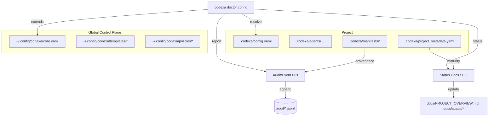

# MS-03 Operating Model Integration — Design Notes

## 1. Overview
MS-03 implements Change Request 004 by enforcing Codexa’s hybrid configuration model:
- Project-level `.codexa/` directory as canonical configuration root.
- Optional inheritance from a versioned global control plane (`~/.config/codexa/`).
- CLI tooling (`codexa doctor config`) that validates configuration precedence and reports lineage.
- Audit/status artifacts recording configuration provenance alongside discovery metadata.

## 2. Solution Architecture



### Key Flows
1. **Configuration Resolution:** CLI searches upward for `.codexa/config.yaml`; if absent, falls back to global control plane; supports explicit `--config-root`.
2. **Validation & Reporting:** `codexa doctor config` inspects both project and global configs, reporting missing files, schema issues, and template version hashes.
3. **Discovery Outputs:** Discovery agents now emit manifests into `.codexa/manifests/` and include configuration provenance in metadata.
4. **Audit & Status Updates:** All agent handoffs include `{config_root, extends_from, template_hash}`; status docs note the resolved configuration lineage.

## 3. Components

| Component | Change | Requirements |
| --- | --- | --- |
| CLI (`codexa doctor config`) | New subcommand with precedence diagnostics, JSON report output, and exit codes for CI. | FR-44 |
| CLI (`codexa init`, `codexa migrate spec-kit`) | Add scaffolding and migration flows for `.codexa/`. | FR-42 |
| Global Bundle Manager | Versioned control-plane templates + sync command; provenance hashing shared with CLI + audit. | FR-43 |
| Discovery Agents | Output manifests to `.codexa/manifests/`; embed provenance metadata. | FR-38, FR-39 |
| Audit Logger | Extend schema to include configuration lineage. | FR-06 |
| PM/GO Agents | Persist configuration lineage in run metadata and status docs. | FR-01, FR-02 |
| Maturity Utilities | Consume `.codexa/project_metadata.yaml` as canonical source. | FR-32 |

## 4. CLI Spec (`codexa doctor config`)

### Invocation
```
codexa doctor config [--config-root PATH] [--format json|text] [--no-telemetry]
```

### Exit Codes
| Code | Meaning |
| --- | --- |
| 0 | All checks passed. |
| 1 | Recoverable issues (missing optional files, stale hashes). |
| 2 | Blocking issues (missing required files, schema errors). |
| 3 | Unexpected failure (exception, IO). |

### Checks
- Presence of required `.codexa/` files (config, README, manifests directory).
- Schema validation for `config.yaml` and `project_metadata.yaml`.
- Resolution of `extends:` chains with cycle detection.
- Availability + version match of `~/.config/codexa/core.yaml`.
- Provenance hashing output: `{config_root, extends_chain[], template_hash}`.
- Optional warnings for unused global templates or overrides.

### Outputs
- **Text mode:** human-readable summary with ASCII table of checks.
- **JSON mode:** structured object stored under `artifacts/doctor/config/latest.json`.
- Telemetry attaches to audit (`audit/doctor_config.jsonl`) with timestamps and hash data.

## 5. Audit Schema Extension
```json
{
  "config_root": "path/to/.codexa",
  "extends_from": ["~/.config/codexa/core.yaml", "..."],
  "template_hash": "sha256:...",
  "manifest_hash": "sha256:..."
}
```
- Added to existing handoff, command, and doctor logs.
- Optional when project is running in legacy mode (record `null` + issue warning).

## 6. Migration Strategy
1. Run `codexa migrate spec-kit --dry-run` to preview `.codexa/` scaffold.
2. Commit generated `.codexa/` directory + README.
3. Publish or update global control-plane bundle (ensuring version bump).
4. Execute `codexa doctor config` in CI; block merges on non-zero exit.
5. Relocate maturity metadata into `.codexa/project_metadata.yaml`; ensure mirror file is updated automatically.
6. Update discovery outputs + audit logs; confirm tests TC-FR38-001, TC-FR39-001, TC-FR06-002.

## 7. Risks & Mitigations
| Risk | Mitigation |
| --- | --- |
| Legacy projects missing `.codexa/` | Provide migration helper, allow temporary mirror support with warnings. |
| Global bundle drift between machines | Versioned sync command + hash verification stored in audit logs. |
| CLI failure in CI due to environment variance | Support `--config-root` override and degrade gracefully with warnings. |
| Increased audit payload size | Compress optional fields, document retention policy for doctor logs. |

## 8. Open Questions
- Should we allow environment variables to override global bundle location? (Default is `$HOME/.config/codexa`.)
- Do we need encryption for global templates? (Currently assumed plain text; revisit if sensitive data introduced.)
- How do we model remote/global bundle updates when offline? (Plan: cache last known bundle and warn on stale version.)

## 9. Acceptance Evidence
- TC-FR42-001: log lint failure + success samples.
- TC-FR43-001: verify versioned bundle + provenance hash.
- TC-FR44-001: run automated precedence tests (project-only, global-only, hybrid, override).
- TC-FR06-002: audit sample with new metadata + validation script.
- TC-FR32-001: CLI utility verifying metadata relocation + sync.
- TC-FR38-001 / TC-FR39-001: discovery run snapshot showing new manifest layout and hashes.
