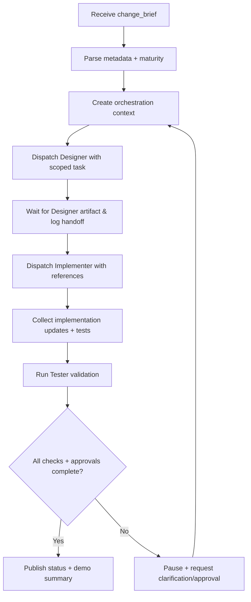

# 🧩 Requirement Elaboration — FR-01

## 1. Summary
Enable the Project Manager (PM) agent to coordinate the minimum Dynaforge loop—collecting work intents, orchestrating Designer → Implementer → Tester handoffs, and surfacing human-readable state so the MS-01 spike can be demoed end-to-end.

## 2. Context & Rationale
MS-01 demonstrates a closed loop where a PM agent translates stakeholder goals into actionable agent work. FR-01 is the backbone of that demo: without orchestration, the other agents remain disconnected and the human cannot observe progress. This requirement ensures the PM ingests change briefs, steers downstream agents, captures evidence, and pauses for human approvals.

## 3. Inputs
| Name | Type / Format | Example | Notes |
|------|----------------|---------|-------|
| `change_brief` | Markdown (`docs/IMPLEMENTATION_PLAN.md`) | `## Objective\n- build audit hook\n` | Authoritative description of requested capability. |
| `project_metadata` | YAML (`PROJECT_METADATA.yaml`) | `maturity_level: M0` | Drives which gates must execute. |
| `agent_handoff` | JSONL (`audit/handoffs.jsonl`) | `{"from":"PM","to":"Designer","fr_id":"FR-03"}` | Captures state transitions between agents. |
| `human_command` | CLI / Discord command | `/status milestone` | Injects clarifications or approvals. |

### Edge & Error Inputs
- Missing `project_metadata` → PM must default to M0 behaviour and log a warning.
- Designer returns validation error → PM halts progression and requests `/clarify designer`.
- Human denies approval (`/deny`) → PM records denial, notifies agents, and awaits new brief.

## 4. Process Flow

## 5. Outputs
| Format | Example | Consumer |
|--------|---------|----------|
| Markdown | `docs/PROJECT_OVERVIEW.md` updated with latest milestone summary | Human stakeholders |
| JSONL | `audit/handoffs.jsonl` entries for each agent progression | Audit / QA reviewers |
| Log | `artifacts/phase1/orchestration/run.log` | Demo + observability tooling |

## 6. Mockups / UI Views (if applicable)
- `artifacts/phase1/screenshots/pm_status_cli.md` — CLI snapshot showing PM posting consolidated `/status`.
- `artifacts/phase1/screenshots/pm_approval_wait.md` — Visual showing paused loop awaiting human review.

## 7. Acceptance Criteria
* [ ] PM agent produces ordered Designer → Implementer → Tester dispatches with traceable IDs.
* [ ] Handoff log captures `{fr_id, ws_id, change_id}` for each transition.
* [ ] PM blocks progression when approvals are missing and surfaces prompt to human via CLI/Discord.
* [ ] `/status` command returns milestone narrative updated within 60 seconds of latest change.

## 8. Dependencies
- FR-02 for the documentation the PM publishes.
- FR-06 for structured handoff logging schema.
- FR-10 to enforce approval gating during orchestration.
- WS-101 orchestration runtime, WS-05 PM skeleton.

## 9. Risks & Assumptions
- Assumes designer/implementer/tester agents respond idempotently; retries could duplicate logs.
- Risk that missing maturity metadata results in incorrect gate sequencing; mitigation is safe default (M0) with visible warning.
- Multi-agent flow presumes synchronous operations for MS-01; future async execution may require queueing.

## 10. Review Status
| Field | Value |
|-------|-------|
| **Status** | Draft |
| **Reviewed By** | _Unassigned_ |
| **Date** | 2025-10-30 |
| **Linked Change** | Pending |
