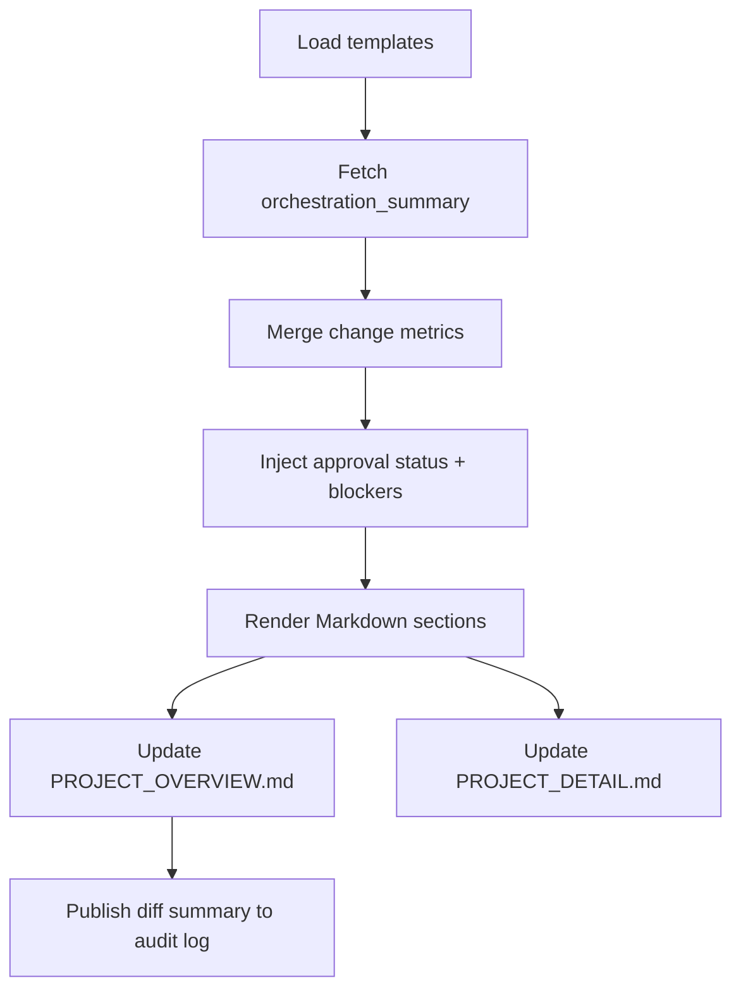

# 🧩 Requirement Elaboration — FR-02

## 1. Summary
Keep Dynaforge status documentation current by auto-refreshing `PROJECT_OVERVIEW.md` and `PROJECT_DETAIL.md` with milestone narratives, change summaries, and maturity signals produced during the MS-01 loop.

## 2. Context & Rationale
Stakeholders judge the POC spike via human-readable docs. FR-02 ensures the PM agent translates orchestration outputs into concise documentation that reflects real-time progress, approvals, and outstanding work. Without this, humans cannot verify the loop or trace requirement coverage.

## 3. Inputs
| Name | Type / Format | Example | Notes |
|------|----------------|---------|-------|
| `orchestration_summary` | JSON (`artifacts/phase1/orchestration/state.json`) | `{"milestone":"MS-01","status":"In Review"}` | Single source of truth for loop state. |
| `change_metrics` | YAML (`artifacts/metrics/milestone.yaml`) | `completed_requirements: ["FR-09"]` | Feeds maturity + coverage tables. |
| `approval_log` | JSONL (`artifacts/phase1/approvals/events.jsonl`) | `{"fr_id":"FR-10","approved_by":"human"}` | Documents gating decisions. |
| `doc_templates` | Markdown partials (`docs/templates/status/*.md`) | `{{ milestone_objective }}` | Provides paragraphs/headings. |

### Edge & Error Inputs
- Missing approval entries → documentation must show “Pending Approval” badge rather than implying completion.
- Metrics file corrupted → PM falls back to minimal status block and logs error for QA.
- Template keys missing → PM renders fallback plain text and raises concern via FR-07 workflow.

## 4. Process Flow

## 5. Outputs
| Format | Example | Consumer |
|--------|---------|----------|
| Markdown | `docs/PROJECT_OVERVIEW.md` milestone card | Stakeholders |
| Markdown | `docs/PROJECT_DETAIL.md` requirement breakdown | Agents + QA |
| JSON | `artifacts/phase1/status/export.json` for dashboards | Analytics |

## 6. Mockups / UI Views (if applicable)
- `artifacts/phase1/screenshots/status_overview.md` — Rendered milestone card.
- `artifacts/phase1/screenshots/status_detail.md` — Requirement table highlighting approvals.

## 7. Acceptance Criteria
* [ ] Documentation refresh runs automatically after each approved handoff.
* [ ] Each requirement in MS-01 shows `Status`, `Last Updated`, and `Evidence` links.
* [ ] Pending approvals render with warning badge and reviewer name placeholder.
* [ ] Export JSON matches Markdown tables (spot-check by hash in audit log).

## 8. Dependencies
- FR-01 for orchestration summaries.
- FR-06 for audit logging of document updates.
- FR-10 for approval metadata.
- WS-08 documentation updates, WS-108 demo documentation.

## 9. Risks & Assumptions
- Assumes templates stay in sync with traceability table fields; divergence causes rendering gaps.
- Documentation generation must be idempotent to avoid merge churn; ensure deterministic ordering.
- Human reviewers rely on docs for sign-off; stale data becomes governance risk.

## 10. Review Status
| Field | Value |
|-------|-------|
| **Status** | Draft |
| **Reviewed By** | _Unassigned_ |
| **Date** | 2025-10-30 |
| **Linked Change** | Pending |
