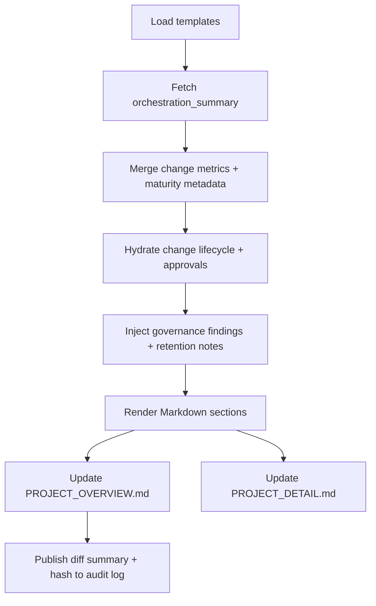

# 🧩 Requirement Elaboration — FR-02

## 1. Summary
Continuously refresh `PROJECT_OVERVIEW.md` and `PROJECT_DETAIL.md` so they narrate change-centric progress: each `CH-###` lifecycle, staged approvals, maturity metrics, and cross-links to evidence generated by the RA→IA→IM→QA→TQA→GO loop.

## 2. Context & Rationale
Stakeholders judge each milestone through human-readable docs. CR002 requires those docs to reflect the change governance model—anchoring summaries on `CH-###` objects, highlighting partial approvals, and reporting maturity signals aligned with `PROJECT_METADATA.md` and `TRACEABILITY.md`. Without this, humans cannot verify staged approvals, retention decisions, or traceability coverage mandated by FR-26.

## 3. Inputs
| Name | Type / Format | Example | Notes |
|------|----------------|---------|-------|
| `change_lifecycle` | Markdown (`changes/CH-###/status.md`) | `Partially Approved` with blockers list | Drives change cards and approval badges. |
| `orchestration_summary` | JSON (`artifacts/phase1/orchestration/state.json`) | `{"milestone":"MS-01","status":"In Review"}` | Summarises loop execution and retention notes. |
| `change_metrics` | YAML (`artifacts/metrics/milestone.yaml`) | `completed_requirements: ["FR-09"]` | Feeds maturity and traceability tables. |
| `governance_report` | Markdown (`docs/GOVERNANCE_REPORT.md`) | `### Outstanding Concerns` | Exposes compliance blockers.
| `doc_templates` | Markdown partials (`docs/templates/status/*.md`) | `{{ change_cards }}` | Provides structured sections.

### Edge & Error Inputs
- Missing change lifecycle data → render card with `Unknown` state and raise FR-07 concern referencing `CH-###`.
- Metrics file corrupted → fallback to minimal status block and log FR-06 audit warning.
- Governance report absent → highlight “GO report pending” callout and block completion metrics.

## 4. Process Flow

## 5. Outputs
| Format | Example | Consumer |
|--------|---------|----------|
| Markdown | `docs/PROJECT_OVERVIEW.md` milestone card with change lifecycle timeline | Stakeholders |
| Markdown | `docs/PROJECT_DETAIL.md` requirement table cross-linking to `TRACEABILITY.md` anchors | Agents + QA |
| JSON | `artifacts/phase1/status/export.json` for dashboards (includes maturity and approval stats) | Analytics |
| JSONL | `audit/status_updates.jsonl` describing rendered hashes and source change IDs | Governance Officer

## 6. Mockups / UI Views (if applicable)
- `artifacts/phase1/screenshots/status_overview.md` — Rendered milestone card with `CH-###` timeline.
- `artifacts/phase1/screenshots/status_detail.md` — Requirement table highlighting partial approvals and GO blockers.

## 6.1 Change & Traceability Links
- `change_refs`: `CH-002` (change-centric governance), additional `CH-###` entries per milestone refresh.
- `trace_sections`: `TRACEABILITY.md#fr-02-status-documentation`, `TRACEABILITY.md#ws-108-demo--documentation`.
- `artifacts`: `docs/PROJECT_OVERVIEW.md`, `docs/PROJECT_DETAIL.md`, `CHANGELOG.md`, `artifacts/metrics/milestone.yaml`.

## 7. Acceptance Criteria
* [ ] Documentation refresh runs automatically whenever a `CH-###` lifecycle transitions or `/df.checklist` completes.
* [ ] Each requirement entry shows `Status`, `Last Updated`, `Evidence`, and linked `CH-###` IDs consistent with `TRACEABILITY.md`.
* [ ] Pending approvals render with warning badge, Governance Officer blocker summary, and pointer to `GOVERNANCE_REPORT.md`.
* [ ] JSON export hash recorded in `audit/status_updates.jsonl` matches Markdown render for the same change set.

## 8. Dependencies
- FR-01 orchestration summaries and staged approvals.
- FR-06 structured audit logging, FR-26 traceability mapping.
- FR-10 multi-gate approvals, FR-11 QA gating, FR-13 observability metrics, FR-30 velocity dashboard integration.
- WS-08 documentation updates, WS-108 demo documentation, WS-201 requirements intelligence.

## 9. Risks & Assumptions
- Templates must stay in sync with traceability table fields; divergence causes rendering gaps—mitigated by automated template validation.
- Documentation generation must be idempotent to avoid merge churn; ensure deterministic ordering and canonical sorting of changes.
- Maturity metrics rely on accurate `PROJECT_METADATA.md`; stale metadata misleads stakeholders about readiness.

## 9.1 Retention Notes
- Status refresh logs should reference Implementer retention decisions (success auto-purge vs `--retain`) to keep narrative aligned with FR-27 evidence availability.
- If retention is requested, documentation must highlight the retained run and location for Governance Officer review.

## 10. Review Status
| Field | Value |
|-------|-------|
| **Status** | Draft |
| **Reviewed By** | _Unassigned_ |
| **Date** | 2025-11-01 |
| **Linked Change** | CH-002 |
