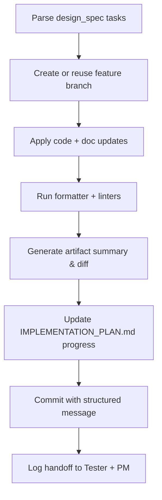

# 🧩 Requirement Elaboration — FR-04

## 1. Summary
Equip the Implementer agent with disciplined branching, artifact updates, and evidence capture so MS-01 changes can ship safely with traceable diffs.

## 2. Context & Rationale
The spike must show the Implementer consuming Designer guidance, applying code/doc changes, and packaging results for Tester review. FR-04 ensures every implementation task produces a clean branch, artifacts aligned with specs, and auditable evidence—mirroring how future automated deliveries will operate.

## 3. Inputs
| Name | Type / Format | Example | Notes |
|------|----------------|---------|-------|
| `design_spec` | Markdown (`design/DESIGN_SPEC.md`) | `### Sequence\n1. extend logger\n` | Defines scope. |
| `branch_naming_rules` | YAML (`docs/WORKFLOW.md#branches`) | `pattern: feature/{fr_id}-{slug}` | Enforces naming discipline. |
| `qa_policy` | YAML (`QA_POLICY.yaml`) | `require_tests: true` | Determines required artifacts. |
| `pm_directives` | JSON (`artifacts/phase1/orchestration/directives.json`) | `{"fr_id":"FR-04","priority":"high"}` | Additional constraints or deadlines. |

### Edge & Error Inputs
- Branch already exists → Implementer reuses after verifying clean state and logs reuse event.
- Tests missing from QA policy → Implementer tags work as blocked and raises concern.
- Designer spec references unavailable component → Implementer halts and requests clarification.

## 4. Process Flow

## 5. Outputs
| Format | Example | Consumer |
|--------|---------|----------|
| Git branch | `feature/FR-04-logger-discipline` | Human reviewer |
| Markdown | `docs/IMPLEMENTATION_PLAN.md` progress table updated | PM, QA |
| JSONL | `audit/handoffs.jsonl` Implementer→Tester entries | Audit |

## 6. Mockups / UI Views (if applicable)
- `artifacts/phase1/screenshots/implementer_diff.md` — Example of structured diff summary.

## 7. Acceptance Criteria
* [ ] Branch names follow `feature/FR-XX-short-slug` and include change metadata.
* [ ] Each Implementer run produces a `CHANGE_SUMMARY.md` snippet linked in audit log.
* [ ] QA policy requirements satisfied (tests, docs) or explicit blockers logged.
* [ ] Implementer notifies Tester and PM with artifact paths within 5 minutes of completion.

## 8. Dependencies
- FR-03 design outputs.
- FR-06 logging schema for handoffs.
- FR-10 approval flow to guard merges.
- WS-101 orchestration sequence, WS-07 demo workflow artifacts.

## 9. Risks & Assumptions
- Assumes repository tooling (linters, formatters) is available in automation environment.
- Concurrent Implementer runs could contend for branches; orchestration must serialize per FR.
- Human reviewers may request hotfixes; ensure Implementer can resume work after manual edits.

## 10. Review Status
| Field | Value |
|-------|-------|
| **Status** | Draft |
| **Reviewed By** | _Unassigned_ |
| **Date** | 2025-10-30 |
| **Linked Change** | Pending |
