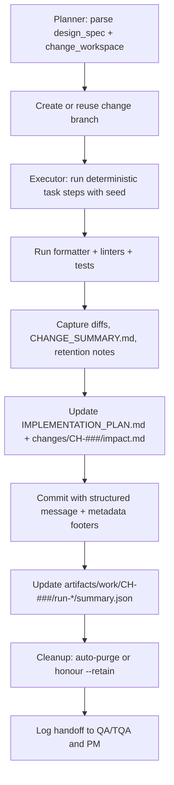

# 🧩 Requirement Elaboration — FR-04

## 1. Summary
Equip the Implementer agent with a SpekKit-inspired micro-loop that executes deterministic tasks per `CH-###`, enforces branch/artifact discipline, captures audit evidence, and coordinates retention policies required by FR-27.

## 2. Context & Rationale
The spike must show the Implementer consuming Designer guidance, applying code/doc changes, and packaging results for QA review. CR002 extends this by mandating a deterministic micro-loop (planner→executor→cleanup), change-centric branch naming, and retention-aware evidence capture. FR-04 ensures every implementation task produces traceable diffs aligned with `CH-###`, surfaces staged approval checkpoints, and keeps audit data for Governance Officer inspection.

## 3. Inputs
| Name | Type / Format | Example | Notes |
|------|----------------|---------|-------|
| `design_spec` | Markdown (`design/DESIGN_SPEC.md`) | `### Sequence\n1. extend logger\n` | Defines scoped tasks. |
| `change_workspace` | Directory (`changes/CH-###/`) | `impact.md`, `tasks.md` | Defines change anchor, lifecycle, and evidence targets. |
| `branch_naming_rules` | YAML (`docs/WORKFLOW.md#branches`) | `pattern: ch/{ch_id}-{slug}` | Enforces change-centric naming. |
| `qa_policy` | YAML (`QA_POLICY.yaml`) | `require_tests: true` | Determines required artifacts/tests. |
| `pm_directives` | JSON (`artifacts/phase1/orchestration/directives.json`) | `{"fr_id":"FR-04","priority":"high","maturity":"M2"}` | Additional constraints or deadlines. |
| `micro_loop_config` | JSON (`artifacts/work/CH-###/planner_config.json`) | `{"seed":42,"tasks":5}` | Defines deterministic planner/executor setup.

### Edge & Error Inputs
- Branch already exists → Implementer verifies clean state, logs reuse with run_id, and notifies PM.
- Tests missing from QA policy → Implementer marks change as blocked, records in `changes/CH-###/status.md`, and raises FR-07 concern.
- Designer spec references unavailable component → Implementer halts, raises concern, and appends blocker to `impact.md`.
- Executor crash mid-run → Cleanup module records partial state, retains artifacts using `.retain` marker, and signals manual intervention.

## 4. Process Flow

## 5. Outputs
| Format | Example | Consumer |
|--------|---------|----------|
| Git branch | `ch/017-logger-discipline` with metadata footer | Human reviewer |
| Markdown | `docs/IMPLEMENTATION_PLAN.md` progress table updated with change references | PM, QA |
| Markdown | `changes/CH-###/impact.md` updated with implementation evidence | Governance Officer |
| JSONL | `audit/handoffs.jsonl` Implementer→QA entries including `{fr_id, ch_id, run_id, seed}` | Audit |
| JSON | `artifacts/work/CH-###/run-*/summary.json` containing task outcomes and retention flags | Governance, QA

## 6. Mockups / UI Views (if applicable)
- `artifacts/mockups/FR-04/implementer_diff.md` — Example of structured diff summary including `ch_id`.
- `artifacts/mockups/FR-04/implementer_retention.md` — Snapshot showing `.retain` marker explanation.

## 6.1 Change & Traceability Links
- `change_refs`: `CH-002` baseline, plus specific `CH-###` per implementation task.
- `trace_sections`: `TRACEABILITY.md#fr-04-implementer-branch--artifact-discipline`, `TRACEABILITY.md#ws-109-implementer-micro-loop--retention`.
- `artifacts`: `docs/IMPLEMENTATION_PLAN.md`, `CHANGELOG.md`, `changes/CH-###/impact.md`, `artifacts/work/CH-###/run-*/`.

## 7. Acceptance Criteria
* [ ] Branch names follow `ch/{ch_id}-{slug}` and commits include structured footers `{ch_id, fr_id, run_id}`.
* [ ] Each Implementer run produces `CHANGE_SUMMARY.md`, updates `changes/CH-###/impact.md`, and logs run metadata (`seed`, `duration_ms`, retention decision).
* [ ] QA policy requirements satisfied (tests, docs) or explicit blockers logged in `changes/CH-###/status.md` and FR-07 concern raised.
* [ ] Implementer creates `audit/handoffs.jsonl` entry within 5 minutes of completion, referencing `--retain` status and evidence paths.

## 8. Dependencies
- FR-03 design outputs, FR-06 logging schema, FR-26 traceability expectations.
- FR-10 approval flow, FR-11 QA gating, FR-27 retention, FR-29 micro-loop discipline.
- WS-101 orchestration, WS-109 micro-loop implementation, WS-206 change records.

## 9. Risks & Assumptions
- Assumes repository tooling (linters, formatters) is available in automation environment.
- Concurrent Implementer runs could contend for branches; orchestration must serialize per `CH-###`.
- Human reviewers may request hotfixes; ensure Implementer can resume work after manual edits and log manual interventions.

## 9.1 Retention Notes
- Successful runs auto-purge after 48 h/2 GB; Implementer records purge timestamp in `summary.json`.
- When `--retain` is set, Implementer creates `.retain` marker with justification (e.g., “awaiting GO review”) and notifies PM/GO.

## 10. Review Status
| Field | Value |
|-------|-------|
| **Status** | Draft |
| **Reviewed By** | _Unassigned_ |
| **Date** | 2025-11-01 |
| **Linked Change** | CH-002 |
