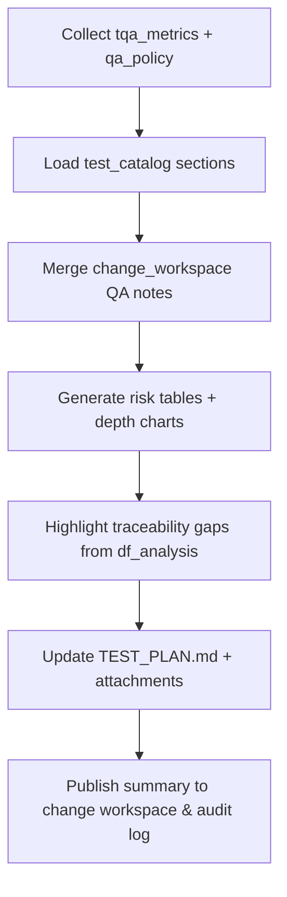

# 🧩 Requirement Elaboration — FR-05

## 1. Summary
Establish a Tester-owned documentation flow that embeds Test Quality Assessor (TQA) risk metrics, depth tables, and maturity bands into project QA artifacts so every `CH-###` promotes with traceable coverage evidence.

## 2. Context & Rationale
CR002 elevates the Tester’s responsibilities beyond executing suites—the Tester must curate living QA documentation (`tests/TEST_PLAN.md`, risk summaries, evidence snapshots) that reflect TQA analysis and change-centric governance. By aligning Tester outputs with FR-27 retention policies and FR-11 gating, stakeholders can judge whether risk tiers and required depth are satisfied before approvals proceed.

## 3. Inputs
| Name | Type / Format | Example | Notes |
|------|----------------|---------|-------|
| `tqa_metrics` | JSON (`artifacts/phase1/tqa/coverage.json`) | `{"fr_id":"FR-05","risk_tier":"high","required_depth":3,"actual_depth":2}` | Primary data for coverage tables. |
| `test_catalog` | Markdown (`tests/TEST_PLAN.md`) | `### FR-05\n- TC-FR05-001` | Baseline QA document updated by Tester. |
| `change_workspace` | Markdown (`changes/CH-###/impact.md`) | `### QA Notes` | Links coverage evidence to active change. |
| `qa_policy` | YAML (`QA_POLICY.yaml`) | `risk_tiers.high.min_tests: 3` | Determines thresholds for narrative sections. |
| `df_analysis` | JSON (`artifacts/analyze/df.clarify.json`) | `{"unmapped_tests":[]}` | Highlights traceability gaps from `/df.*` commands. |

### Edge & Error Inputs
- Missing TQA metrics → render section with “Metrics Pending” banner, log FR-07 concern, and block QA sign-off.
- Coverage below policy threshold → annotate deficiency, notify QA policy engine, and mark change `Partially Approved`.
- Change workspace absent → fallback to `CH-???` placeholder and prompt Implementer to register change.

## 4. Process Flow

## 5. Outputs
| Format | Example | Consumer |
|--------|---------|----------|
| Markdown | `tests/TEST_PLAN.md` updated with risk/depth table | QA, Governance Officer |
| Markdown | `docs/TEST_QUALITY_SUMMARY.md` (optional) referencing `CH-###` | Stakeholders |
| JSON | `artifacts/phase1/tqa/summary.json` with verdicts | QA policy engine |
| JSONL | `audit/qa_docs.jsonl` entry describing update hash | Audit reviewers |

## 6. Mockups / UI Views (if applicable)
- `artifacts/mockups/FR-05/test_plan_depth_table.md` — Example depth chart.
- `artifacts/mockups/FR-05/tqa_gap_callout.md` — Highlight of unmet metrics.

## 6.1 Change & Traceability Links
- `change_refs`: `CH-002`, plus active `CH-###` entries updated in QA sections.
- `trace_sections`: `TRACEABILITY.md#ws-302-test-synthesizer--quality-depth`, `TRACEABILITY.md#fr-05-tester-owned-qa-artifacts`.
- `artifacts`: `tests/TEST_PLAN.md`, `changes/CH-###/impact.md`, `artifacts/phase1/tqa/coverage.json`.

## 7. Acceptance Criteria
* [ ] Test plan entries list risk tier, required depth, actual depth, and linked test IDs for every impacted FR.
* [ ] Coverage shortfalls automatically create FR-07 concerns and annotate `CH-###/status.md`.
* [ ] QA documentation refresh emits audit record with `{fr_id, ch_id, metrics_hash}` within the run.
* [ ] `/df.analyze` reports zero unmapped tests after documentation updates (or documents outstanding items with owner and due date).

## 8. Dependencies
- FR-11 QA policy enforcement for gating decisions.
- FR-18 Test Synthesizer and FR-19 TQA outputs to populate metrics and new tests.
- FR-26 traceability schema, FR-27 retention (links to preserved runs when necessary).
- WS-302 Test Synthesizer & Quality Depth workstream.

## 9. Risks & Assumptions
- TQA metrics must be regenerated each run; stale data risks false PASS verdicts.
- Manual edits to `tests/TEST_PLAN.md` can drift from automated sections; enforce templated blocks.
- High-risk tiers may require visual attachments (charts) that inflate repo size; prefer text-based tables or generated SVG kept under size limits.

## 9.1 Retention Notes
- When tests fail or depth is insufficient, reference retained Implementer runs and associated evidence so Governance Officer can review before purge.
- Upon PASS verdict, document retention decision (purged vs retained) in `artifacts/phase1/tqa/summary.json`.

## 10. Review Status
| Field | Value |
|-------|-------|
| **Status** | Draft |
| **Reviewed By** | _Unassigned_ |
| **Date** | 2025-11-01 |
| **Linked Change** | CH-002 |
