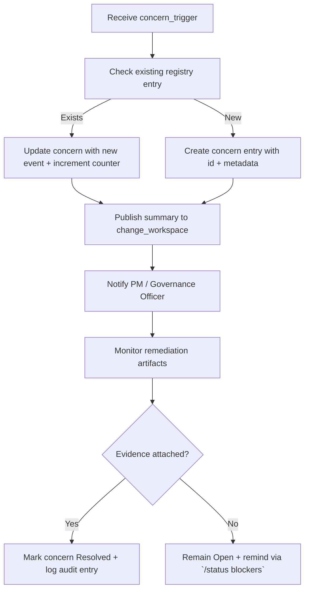

# 🧩 Requirement Elaboration — FR-07

## 1. Summary
Maintain an automated concern lifecycle that raises, tracks, and resolves governance issues for each `CH-###`, ensuring failed Implementer runs, traceability gaps, or approval denials generate actionable remediation loops rather than silent failures.

## 2. Context & Rationale
CR002 introduces staged approvals, `/df.*` diagnostics, and retention decisions—all of which can surface issues requiring structured follow-up. FR-07 guarantees that concerns originate from these signals, persist until remediation evidence is captured, and update both the change workspace and traceability matrix so stakeholders understand outstanding risks.

## 3. Inputs
| Name | Type / Format | Example | Notes |
|------|----------------|---------|-------|
| `concern_trigger` | JSON (`artifacts/phase1/concerns/triggers.jsonl`) | `{"source":"Implementer","ch_id":"CH-017","reason":"tests failing"}` | Generated when pipeline detects issue. |
| `change_workspace` | Markdown (`changes/CH-###/status.md`) | `### Concerns` section | Destination for concern summaries. |
| `df_analyze_output` | JSON (`artifacts/analyze/df.analyze.json`) | `{"traceability_gaps":["FR-05"]}` | Highlights drift requiring concerns. |
| `approval_event` | JSONL (`artifacts/phase1/approvals/events.jsonl`) | `{"stage":"GO","decision":"deny","ch_id":"CH-017"}` | Creates governance concern entries. |
| `concern_registry` | JSON (`artifacts/phase1/concerns/open.json`) | `{"id":"C-021","status":"Open"}` | Master list for lifecycle management. |

### Edge & Error Inputs
- Duplicate concern trigger → merge into existing concern entry while incrementing occurrence count.
- Concern closed without evidence → block closure, require linked artifact hash or remediation note.
- Change merged while concerns remain open → raise escalation to Governance Officer and log policy breach.

## 4. Process Flow

## 5. Outputs
| Format | Example | Consumer |
|--------|---------|----------|
| JSON | `artifacts/phase1/concerns/open.json` | PM, Governance Officer |
| Markdown | `changes/CH-###/status.md` concern log | Stakeholders |
| JSONL | `audit/concerns.jsonl` lifecycle events | Audit trail |
| Markdown | `TRACEABILITY.md` “Unmapped Elements” entries annotated with concern IDs | QA Auditor |

## 6. Mockups / UI Views (if applicable)
- `artifacts/mockups/FR-07/concern_tracker.md` — Visualization of open vs resolved concerns.
- `artifacts/mockups/FR-07/status_blockers_callout.md` — Example `/status` output listing blockers.

## 6.1 Change & Traceability Links
- `change_refs`: `CH-002`, plus individual `CH-###` where concerns originate.
- `trace_sections`: `TRACEABILITY.md#ws-102-concern-lifecycle`, `TRACEABILITY.md#fr-07-concern-lifecycle`.
- `artifacts`: `artifacts/phase1/concerns/open.json`, `changes/CH-###/status.md`, `/df.analyze` output.

## 7. Acceptance Criteria
* [ ] Concern entries include `{concern_id, fr_id?, ch_id, source, severity, status, evidence_links}`.
* [ ] `/status blockers` lists all open concerns with owner and next action until resolved.
* [ ] Closing a concern requires linked remediation artifacts (commit hash, updated doc, QA verdict) and updates traceability tables.
* [ ] Concern registry triggers FR-11 QA policy engine to fail if severity ≥ high remains open.

## 8. Dependencies
- FR-06 audit logging, FR-10 approvals (denials feed concerns), FR-11 QA policy (concern gating).
- FR-26 traceability to surface unmapped elements, FR-27 retention (retain runs when concern unresolved).
- WS-102 Concern Lifecycle workstream, WS-205 change router for notifications.

## 9. Risks & Assumptions
- Excessive concern noise can desensitize stakeholders; categorize severity and auto-close stale low-risk items only with governance approval.
- Manual concern edits risk drift from registry; prefer CLI/automation updates.
- Ensure concern IDs remain stable across restarts to avoid orphan entries.

## 9.1 Retention Notes
- When concerns reference retained Implementer runs, include `retained_run_id` and purge instructions upon resolution.
- Document purge actions in `audit/concerns.jsonl` to prove evidence retention policy compliance.

## 10. Review Status
| Field | Value |
|-------|-------|
| **Status** | Draft |
| **Reviewed By** | _Unassigned_ |
| **Date** | 2025-11-01 |
| **Linked Change** | CH-002 |
