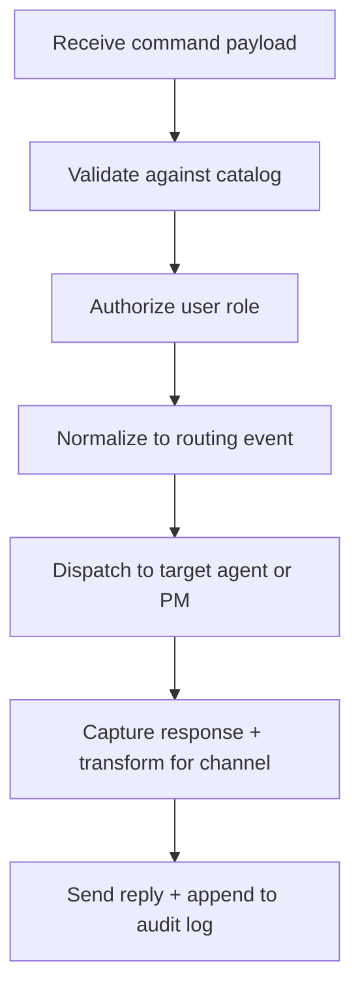

# 🧩 Requirement Elaboration — FR-08

## 1. Summary
Offer Discord/CLI command coverage (`/status`, `/clarify`, `/ack`, `/resolve`, etc.) so humans can interact with the MS-01 loop in real time.

## 2. Context & Rationale
The spike lives or dies by human perception. FR-08 ensures stakeholders can query progress, clarify intent, and acknowledge outcomes using consistent commands across local CLI and remote Discord stubs. This keeps humans in the loop without manual code changes.

## 3. Inputs
| Name | Type / Format | Example | Notes |
|------|----------------|---------|-------|
| `command_payload` | JSON (`pipelines/interaction_stub.py`) | `{"cmd":"/clarify","channel":"cli","text":"Designer: confirm scope"}` | Normalized command event. |
| `user_profile` | Dict | `{"handle":"@stakeholder","role":"Human Reviewer"}` | Determines permissions and audit tags. |
| `command_catalog` | YAML (`docs/WORKFLOW.md#commands`) | `/ack: acknowledge delivery` | Defines allowed commands + help text. |
| `routing_table` | Python mapping | `{"clarify":"PM","ack":"PM"}` | Specifies agent destinations. |

### Edge & Error Inputs
- Unknown command → return contextual help and log `command_error`.
- User without permission issues `/approve` → respond with denial and log attempt.
- Discord outage (webhook failure) → queue command locally and mark as `pending`.

## 4. Process Flow

## 5. Outputs
| Format | Example | Consumer |
|--------|---------|----------|
| JSONL | `audit/commands.jsonl` with `{cmd, role, timestamp}` | Governance, QA |
| Text | CLI/Discord response message | Human stakeholder |
| Markdown | `artifacts/phase1/commands/summary.md` | Demo collateral |

## 6. Mockups / UI Views (if applicable)
- `artifacts/phase1/screenshots/discord_command_flow.md` — Discord thread example.
- `artifacts/phase1/screenshots/cli_command_flow.md` — CLI session transcript.

## 7. Acceptance Criteria
* [ ] Commands `/status`, `/clarify`, `/ack`, `/resolve`, `/approve`, `/deny` implemented with parity between CLI and Discord stub.
* [ ] Help text (`/help`) lists available commands and required roles.
* [ ] Command invocations append audit records linking to FR and change IDs.
* [ ] Error responses provide next-step guidance (e.g., “Try `/status` to see blockers”).

## 8. Dependencies
- FR-09 routing + logging for structured audit entries.
- FR-10 approvals to authorize `/approve`/`/deny`.
- WS-04 interaction stub, WS-105 bridge expansion.

## 9. Risks & Assumptions
- Discord API tokens handled securely; spikes rely on stub but real integration must secure secrets.
- Role mapping must stay consistent with AGENTS_RACI to prevent privilege gaps.
- High latency responses degrade UX; target <2s round-trip for CLI.

## 10. Review Status
| Field | Value |
|-------|-------|
| **Status** | Draft |
| **Reviewed By** | _Unassigned_ |
| **Date** | 2025-10-30 |
| **Linked Change** | Pending |
