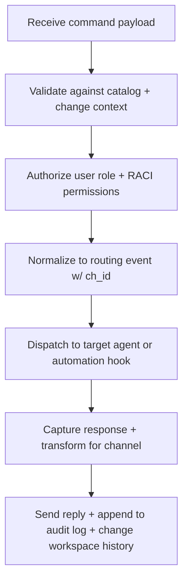

# 🧩 Requirement Elaboration — FR-08

## 1. Summary
Offer CLI/Discord command coverage (`/status`, `/clarify`, `/ack`, `/resolve`, `/approve`, `/deny`, `/df.clarify`, `/df.analyze`, `/df.checklist`) so humans can interact with the change-centric loop in real time and trigger governance/analysis routines.

## 2. Context & Rationale
The spike lives or dies by human perception. FR-08 ensures stakeholders can query progress, clarify intent, trigger `/df.*` checks, and acknowledge outcomes using consistent commands across local CLI and remote Discord stubs. CR002 mandates that these commands surface change lifecycle data, retention status, and traceability gaps so governance decisions remain visible without manual inspection of logs.

## 3. Inputs
| Name | Type / Format | Example | Notes |
|------|----------------|---------|-------|
| `command_payload` | JSON (`pipelines/interaction_stub.py`) | `{"cmd":"/clarify","channel":"cli","text":"Designer: confirm scope","ch_id":"CH-017"}` | Normalized command event. |
| `user_profile` | Dict | `{"handle":"@stakeholder","role":"Human Reviewer","raci_role":"HR"}` | Determines permissions and audit tags. |
| `command_catalog` | YAML (`docs/WORKFLOW.md#commands`) | `/df.checklist: run readiness checklist` | Defines allowed commands + help text. |
| `routing_table` | Python mapping | `{"clarify":"PM","df.checklist":"Implementer"}` | Specifies agent destinations.
| `change_context` | Markdown (`changes/CH-###/status.md`) | `In-Progress` | Used to validate `ch_id` references.

### Edge & Error Inputs
- Unknown command → return contextual help, log `command_error`, and suggest `/help`.
- User without permission issues `/approve` → respond with denial, log attempt, and notify Governance Officer.
- Discord outage (webhook failure) → queue command locally, mark `pending`, and include `retry_after`.
- `/df.*` command triggered without required artifacts → respond with diagnostic message and log FR-07 concern.

## 4. Process Flow

## 5. Outputs
| Format | Example | Consumer |
|--------|---------|----------|
| JSONL | `audit/commands.jsonl` with `{cmd, role, ch_id, maturity_level, outcome}` | Governance, QA |
| Text | CLI/Discord response message | Human stakeholder |
| Markdown | `artifacts/phase1/commands/summary.md` with `/df.*` results | Demo collateral |
| Markdown | `changes/CH-###/status.md` appended with command history | PM, Governance Officer

## 6. Mockups / UI Views (if applicable)
- `artifacts/mockups/FR-08/discord_command_flow.md` — Discord thread example.
- `artifacts/mockups/FR-08/cli_command_flow.md` — CLI session transcript showing `/df.checklist`.

## 6.1 Change & Traceability Links
- `change_refs`: `CH-002`, additional `CH-###` per command session.
- `trace_sections`: `TRACEABILITY.md#fr-08-discord-bridge-commands`, `TRACEABILITY.md#ws-105-interaction-bridge-expansion`, `TRACEABILITY.md#ws-207-interaction-cli-extensions`.
- `artifacts`: `audit/commands.jsonl`, `changes/CH-###/status.md`, `/df.analyze` output.

## 7. Acceptance Criteria
* [ ] Commands `/status`, `/clarify`, `/ack`, `/resolve`, `/approve`, `/deny`, `/df.clarify`, `/df.analyze`, `/df.checklist` implemented with parity between CLI and Discord stub.
* [ ] Help text (`/help`) lists available commands, required roles, and indicates when change context is required.
* [ ] Command invocations append audit records linking to FR IDs, `CH-###`, RACI roles, and record outcomes (`success`, `denied`, `queued`).
* [ ] Error responses provide next-step guidance (e.g., “Run `/df.clarify` to resolve missing traceability links”).

## 8. Dependencies
- FR-09 routing + logging for structured audit entries.
- FR-10 approvals to authorize `/approve`/`/deny`, FR-11 for QA gating, FR-26 for change linkage, FR-28 `/df.*` commands.
- WS-04 interaction stub, WS-105 bridge expansion, WS-207 CLI extensions.

## 9. Risks & Assumptions
- Discord API tokens handled securely; spikes rely on stub but real integration must secure secrets.
- Role mapping must stay consistent with `AGENTS_RACI.md` to prevent privilege gaps.
- High latency responses degrade UX; target <2s round-trip for CLI, <5s for remote webhook.
- `/df.*` commands may produce large outputs; ensure pagination and summarization for Discord.

## 9.1 Retention Notes
- Command responses referencing retained Implementer runs must include link to retained run folder and retention rationale.
- When `/approve` completes and retention is cleared, command log should note purge event for Governance Officer awareness.

## 10. Review Status
| Field | Value |
|-------|-------|
| **Status** | Draft |
| **Reviewed By** | _Unassigned_ |
| **Date** | 2025-11-01 |
| **Linked Change** | CH-002 |
