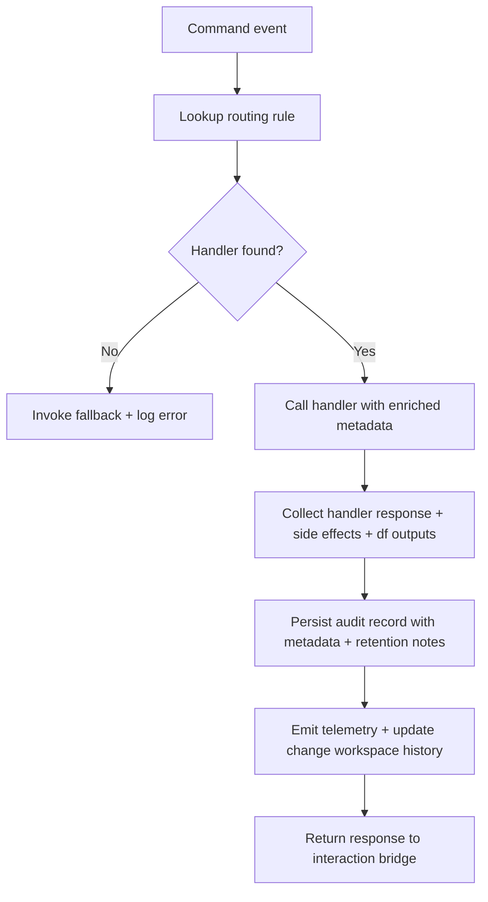

# 🧩 Requirement Elaboration — FR-09

## 1. Summary
Provide reliable command routing and logging so every human interaction (including `/df.*` commands) is captured with change, maturity, and RACI metadata, driving downstream automation and governance visibility.

## 2. Context & Rationale
FR-08 covers command availability; FR-09 ensures those commands trigger the right behaviour and leave an auditable trace. CR002 requires logs to link commands to `CH-###`, record the triggering agent or automation, and expose outputs for `/df.clarify`, `/df.analyze`, `/df.checklist`, and `dynaforge doctor`. Without structured routing/logging the spike would lack traceability, blocking governance reviews and automation.

## 3. Inputs
| Name | Type / Format | Example | Notes |
|------|----------------|---------|-------|
| `command_event` | Dict | `{"cmd":"/status","channel":"cli","args":["ch-017"],"user":"@stakeholder"}` | Normalized command with change context. |
| `routing_rules` | YAML (`pipelines/config/command_routing.yaml`) | `/df.checklist: implementer_checklist_handler` | Maps to handlers. |
| `audit_context` | Dict | `{"fr_id":"FR-09","ch_id":"CH-017","maturity_level":"M2","raci_role":"HR"}` | Metadata for logging and permissions.
| `handler_registry` | Python callable map | `{"pm_status_handler": fn}` | Resolved functions.
| `telemetry_bus` | Async queue (`artifacts/metrics/command_queue.jsonl`) | `{"cmd":"/approve","duration_ms":820}` | Used for metrics emission.

### Edge & Error Inputs
- Missing handler → route to fallback that informs user, logs severity `error`, and recommends `/help`.
- Handler raises exception → capture stack, respond with friendly message including correlation ID, increment failure metric, and raise FR-07 concern if command critical.
- Audit write failure → store to retry queue (`artifacts/phase1/commands/pending.json`), warn operator, and include status in `/status`.
- Invalid `ch_id` reference → respond with guidance to run `/change.list`, mark command `failed`, and log attempted ID for audit.

## 4. Process Flow

## 5. Outputs
| Format | Example | Consumer |
|--------|---------|----------|
| JSONL | `audit/commands.jsonl` entry `{"cmd":"/status","handler":"pm_status_handler","ch_id":"CH-017","outcome":"success"}` | QA, Governance |
| Metrics | `artifacts/metrics/command_counts.csv` / `.json` with durations and outcomes | Observability |
| Markdown | `artifacts/phase1/commands/summary.md` daily digest referencing `/df.*` results | Stakeholders |
| Markdown | `changes/CH-###/status.md` updated with command history | Governance Officer

## 6. Mockups / UI Views (if applicable)
- `artifacts/phase1/screenshots/command_audit_dashboard.md` — Quick-look view of command volume.
- `artifacts/phase1/screenshots/command_failure_flow.md` — Illustration of fallback handling with correlation ID.

## 6.1 Change & Traceability Links
- `change_refs`: `CH-002`, plus individual `CH-###` for command logs.
- `trace_sections`: `TRACEABILITY.md#fr-09-command-audit-trail`, `TRACEABILITY.md#ws-105-interaction-bridge-expansion`, `TRACEABILITY.md#ws-207-interaction-cli-extensions`.
- `artifacts`: `audit/commands.jsonl`, `artifacts/metrics/command_counts.csv`, `changes/CH-###/status.md`.

## 7. Acceptance Criteria
* [ ] All commands registered in routing config resolve to handlers with health checks and record resolver version in audit log.
* [ ] Audit logs include cross-links to handoff IDs and `CH-###` when commands influence agent flow or trigger `/df.*`.
* [ ] Error handling response includes correlation ID surfaced to the human and stored in `audit/commands.jsonl`.
* [ ] Command metrics available via `/status metrics` detailing counts, success rate, median latency, and top failing commands.

## 8. Dependencies
- FR-08 interaction commands pipeline.
- FR-06 logging schema to include command context, FR-26 traceability, FR-28 `/df.*` command semantics.
- WS-02 audit primitives, WS-105 interaction bridge expansion, WS-207 CLI extensions.

## 9. Risks & Assumptions
- Routing config drift may break commands; add validation on startup and automated tests.
- Large command payloads (attachments) may exceed log limits; restrict to text and note risk for future work.
- Duplicate logging must be avoided; ensure idempotent writes with correlation IDs and dedupe logic.
- `/df.*` outputs can be large; ensure logs capture pointers to artifacts instead of raw text.

## 9.1 Retention Notes
- If command results reference retained Implementer runs, log `retained_run_id` and retention rationale.
- Command logs should note when retention is cleared after approvals for full audit trail.

## 10. Review Status
| Field | Value |
|-------|-------|
| **Status** | Draft |
| **Reviewed By** | _Unassigned_ |
| **Date** | 2025-11-01 |
| **Linked Change** | CH-002 |
