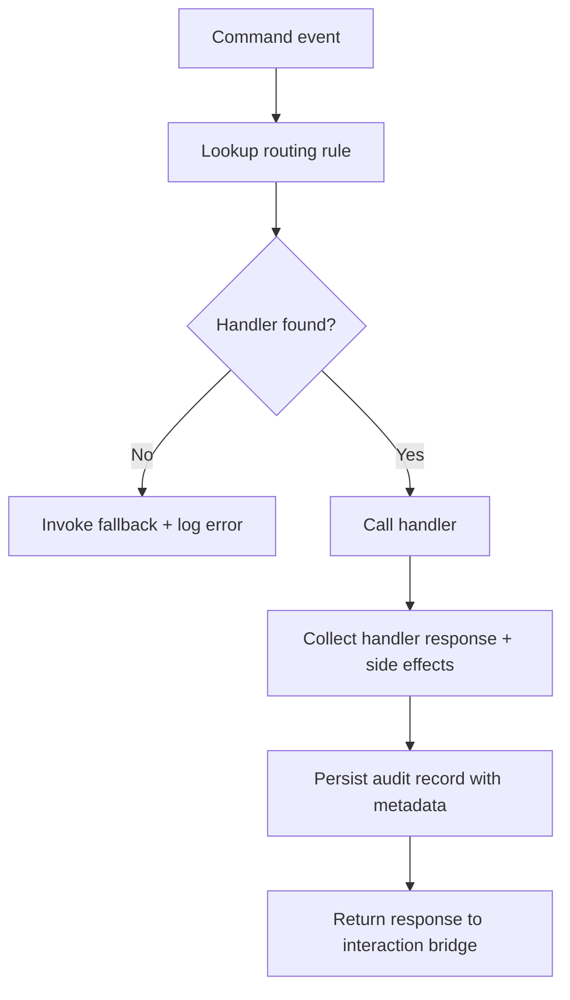

# 🧩 Requirement Elaboration — FR-09

## 1. Summary
Provide reliable command routing and logging so every human interaction is captured, linked to handoffs, and actionable within the MS-01 spike.

## 2. Context & Rationale
FR-08 covers command availability; FR-09 ensures those commands trigger the right behaviour and leave an auditable trace. Without structured routing/logging the spike would lack traceability, blocking governance reviews and automation.

## 3. Inputs
| Name | Type / Format | Example | Notes |
|------|----------------|---------|-------|
| `command_event` | Dict | `{"cmd":"/status","channel":"cli","args":["milestone"]}` | Normalized command. |
| `routing_rules` | YAML (`pipelines/config/command_routing.yaml`) | `/status: pm_status_handler` | Maps to handlers. |
| `audit_context` | Dict | `{"fr_id":"FR-09","change_id":"CH-001"}` | Additional metadata for logging. |
| `handler_registry` | Python callable map | `{"pm_status_handler": fn}` | Resolved functions. |

### Edge & Error Inputs
- Missing handler → route to fallback that informs user and logs severity `error`.
- Handler raises exception → capture stack, respond with friendly message, increment failure metric.
- Audit write failure → store to retry queue (`artifacts/phase1/commands/pending.json`) and warn operator.

## 4. Process Flow

## 5. Outputs
| Format | Example | Consumer |
|--------|---------|----------|
| JSONL | `audit/commands.jsonl` entry `{"cmd":"/status","handler":"pm_status_handler"}` | QA, Governance |
| Metrics | `artifacts/metrics/command_counts.csv` | Observability |
| Markdown | `artifacts/phase1/commands/summary.md` daily digest | Stakeholders |

## 6. Mockups / UI Views (if applicable)
- `artifacts/phase1/screenshots/command_audit_dashboard.md` — Quick-look view of command volume.

## 7. Acceptance Criteria
* [ ] All commands registered in routing config resolve to handlers with health checks.
* [ ] Audit logs include cross-links to handoff IDs when commands influence agent flow.
* [ ] Error handling response includes correlation ID surfaced to the human.
* [ ] Command metrics available via `/status metrics` for demo.

## 8. Dependencies
- FR-08 interaction commands pipeline.
- FR-06 logging schema to include command context.
- WS-02 audit primitives, WS-105 interaction bridge expansion.

## 9. Risks & Assumptions
- Routing config drift may break commands; add validation on startup.
- Large command payloads (attachments) may exceed log limits; spike scope limits to text.
- Duplicate logging must be avoided; ensure idempotent writes with correlation IDs.

## 10. Review Status
| Field | Value |
|-------|-------|
| **Status** | Draft |
| **Reviewed By** | _Unassigned_ |
| **Date** | 2025-10-30 |
| **Linked Change** | Pending |
