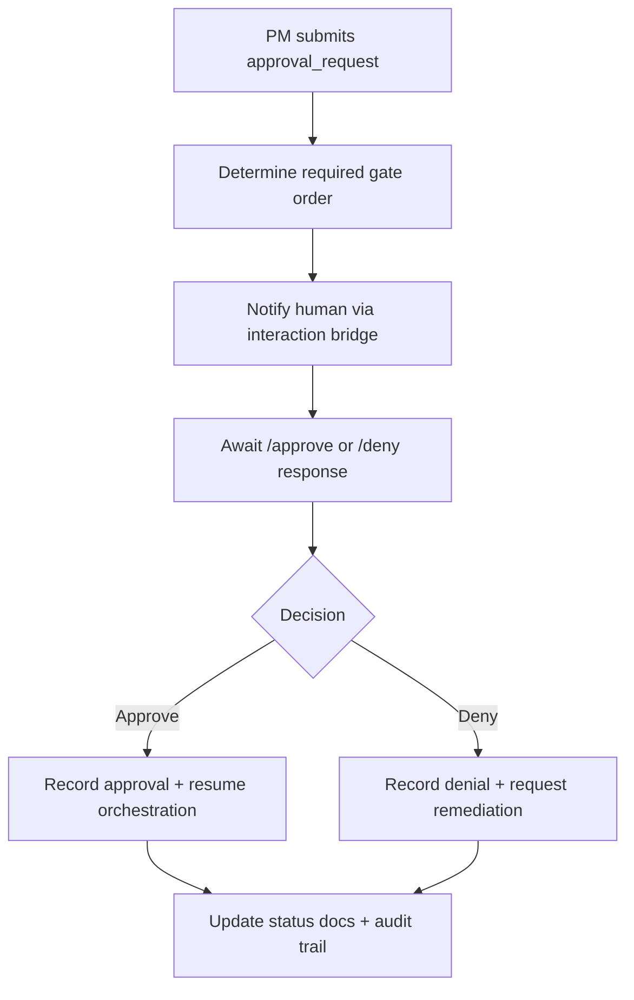

# 🧩 Requirement Elaboration — FR-10

## 1. Summary
Enforce human approval gates across the MS-01 loop, ensuring each change pauses for validation and records the decision path before progressing.

## 2. Context & Rationale
Governance is a core selling point of Dynaforge. FR-10 guarantees human reviewers can approve or deny work at defined checkpoints, with the PM agent respecting those decisions and logging them for audit. Even in the spike, we must show the approval ladder works and prevents unauthorized progression.

## 3. Inputs
| Name | Type / Format | Example | Notes |
|------|----------------|---------|-------|
| `approval_request` | JSON (`artifacts/phase1/approvals/pending.json`) | `{"fr_id":"FR-10","change_id":"CH-001","stage":"Designer Review"}` | Created when PM pauses for review. |
| `command_event` | Dict from FR-08 | `{"cmd":"/approve","user":"@reviewer","note":"Looks good"}` | Human action. |
| `raci_matrix` | Markdown (`docs/AGENTS_RACI.md`) | `Human Reviewer: Approver` | Confirms user permissions. |
| `maturity_policy` | YAML (`MATURITY_LEVEL.yaml`) | `M0: ["Human Reviewer"]` | Defines required gate order per maturity. |

### Edge & Error Inputs
- Unauthorized user attempts approval → system denies, logs attempt, keeps request pending.
- Timeout (no response within SLA) → escalate via `/status blockers` and keep loop paused.
- Denial with remediation note → create follow-up task and prevent auto-resume until addressed.

## 4. Process Flow

## 5. Outputs
| Format | Example | Consumer |
|--------|---------|----------|
| JSONL | `artifacts/phase1/approvals/events.jsonl` decision log | Governance Officer, QA |
| Markdown | `docs/PROJECT_DETAIL.md` approval badges | Stakeholders |
| Text | CLI/Discord confirmation message with correlation ID | Human reviewer |

## 6. Mockups / UI Views (if applicable)
- `artifacts/phase1/screenshots/approval_flow_cli.md` — CLI approval sequence.
- `artifacts/phase1/screenshots/approval_badge.md` — Doc badge showing pending/approved.

## 7. Acceptance Criteria
* [ ] Every handoff that changes requirement status generates an approval request and blocks progression until resolved.
* [ ] Approval events include `{fr_id, ws_id, change_id, reviewer_handle, decision, note}`.
* [ ] Denials trigger PM to reopen Designer/Implementer loop with remediation tasks.
* [ ] Audit log and documentation stay in sync within one orchestration cycle.

## 8. Dependencies
- FR-08 commands (`/approve`, `/deny`).
- FR-06 logging to persist approval events.
- FR-02 documentation to surface badges.
- WS-103 human approval gates, WS-108 demo documentation.

## 9. Risks & Assumptions
- Assumes reviewer identity can be validated against RACI; need environment config for mapping CLI usernames.
- Gate ordering may expand in future maturities; design allows injecting additional checkpoints.
- Excessive approvals could slow loop; consider batching where safe in later phases.

## 10. Review Status
| Field | Value |
|-------|-------|
| **Status** | Draft |
| **Reviewed By** | _Unassigned_ |
| **Date** | 2025-10-30 |
| **Linked Change** | Pending |
