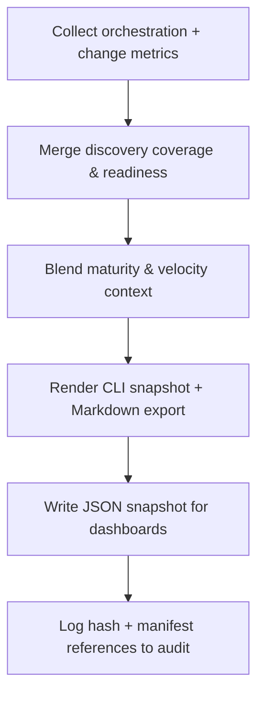

# 🧩 Requirement Elaboration — FR-13

## 1. Summary
Generate deterministic status snapshots (CLI + Markdown) that capture change density, change-to-delivery lag, vision drift indicators, stability ratios, maturity data, and discovery understanding metrics, ensuring stakeholders can quickly assess current system health.

## 2. Context & Rationale
Status snapshots are the rapid heartbeat of Codexa governance. CR003 elevates discovery-first understanding, so `/status` and published snapshots must combine operational telemetry (changes, approvals, QA) with discovery coverage/readiness signals. These outputs feed milestone reviews, audits, and day-to-day decision-making.

## 3. Inputs
| Name | Type / Format | Example | Notes |
|------|----------------|---------|-------|
| `orchestration_state` | JSON (`artifacts/phase1/orchestration/state.json`) | `{"milestone":"MS-02","status":"In Progress"}` | Baseline milestone info. |
| `change_metrics` | YAML (`artifacts/metrics/milestone.yaml`) | `density: 4` | Change density and lag metrics. |
| `discovery_metrics` | YAML (`analysis/metrics/understanding_coverage.yaml`) | `coverage: 0.68` | Understanding coverage & readiness. |
| `discovery_manifests` | YAML/MD (`analysis/system_manifest.yaml`, `analysis/change_zones.md`) | `modules: [...]` | Summaries for active change zones. |
| `maturity_metrics` | JSON (`artifacts/metrics/maturity_overview.json`) | `{"current_level":"M2"}` | Maturity signal. |
| `velocity_metrics` | JSON (`artifacts/metrics/velocity_weekly.json`) | `throughput: 6` | Change velocity context. |
| `governance_alerts` | JSONL (`audit/concerns.jsonl`) | open concerns | Highlight blockers. |

### Edge & Error Inputs
- Missing discovery metrics → snapshot marks coverage as `stale`, raises warning, and prompts PM to rerun discovery.
- Inconsistent timestamps between metrics → normalize to UTC and log discrepancy.
- Large snapshot payloads → provide `--summary` mode to condense output.

## 4. Process Flow

## 5. Outputs
| Format | Example | Consumer |
|--------|---------|----------|
| CLI | `/status` default output + `/status discovery` subcommand | Humans, operators |
| Markdown | `docs/status/SNAPSHOT.md` | Stakeholders, auditors |
| JSON | `artifacts/metrics/status_snapshot.json` | Dashboards, analytics |
| JSONL | `audit/status_snapshots.jsonl` | Governance, audit trail |

## 6. Mockups / UI Views
- `artifacts/mockups/FR-13/status_cli.png` — CLI screenshot showing coverage + readiness.
- `artifacts/mockups/FR-13/status_markdown.md` — Markdown card with change, discovery, maturity sections.

## 6.1 Change & Traceability Links
- `change_refs`: `CH-003`, subsequent `CH-###` entries triggering snapshots.
- `trace_sections`: `TRACEABILITY.md#ws-106-status-snapshots--observability`, `TRACEABILITY.md#fr-13-status-snapshots`, `TRACEABILITY.md#fr-41-understanding-coverage-readiness-metrics`.
- `artifacts`: `docs/status/SNAPSHOT.md`, `analysis/metrics/understanding_coverage.yaml`, `artifacts/metrics/status_snapshot.json`.

## 7. Acceptance Criteria
* [ ] `/status` displays change density, lag, stability ratio, maturity level/time-in-level, discovery coverage %, readiness heatmap summary, and outstanding concerns.
* [ ] Markdown/JSON snapshot regenerated within one orchestration cycle of new discovery metrics, maturity updates, or change approvals.
* [ ] Snapshot includes manifest hashes (`analysis/system_manifest.yaml`) and timestamps so discovery freshness is audit-ready.
* [ ] When discovery metrics are stale, snapshot clearly labels status and issues actionable guidance (e.g., `Run codexa discover --depth quick`).
* [ ] Snapshot artifacts recorded in audit log with SHA and linked change IDs.

## 8. Dependencies
- FR-02 status documentation integration.
- FR-30 velocity metrics, FR-36 maturity metrics, FR-38 discovery pipeline, FR-39 System Model Graph, FR-41 understanding coverage.
- WS-106 Status Snapshots & Observability, WS-09 Discovery Foundations, WS-306 Maturity Metrics & Snapshots.

## 9. Risks & Assumptions
- Overloading CLI output can reduce readability; provide toggles for verbose/summary plus targeted subcommands (`/status discovery`).
- Metrics pipelines must remain fast (<3s) for CLI usage; implement caching.
- If discovery runs fail, snapshot must fall back gracefully while blocking approvals until refreshed.

## 9.1 Retention Notes
- Snapshots themselves are lightweight, but they reference manifests and metrics; ensure referenced files stay available until superseded. Archive historical snapshots for at least 90 days to support audit timelines.

## 10. Review Status
| Field | Value |
|-------|-------|
| **Status** | Draft |
| **Reviewed By** | _Pending_ |
| **Date** | 2025-11-04 |
| **Linked Change** | CH-003 |
