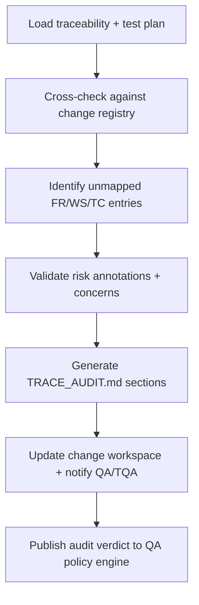

# 🧩 Requirement Elaboration — FR-17

## 1. Summary
Introduce a QA Auditor agent that scans traceability artifacts, generates gap reports, enforces risk-tier annotations, and updates requirement statuses so governance decisions rely on current coverage data.

## 2. Context & Rationale
CR002 expands documentation and change governance. The QA Auditor validates that every requirement, workstream, and test remains linked to relevant `CH-###` entries and elaborations. By publishing `TRACE_AUDIT.md` and driving `/df.analyze` outputs, it provides the Governance Officer and QA policy engine with the assurance that no orphaned elements exist before approvals.

## 3. Inputs
| Name | Type / Format | Example | Notes |
|------|----------------|---------|-------|
| `traceability_matrix` | Markdown (`TRACEABILITY.md`) | Phase/WS tables | Base dataset. |
| `test_plan` | Markdown (`tests/TEST_PLAN.md`) | Risk/depth tables | QA documentation reference. |
| `change_registry` | Markdown (`CHANGELOG.md`) | `CH-017` entry | Connects traceability to change objects. |
| `df_analyze_output` | JSON (`artifacts/analyze/df.analyze.json`) | `{"unmapped_frs":["FR-17"]}` | Automated detection hints. |
| `concern_registry` | JSON (`artifacts/phase1/concerns/open.json`) | `{"id":"C-030","fr_id":"FR-05"}` | Ensures unresolved concerns surface in audit. |

### Edge & Error Inputs
- Traceability file missing sections → QA Auditor regenerates baseline table skeleton and flags manual review.
- Unmapped FR persists across two runs → escalate severity and block QA policy PASS verdict.
- Test plan unreachable → log blocking issue, raise FR-05/TQA action item, and mark requirement `PARTIAL`.

## 4. Process Flow

## 5. Outputs
| Format | Example | Consumer |
|--------|---------|----------|
| Markdown | `docs/TRACE_AUDIT.md` with `### Unmapped Elements` | Governance Officer, QA policy engine |
| JSON | `artifacts/phase3/qa_audit/summary.json` | Analytics, PM |
| Markdown | `TRACEABILITY.md` patched rows with `audit_status` field | Stakeholders |
| JSONL | `audit/qa_auditor.jsonl` events | Audit log |

## 6. Mockups / UI Views (if applicable)
- `artifacts/mockups/FR-17/qa_audit_unmapped.md` — Example gap table.
- `artifacts/mockups/FR-17/qa_audit_dashboard.md` — Visualization for presentations.

## 6.1 Change & Traceability Links
- `change_refs`: `CH-002`, plus specific `CH-###` referenced in gap reports.
- `trace_sections`: `TRACEABILITY.md#ws-301-qa-auditor--traceability-gaps`, `TRACEABILITY.md#fr-17-qa-auditor-agent`.
- `artifacts`: `docs/TRACE_AUDIT.md`, `TRACEABILITY.md`, `artifacts/phase3/qa_audit/summary.json`.

## 7. Acceptance Criteria
* [ ] QA Auditor outputs list `{fr_id, ws_id, tc_id, ch_id?, gap_type, severity, owner, due_date}` for all gaps.
* [ ] Gaps automatically generate FR-07 concerns when severity ≥ medium and no owner assigned.
* [ ] Traceability updates include `audit_status` column reflecting `OK`, `Gap`, or `Pending`.
* [ ] `/df.analyze` sees zero unmapped elements after QA Auditor run; otherwise, QA Auditor entry explains outstanding work.

## 8. Dependencies
- FR-26 bidirectional traceability, FR-05/TQA documentation, FR-11 QA policy gating.
- FR-07 concern lifecycle for unresolved gaps, FR-23 orchestration to schedule audits.
- WS-301 QA Auditor & Traceability Gaps workstream.

## 9. Risks & Assumptions
- Excessive false positives may reduce trust—add suppression for known exceptions with expiry dates.
- Large traceability files should be parsed efficiently; implement incremental diff to avoid full rewrites.
- Requires consistent naming conventions (FR/WS/TC) or mapping table maintained by RA agent.

## 9.1 Retention Notes
- When gaps relate to retained runs, document `retained_run_id` and provide context so Governance Officer knows when purge is safe.
- Once gaps resolve, QA Auditor logs purge status or confirms retention still required for audit trail.

## 10. Review Status
| Field | Value |
|-------|-------|
| **Status** | Draft |
| **Reviewed By** | _Unassigned_ |
| **Date** | 2025-11-01 |
| **Linked Change** | CH-002 |
