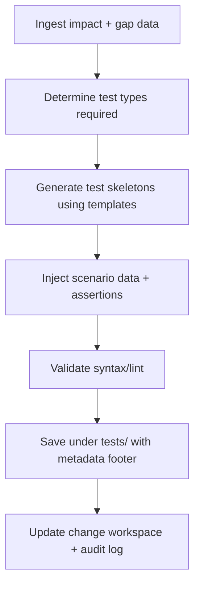

# 🧩 Requirement Elaboration — FR-18

## 1. Summary
Provide a Test Synthesizer agent that generates or updates `TC-*` artifacts aligned with Impact Assessor and QA Auditor findings, ensuring every requirement change ships with up-to-date automated tests.

## 2. Context & Rationale
Automated test coverage underpins QA policy and governance approvals. When RA/IA/QA audits detect new scope or gaps, the Test Synthesizer must produce candidate tests (unit, integration, scenario) linked to the active `CH-###`. This accelerates Implementer and Tester workflows while keeping traceability intact.

## 3. Inputs
| Name | Type / Format | Example | Notes |
|------|----------------|---------|-------|
| `impact_summary` | JSON (`artifacts/phase2/impact/CH-###.json`) | `{"affected_components":["audit/logger.py"]}` | Guides test creation scope. |
| `qa_gap_report` | Markdown (`docs/TRACE_AUDIT.md`) | `- FR-18 missing regression tests` | Identifies required tests. |
| `existing_tests` | Directory listing (`tests/TC-FR18-*`) | `TC-FR18-001.md` | For diff-aware updates. |
| `code_context` | Source tree snapshot | `audit/logger.py` | Provides implementation details. |
| `test_templates` | Markdown/Jinja (`tests/templates/*`) | `template_regression.md` | Standardizes outputs. |

### Edge & Error Inputs
- Conflicting templates or naming collisions → Synthesizer aborts, logs error, and requests manual intervention.
- Generated test fails static analysis → mark as draft, attach lint results, and notify Implementer.
- Coverage already sufficient → Synthesizer records “no action required” entry with justification.

## 4. Process Flow

## 5. Outputs
| Format | Example | Consumer |
|--------|---------|----------|
| Markdown / Code | `tests/TC-FR18-002.md` or `.py` | Implementer, Tester, QA |
| Markdown | `changes/CH-###/impact.md` test summary | PM, Governance Officer |
| JSON | `artifacts/phase3/test_synthesizer/summary.json` | QA policy engine |
| JSONL | `audit/test_synthesizer.jsonl` | Audit trail |

## 6. Mockups / UI Views (if applicable)
- `artifacts/phase3/screenshots/test_synth_diff.md` — Example generated test diff.
- `artifacts/phase3/screenshots/test_template_preview.md` — Template snippet for review.

## 6.1 Change & Traceability Links
- `change_refs`: `CH-002`, plus active `CH-###` requiring tests.
- `trace_sections`: `TRACEABILITY.md#ws-302-test-synthesizer--quality-depth`, `TRACEABILITY.md#fr-18-test-synthesizer-agent`.
- `artifacts`: `tests/`, `changes/CH-###/impact.md`, `artifacts/phase3/test_synthesizer/summary.json`.

## 7. Acceptance Criteria
* [ ] New or updated tests include metadata footer `{fr_id, ch_id, risk_tier, generated_by}`.
* [ ] Synthesizer avoids overwriting manually curated tests unless explicitly permitted (flag or allowlist).
* [ ] Generated tests pass lint or validation checks; failures block commit and notify Implementer.
* [ ] QA policy engine receives summary entry with coverage deltas and updated counts within current change cycle.

## 8. Dependencies
- FR-16 Impact Assessor for scope guidance.
- FR-17 QA Auditor for gap detection.
- FR-19 TQA metrics to determine required depth, FR-11 QA policy gating.
- WS-302 Test Synthesizer & Quality Depth workstream.

## 9. Risks & Assumptions
- Automated tests may require domain knowledge; provide hooks for human review before activation.
- Large-scale generation could clutter repo; implement optional `--retain-drafts` switch to separate drafts vs approved tests.
- Template drift can lead to inconsistent formatting; enforce central template repository.

## 9.1 Retention Notes
- Synthesizer references Implementer runs when tests depend on retained artifacts (e.g., captured fixtures). Document those IDs and remove references once purge occurs.

## 10. Review Status
| Field | Value |
|-------|-------|
| **Status** | Draft |
| **Reviewed By** | _Unassigned_ |
| **Date** | 2025-11-01 |
| **Linked Change** | CH-002 |
