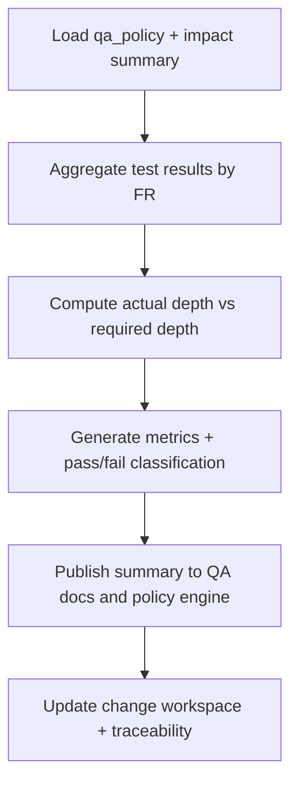

# 🧩 Requirement Elaboration — FR-19

## 1. Summary
Establish a Test Quality Assessor (TQA) capability that calculates risk-tier coverage metrics, required depth versus actual tests, and feeds both QA documentation and policy engines with authoritative data.

## 2. Context & Rationale
Codexa’s governance relies on demonstrating adequate test depth for each risk tier. The TQA agent ingests test execution results, counts scenario coverage, and generates summaries referenced by FR-05 and FR-11. By providing structured metrics, it ensures QA policy gating decisions are evidence-based and traceability reports stay accurate.

## 3. Inputs
| Name | Type / Format | Example | Notes |
|------|----------------|---------|-------|
| `qa_policy` | YAML (`QA_POLICY.yaml`) | `risk_tiers.high.min_depth: 3` | Defines minimum coverage. |
| `test_results` | JSON/JUnit (`artifacts/phase1/tests/results.json`) | `{"TC-FR19-001":{"status":"pass"}}` | Execution evidence. |
| `test_catalog` | Markdown (`tests/TEST_PLAN.md`) | Depth annotations per FR | Baseline for counting. |
| `impact_summary` | JSON (`artifacts/phase2/impact/CH-###.json`) | `{"risk_tier":"high"}` | Determines expected depth. |
| `retention_metadata` | JSON (`artifacts/work/CH-###/summary.json`) | `{"retained":false}` | Ensures metrics align with retained runs. |

### Edge & Error Inputs
- Missing test results → TQA marks coverage as `unknown`, logs FR-07 concern, and blocks QA PASS verdict.
- Inconsistent risk tiers between policy and impact summary → TQA highlights discrepancy and requests PM review.
- Tests failing → coverage reported but flagged `degraded`, prompting Implementer remediation.

## 4. Process Flow

## 5. Outputs
| Format | Example | Consumer |
|--------|---------|----------|
| JSON | `artifacts/phase3/tqa/coverage.json` | QA policy engine, PM |
| Markdown | `tests/TEST_PLAN.md` depth tables | Testers, Governance Officer |
| Markdown | `docs/TEST_QUALITY_SUMMARY.md` (optional) | Stakeholders |
| JSONL | `audit/tqa.jsonl` metric events | Audit |

## 6. Mockups / UI Views (if applicable)
- `artifacts/mockups/FR-19/tqa_dashboard.md` — Depth visualization.
- `artifacts/mockups/FR-19/tqa_gap_card.md` — Example gap entry.

## 6.1 Change & Traceability Links
- `change_refs`: `CH-002`, plus `CH-###` being evaluated.
- `trace_sections`: `TRACEABILITY.md#ws-302-test-synthesizer--quality-depth`, `TRACEABILITY.md#fr-19-test-quality-assessor`.
- `artifacts`: `tests/TEST_PLAN.md`, `artifacts/phase3/tqa/coverage.json`, `changes/CH-###/impact.md`.

## 7. Acceptance Criteria
* [ ] Coverage summary lists `{fr_id, risk_tier, required_depth, actual_depth, status, failing_tests[]}` for each FR touched by the change.
* [ ] Metrics integrate with FR-05 documentation and FR-11 QA policy evaluation within the same orchestration cycle.
* [ ] High-risk deficits automatically raise FR-07 concerns and annotate `CH-###/status.md`.
* [ ] `/status qa` exposes latest TQA summary with color-coded verdicts.

## 8. Dependencies
- FR-05 Tester documentation, FR-11 QA policy engine, FR-18 Test Synthesizer outputs.
- FR-26 traceability for mapping tests ↔ FR ↔ changes.
- WS-302 Test Synthesizer & Quality Depth workstream.

## 9. Risks & Assumptions
- Requires reliable mapping between tests and FRs; maintain metadata footers to avoid drift.
- False negatives can occur if tests not tagged; enforce naming conventions via linting.
- High data volume may slow computations; consider caching results per change.

## 9.1 Retention Notes
- TQA must record whether metrics draw from retained Implementer runs so Governance Officer knows when to revisit coverage after purge.
- When retained runs purge, TQA regenerates metrics and documents new summary revision.

## 10. Review Status
| Field | Value |
|-------|-------|
| **Status** | Draft |
| **Reviewed By** | _Unassigned_ |
| **Date** | 2025-11-01 |
| **Linked Change** | CH-002 |
