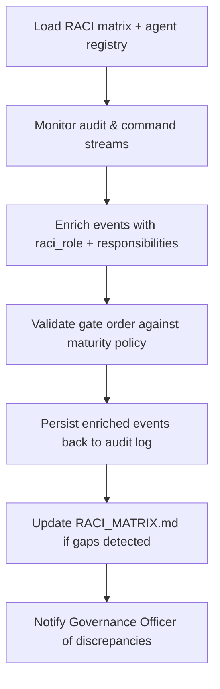

# 🧩 Requirement Elaboration — FR-20

## 1. Summary
Maintain an advisory AI RACI matrix and propagate `raci_role` metadata into audit logs, approval records, and change artifacts so accountability remains explicit across the governance flow.

## 2. Context & Rationale
Dynaforge relies on clearly documented responsibilities. CR002 expands the agent ecosystem and approval ladder, requiring every action (commands, handoffs, approvals) to identify the responsible role. FR-20 ensures the RACI matrix stays current, feeds automation, and that audit entries carry the metadata needed for compliance reviews.

## 3. Inputs
| Name | Type / Format | Example | Notes |
|------|----------------|---------|-------|
| `raci_matrix` | Markdown (`docs/AGENTS_RACI.md`) | `| FR-20 | PM | GO |` | Canonical RACI definitions. |
| `audit_event` | JSON (`audit/handoffs.jsonl`) | `{"actor":"GO","action":"approve"}` | Target for enrichment. |
| `command_event` | JSON (`audit/commands.jsonl`) | `{"user":"@stakeholder","cmd":"/approve"}` | Needs `raci_role` mapping. |
| `approval_policy` | YAML (`PROJECT_METADATA.md`) | `roles: ["IA","GO","PM","HR"]` | Confirms gate order. |
| `agent_registry` | JSON (`artifacts/agents/registry.json`) | `{"governance_officer":{"handle":"@go"}}` | Connects identities to roles. |

### Edge & Error Inputs
- RACI matrix missing entry for new FR → block change progression until updated, raise FR-07 concern.
- Actor not found in registry → log warning, default to `Unknown` role, and request governance update.
- Conflicting role assignments → detection routine raises manual review task for Governance Officer.

## 4. Process Flow

## 5. Outputs
| Format | Example | Consumer |
|--------|---------|----------|
| Markdown | `docs/AGENTS_RACI.md` updated table | Stakeholders |
| JSONL | `audit/raci_enriched.jsonl` or enriched fields in existing logs | Governance Officer, Compliance |
| Markdown | `changes/CH-###/status.md` decision history with roles | PM, HR |
| JSON | `artifacts/phase2/raci/validation.json` | Automation hooks |

## 6. Mockups / UI Views (if applicable)
- `artifacts/phase2/screenshots/raci_dashboard.md` — Role coverage overview.
- `artifacts/phase2/screenshots/approval_raci_callout.md` — Example of enriched approval entry.

## 6.1 Change & Traceability Links
- `change_refs`: `CH-002`, plus `CH-###` containing role changes or approvals.
- `trace_sections`: `TRACEABILITY.md#ws-206-change-records--audit-extensions`, `TRACEABILITY.md#fr-20-raci-metadata-propagation`.
- `artifacts`: `docs/AGENTS_RACI.md`, `audit/*.jsonl`, `changes/CH-###/status.md`.

## 7. Acceptance Criteria
* [ ] Every audit entry includes `raci_role` and `responsibility` fields derived from `AGENTS_RACI.md`.
* [ ] RACI validation job fails CI if a new FR lacks RACI mapping or if gate order deviates from `PROJECT_METADATA.md`.
* [ ] `/df.checklist` verifies RACI coverage for the change before approvals proceed.
* [ ] Governance Officer receives automated summary when discrepancies or unmapped actors are detected.

## 8. Dependencies
- FR-06 audit logging, FR-10 approval gates, FR-24 command routing.
- FR-32 project metadata for maturity-based gate order.
- WS-206 Change Records & Audit Extensions workstream.

## 9. Risks & Assumptions
- Manual edits to `AGENTS_RACI.md` may break parsing—enforce schema with lint.
- Role mapping must stay in sync with identity providers (CLI handles, Discord IDs).
- Overlapping responsibilities can confuse automation; ensure matrix clarifies decision vs consultation roles.

## 9.1 Retention Notes
- RACI metadata does not require special retention, but references to retained runs must include the responsible role for audit context.

## 10. Review Status
| Field | Value |
|-------|-------|
| **Status** | Draft |
| **Reviewed By** | _Unassigned_ |
| **Date** | 2025-11-01 |
| **Linked Change** | CH-002 |
