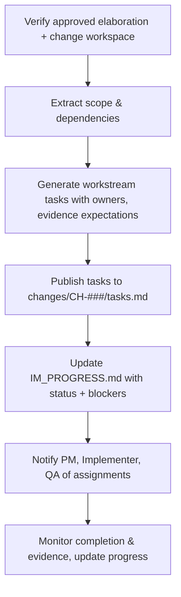

# 🧩 Requirement Elaboration — FR-21

## 1. Summary
Introduce an Implementation Manager (IM) agent that decomposes approved requirements into `WS-*` tasks, tracks execution evidence, and publishes `IM_PROGRESS.md` aligned with change-centric governance.

## 2. Context & Rationale
With elaborations approved and RA/IA analyses complete, the IM agent operationalises work—breaking requirements into executable workstreams, ensuring Implementer loops map back to `CH-###`, and aggregating progress for PM and Governance Officer review. CR002 requires the IM to honour staged approvals and retention policies while keeping stakeholders informed through structured progress reports.

## 3. Inputs
| Name | Type / Format | Example | Notes |
|------|----------------|---------|-------|
| `approved_elaboration` | Markdown (`docs/requirements/elaborations/FR-21_elaboration.md`) | `status: Approved` | Confirms readiness. |
| `change_workspace` | Markdown (`changes/CH-###/tasks.md`) | Proposed tasks | Source and destination. |
| `impact_report` | Markdown (`docs/IMPACT_REPORT.md`) | `## CH-017` | Provides dependency insights. |
| `qa_requirements` | JSON (`artifacts/phase3/tqa/coverage.json`) | Coverage goals | Ensures tasks include QA activities. |
| `project_metadata` | YAML (`PROJECT_METADATA.md`) | `maturity_level: M2` | Determines required oversight. |

### Edge & Error Inputs
- Elaboration not approved → IM refuses to create tasks, logs FR-37 violation, and notifies PM.
- Task decomposition exceeds maturity allowances (e.g., missing governance gate) → flagged and escalated to Governance Officer.
- Change workspace missing → IM initialises structure and records action in audit log.

## 4. Process Flow

## 5. Outputs
| Format | Example | Consumer |
|--------|---------|----------|
| Markdown | `changes/CH-###/tasks.md` structured task list | Implementer, QA |
| Markdown | `docs/IM_PROGRESS.md` status board | PM, Governance Officer |
| JSON | `artifacts/phase2/im/CH-###.json` progress snapshot | Analytics |
| JSONL | `audit/implementation_manager.jsonl` | Audit |

## 6. Mockups / UI Views (if applicable)
- `artifacts/mockups/FR-21/im_task_table.md` — Sample task layout.
- `artifacts/mockups/FR-21/im_progress_board.md` — Progress report view.

## 6.1 Change & Traceability Links
- `change_refs`: `CH-002`, plus each `CH-###` under execution.
- `trace_sections`: `TRACEABILITY.md#ws-203-implementation-management`, `TRACEABILITY.md#fr-21-implementation-manager-agent`.
- `artifacts`: `changes/CH-###/tasks.md`, `docs/IM_PROGRESS.md`, `audit/implementation_manager.jsonl`.

## 7. Acceptance Criteria
* [ ] Task entries include `{task_id, fr_id, ch_id, owner, required_evidence, status, next_review}`.
* [ ] IM tracks evidence references (commits, test artifacts) and auto-updates `IM_PROGRESS.md` when Implementer runs finish.
* [ ] Blocked tasks (approvals, QA gaps) automatically open FR-07 concerns.
* [ ] `/status ch-###` summarises IM progress using latest IM snapshot.

## 8. Dependencies
- FR-37 elaboration approvals, FR-16 impact reports, FR-26 traceability.
- FR-27 retention to capture evidence availability.
- WS-203 Implementation Management, WS-205 change router for notifications.

## 9. Risks & Assumptions
- Poor task granularity could overwhelm Implementer; adjust heuristics based on historical cycle time.
- Requires reliable owner mapping to agents/humans; derive from RACI matrix.
- Ensure IM handles mid-flight requirement updates gracefully by re-syncing with RA outputs.

## 9.1 Retention Notes
- IM tracks which tasks depend on retained runs; progress report should flag tasks awaiting retained evidence to prevent premature purges.

## 10. Review Status
| Field | Value |
|-------|-------|
| **Status** | Draft |
| **Reviewed By** | _Unassigned_ |
| **Date** | 2025-11-01 |
| **Linked Change** | CH-002 |
