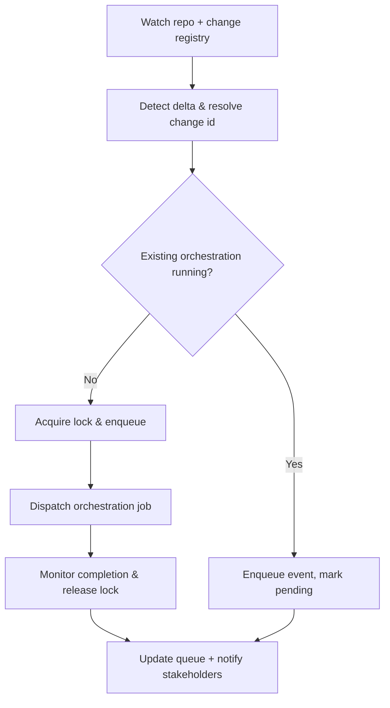

# 🧩 Requirement Elaboration — FR-23

## 1. Summary
Implement automated triggers that detect requirement or documentation changes and launch the RA→IA→IM→QA→TQA→GO→PM orchestration loop without manual intervention.

## 2. Context & Rationale
Change-centric governance depends on timely orchestration. FR-23 ensures watchers observe `docs/`, `changes/`, and `requirements/` directories, queuing runs that update analyses, tasks, QA assessments, and approvals whenever new deltas appear. This reduces latency between change creation and governance review.

## 3. Inputs
| Name | Type / Format | Example | Notes |
|------|----------------|---------|-------|
| `watch_config` | YAML (`configs/change_router.yaml`) | directories + patterns | Defines watched paths. |
| `git_diff` | CLI output (`git diff --name-only`) | `docs/requirements/...` | Detects staged/committed changes. |
| `change_registry` | Markdown (`CHANGELOG.md`) | `CH-017` entry | Maps file diffs to change IDs. |
| `orchestration_queue` | JSON (`artifacts/phase2/router/queue.json`) | pending jobs | Maintains trigger queue. |
| `lock_state` | JSON (`artifacts/phase2/router/locks.json`) | `{"ch_id":"CH-017","status":"running"}` | Prevents duplicate runs. |

### Edge & Error Inputs
- File change without change workspace mapping → router creates placeholder `CH-???` entry and alerts PM.
- Queue backlog > threshold → router notifies PM/GO and prioritizes critical changes (e.g., production hotfixes).
- Trigger failure mid-run → router retries with exponential backoff and logs incident.

## 4. Process Flow

## 5. Outputs
| Format | Example | Consumer |
|--------|---------|----------|
| JSON | `artifacts/phase2/router/queue.json` | PM, Implementer |
| JSON | `artifacts/phase2/router/events.jsonl` | Audit trail |
| Markdown | `changes/CH-###/status.md` with trigger history | Governance Officer |
| Logs | `artifacts/phase2/router/run-*.log` | Observability |

## 6. Mockups / UI Views (if applicable)
- `artifacts/phase2/screenshots/change_router_dashboard.md` — Queue visualization.
- `artifacts/phase2/screenshots/router_cli_status.md` — CLI summary.

## 6.1 Change & Traceability Links
- `change_refs`: `CH-002`, plus each `CH-###` triggered.
- `trace_sections`: `TRACEABILITY.md#ws-205-change-router--orchestration`, `TRACEABILITY.md#fr-23-automated-orchestration-triggers`.
- `artifacts`: `artifacts/phase2/router/queue.json`, `changes/CH-###/status.md`.

## 7. Acceptance Criteria
* [ ] Router detects requirement/elaboration/change workspace updates within five minutes and enqueues orchestration jobs.
* [ ] Queue entries record `{ch_id, trigger_type, files, initiated_by, timestamp}` and clear once loop completes.
* [ ] Router prevents concurrent orchestration for the same `CH-###` unless flagged `allow_parallel`.
* [ ] `/status router` summarises pending jobs and latest outcomes.

## 8. Dependencies
- FR-15/16/17/18/19 agents invoked by orchestration.
- FR-27 retention awareness (router avoids purging while jobs active).
- CI or daemon infrastructure for continuous watchers.
- WS-205 Change Router & Orchestration workstream.

## 9. Risks & Assumptions
- Excessive triggers from documentation churn could flood queue; implement debounce and change grouping.
- Requires reliable mapping from file paths to `CH-###`; RA agent must maintain registry.
- Infrastructure outages should degrade gracefully—manual trigger fallback recommended.

## 9.1 Retention Notes
- Router includes retention status in queue record when orchestrations depend on retained runs, preventing premature cleanup until job completion.

## 10. Review Status
| Field | Value |
|-------|-------|
| **Status** | Draft |
| **Reviewed By** | _Unassigned_ |
| **Date** | 2025-11-01 |
| **Linked Change** | CH-002 |
