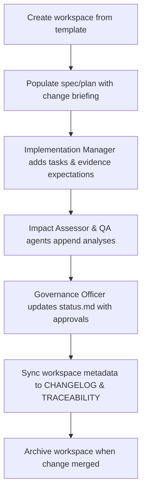

# 🧩 Requirement Elaboration — FR-25

## 1. Summary
Maintain structured change workspaces under `changes/CH-###/` containing `spec.md`, `plan.md`, `tasks.md`, `impact.md`, `evidence.json`, and `status.md`, ensuring every change stays synchronized with downstream artifacts.

## 2. Context & Rationale
Change workspaces are the backbone of the governance flow. They collect all signals—requirements scope, plans, tasks, impact analysis, QA evidence, approvals—into a single directory that agents can read and update. CR002 standardises the layout and enforces ownership between Implementation Manager and Governance Officer.

## 3. Inputs
| Name | Type / Format | Example | Notes |
|------|----------------|---------|-------|
| `workspace_template` | YAML (`configs/change_workspace_template.yaml`) | directory/file schema | Used for scaffolding. |
| `change_request` | CLI (`/change.new`) payload | `{"summary":"Expand audit logging"}` | Kickstarts workspace. |
| `artifact_updates` | Various (Markdown/JSON) | `impact.md`, `evidence.json` updates | Maintains content. |
| `approval_events` | JSONL (`artifacts/phase1/approvals/events.jsonl`) | Stage decisions | Update `status.md`. |
| `retention_metadata` | JSON (`artifacts/work/CH-###/summary.json`) | purge / retain info | Sync retention decisions. |

### Edge & Error Inputs
- Missing required files → workspace lifecycle fails, automation regenerates template and raises warning.
- Concurrent edits cause drift → detection script merges changes or flags manual reconciliation.
- Workspace orphaned (no linked FR) → RA agent marks for archival review before deletion.

## 4. Process Flow

## 5. Outputs
| Format | Example | Consumer |
|--------|---------|----------|
| Directory | `changes/CH-017/` | All agents/humans |
| Markdown | `changes/CH-###/status.md` lifecycle log | PM, GO, HR |
| JSON | `changes/CH-###/evidence.json` hashed artifact references | Audit |
| Markdown | `CHANGELOG.md` entry referencing workspace | Stakeholders |

## 6. Mockups / UI Views (if applicable)
- `artifacts/phase2/screenshots/change_workspace_structure.md` — Directory layout.
- `artifacts/phase2/screenshots/change_status_timeline.md` — Example timeline.

## 6.1 Change & Traceability Links
- `change_refs`: `CH-002`, plus each `CH-###` managed.
- `trace_sections`: `TRACEABILITY.md#ws-203-implementation-management`, `TRACEABILITY.md#fr-25-change-workspace-management`.
- `artifacts`: `changes/CH-###/`, `CHANGELOG.md`, `TRACEABILITY.md`.

## 7. Acceptance Criteria
* [ ] Workspace scaffolding creates required files with default headers referencing `fr_id`/`ch_id`.
* [ ] `status.md` tracks lifecycle states and approvals with timestamps and responsible roles.
* [ ] Evidence entries (`evidence.json`) include artifact hashes, retention status, and audit references.
* [ ] Workspace archival updates `CHANGELOG.md` and removes watchers, retaining history in `_archive/` if configured.

## 8. Dependencies
- FR-21 Implementation Manager (tasks), FR-16 impact reports, FR-22 governance, FR-27 retention.
- FR-26 traceability for cross-linking.
- WS-203 Implementation Management for operational ownership.

## 9. Risks & Assumptions
- Misconfigured templates can cascade errors; enforce CI checks verifying workspace integrity.
- Large evidence files should remain outside workspace (referenced via hash) to avoid repo bloat.
- Requires discipline to avoid manual edits outside automated sections—add linting.

## 9.1 Retention Notes
- Record retained Implementer runs and purge decisions in `status.md` and `evidence.json` for transparency.
- On merge, ensure retention status resolves (purged or retained with justification) before archiving workspace.

## 10. Review Status
| Field | Value |
|-------|-------|
| **Status** | Draft |
| **Reviewed By** | _Unassigned_ |
| **Date** | 2025-11-01 |
| **Linked Change** | CH-002 |
