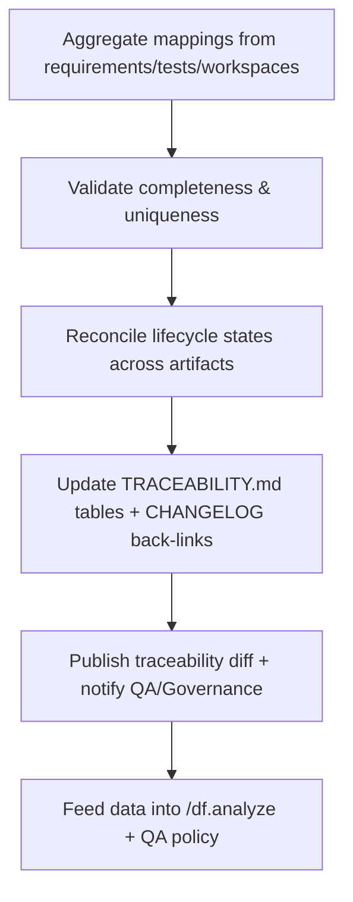

# 🧩 Requirement Elaboration — FR-26

## 1. Summary
Enforce bidirectional traceability between functional requirements, workstreams, test cases, and change objects, capturing lifecycle states from Draft through Merged for every `CH-###`.

## 2. Context & Rationale
Traceability is the connective tissue of Codexa. CR002 mandates that all artifacts (requirements, workstreams, tests, approvals) link to change objects and vice versa. By maintaining consistent metadata, reports, and audit logs, FR-26 provides the Governance Officer and QA agents with confidence that no work proceeds without recorded lineage.

## 3. Inputs
| Name | Type / Format | Example | Notes |
|------|----------------|---------|-------|
| `requirements_registry` | Markdown (`TRACEABILITY.md`) | overview table | Primary dataset. |
| `change_registry` | Markdown (`CHANGELOG.md`) | `CH-017` entry | Reverse mapping. |
| `test_catalog` | Markdown (`tests/TEST_PLAN.md`) | Test entries with FR IDs | Test linkage. |
| `workspace_status` | Markdown (`changes/CH-###/status.md`) | lifecycle state | Change state. |
| `elaboration_headers` | YAML (elaboration files) | `fr_id: FR-26` | Additional metadata. |

### Edge & Error Inputs
- Missing linkage detected via `/df.clarify` → traceability update flagged, FR-07 concern raised.
- Lifecycle state mismatch (status.md vs traceability) → auto-correct or request human confirmation.
- Duplicate change references for same FR with conflicting states → escalate to Governance Officer.

## 4. Process Flow

## 5. Outputs
| Format | Example | Consumer |
|--------|---------|----------|
| Markdown | `TRACEABILITY.md` updated tables with `ch_id` column | PM, QA |
| Markdown | `CHANGELOG.md` entries cross-linking FR/WS/TC | Stakeholders |
| JSON | `artifacts/phase2/traceability/index.json` | Automation |
| JSONL | `audit/traceability.jsonl` | Audit trail |

## 6. Mockups / UI Views (if applicable)
- `artifacts/phase2/screenshots/traceability_matrix_view.md`
- `artifacts/phase2/screenshots/change_to_fr_mapping.md`

## 6.1 Change & Traceability Links
- `change_refs`: `CH-002`, plus each `CH-###` tracked.
- `trace_sections`: `TRACEABILITY.md#ws-206-change-records--audit-extensions`, `TRACEABILITY.md#fr-26-bidirectional-change-traceability`.
- `artifacts`: `TRACEABILITY.md`, `CHANGELOG.md`, `changes/CH-###/status.md`.

## 7. Acceptance Criteria
* [ ] Each FR row lists associated `CH-###`, workstreams, tests, lifecycle state, and last-updated timestamp.
* [ ] Each change entry references impacted FR/WS/TC, current lifecycle state, and approval status.
* [ ] Traceability jobs fail if any artifact lacks reciprocal link; failure raises FR-07 concern.
* [ ] `/df.analyze` passes only when traceability dataset is consistent and no duplicates remain.

## 8. Dependencies
- FR-15 RA outputs, FR-16 impact, FR-17 QA audit, FR-25 workspace management.
- FR-28 `/df.*` analysis commands.
- WS-206 Change Records & Audit Extensions.

## 9. Risks & Assumptions
- Manual edits to traceability can break structure; enforce formatting lint checks.
- High volume of change objects may require pagination or decomposition; design for scalability.
- Ensure automated merges handle parallel updates from multiple agents without conflicting diffs.

## 9.1 Retention Notes
- Traceability entries should reference retained runs where evidence resides; remove markers once purge occurs and record final decision.

## 10. Review Status
| Field | Value |
|-------|-------|
| **Status** | Draft |
| **Reviewed By** | _Unassigned_ |
| **Date** | 2025-11-01 |
| **Linked Change** | CH-002 |
