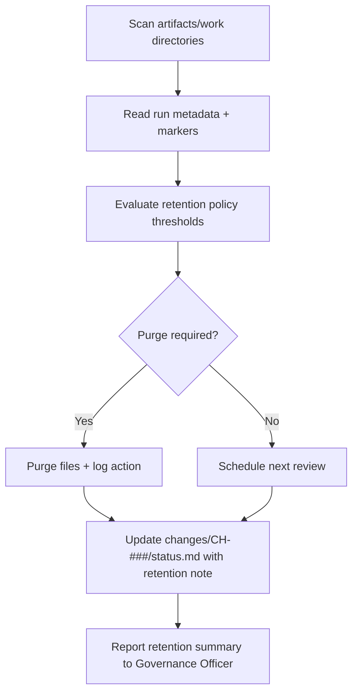

# 🧩 Requirement Elaboration — FR-27

## 1. Summary
Manage ephemeral Implementer workspaces under `artifacts/work/CH-###/run-*`, auto-purging successful runs after 48 hours or when storage exceeds 2 GB, retaining failed runs for 30 days, and honoring `--retain` markers.

## 2. Context & Rationale
Implementer runs generate transient artifacts (diffs, logs, seeds). CR002 codifies retention rules to balance auditability with storage efficiency. This requirement ensures automation applies the policy, records decisions, and keeps Governance Officer informed whenever runs are retained beyond default windows.

## 3. Inputs
| Name | Type / Format | Example | Notes |
|------|----------------|---------|-------|
| `run_metadata` | JSON (`artifacts/work/CH-###/run-*/summary.json`) | `{"status":"success","duration_ms":42000}` | Describes execution outcomes. |
| `retention_config` | YAML (`configs/retention.yaml`) | `success_ttl_hours: 48` | Policy parameters. |
| `storage_usage` | CLI/OS metrics | `1.6 GB` | Used to trigger purge. |
| `retain_marker` | File (`.retain`) | presence indicates keep | Manual override. |
| `audit_log` | JSONL (`audit/implementer_runs.jsonl`) | records actions | Evidence trail. |

### Edge & Error Inputs
- Missing metadata → treat run as retained until metadata regenerated; raise warning.
- Purge failure (file lock) → retry with exponential backoff and alert Ops if persistent.
- `--retain` marker stale (> configured limit) → notify Governance Officer for decision.

## 4. Process Flow

## 5. Outputs
| Format | Example | Consumer |
|--------|---------|----------|
| JSON | `artifacts/work/retention_index.json` | PM, Governance Officer |
| JSONL | `audit/retention.jsonl` purge/retain events | Audit |
| Markdown | `changes/CH-###/status.md` retention section | Stakeholders |

## 6. Mockups / UI Views (if applicable)
- `artifacts/mockups/FR-27/retention_dashboard.md` — Storage overview.
- `artifacts/mockups/FR-27/retention_status_cli.md` — CLI summary.

## 6.1 Change & Traceability Links
- `change_refs`: `CH-002`, plus each `CH-###` with runs.
- `trace_sections`: `TRACEABILITY.md#ws-109-implementer-micro-loop--retention`, `TRACEABILITY.md#fr-27-implementer-run-retention`.
- `artifacts`: `artifacts/work/CH-###/`, `audit/retention.jsonl`, `changes/CH-###/status.md`.

## 7. Acceptance Criteria
* [ ] Successful runs purge within 48 hours (default) unless `.retain` marker exists.
* [ ] Total workspace usage exceeding 2 GB triggers oldest-run purge and notification.
* [ ] Retained runs record `{reason, requested_by, review_date}` in `summary.json` and `status.md`.
* [ ] `/status ch-###` reports active retention decisions for transparency.

## 8. Dependencies
- FR-04 Implementer micro-loop metadata.
- FR-10/22 approvals to clear retention once change merged.
- FR-28 `/df.checklist` to verify retention status before approvals.
- WS-109 Implementer Micro-Loop & Retention workstream.

## 9. Risks & Assumptions
- Aggressive purge thresholds may delete evidence prematurely; adjust via config with GO approval.
- File permission issues could block purge; ensure automation runs with correct privileges.
- Manual `.retain` markers must be audited to prevent forgotten artifacts.

## 9.1 Retention Notes
- This requirement codifies retention policy; ensure policy changes go through governance review and update configuration plus documentation simultaneously.

## 10. Review Status
| Field | Value |
|-------|-------|
| **Status** | Draft |
| **Reviewed By** | _Unassigned_ |
| **Date** | 2025-11-01 |
| **Linked Change** | CH-002 |
