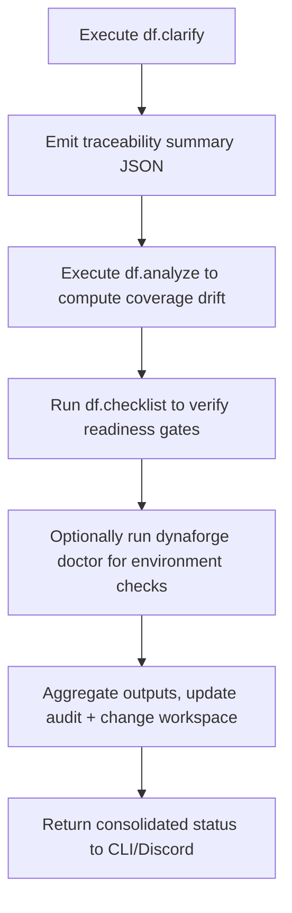

# 🧩 Requirement Elaboration — FR-28

## 1. Summary
Provide `/df.clarify`, `/df.analyze`, `/df.checklist`, and `dynaforge doctor` commands that emit JSON logs under `artifacts/analyze/`, validating traceability coverage, environment health, and readiness before approvals.

## 2. Context & Rationale
The `/df.*` suite offers automated diagnostics that feed into RA/QA/Governance workflows. CR002 expects these commands to run within orchestration, producing machine-readable outputs that FR-06, FR-07, FR-11, and FR-22 consume. They help detect gaps early (unmapped requirements, failing environments) and certify readiness with `/df.checklist`.

## 3. Inputs
| Name | Type / Format | Example | Notes |
|------|----------------|---------|-------|
| `traceability_matrix` | Markdown (`TRACEABILITY.md`) | Source for `/df.clarify` | Ensures links exist. |
| `change_registry` | Markdown (`CHANGELOG.md`) | Input to `/df.analyze` | Tracks change coverage. |
| `qa_metrics` | JSON (`artifacts/phase3/tqa/coverage.json`) | Feed for `/df.checklist` | Determines QA readiness. |
| `environment_checks` | Scripts (`scripts/doctor/*`) | `pytest --collect-only` | Validates tooling. |
| `config` | YAML (`configs/dynaforge_doctor.yaml`) | Which checks to run | Parameter set. |

### Edge & Error Inputs
- Command fails due to missing artifact → produce structured error message, log FR-07 concern, and halt approvals.
- Output file unwritable → fallback to console log, alert Governance Officer, and retry.
- Checklist mismatch (e.g., GO approval missing) → command returns failure code and guidance.

## 4. Process Flow

## 5. Outputs
| Format | Example | Consumer |
|--------|---------|----------|
| JSON | `artifacts/analyze/df.clarify.json` | RA, QA Auditor |
| JSON | `artifacts/analyze/df.analyze.json` | Governance Officer |
| JSON | `artifacts/analyze/df.checklist.json` | PM, approvals |
| JSON | `artifacts/analyze/dynaforge_doctor.json` | Ops/Infrastructure |
| JSONL | `audit/df_commands.jsonl` | Audit trail |

## 6. Mockups / UI Views (if applicable)
- `artifacts/phase2/screenshots/df_checklist_cli.md` — CLI output.
- `artifacts/phase2/screenshots/df_analyze_dashboard.md` — Visualization of metrics.

## 6.1 Change & Traceability Links
- `change_refs`: `CH-002`, plus whichever `CH-###` the diagnostics cover.
- `trace_sections`: `TRACEABILITY.md#ws-207-interaction-cli-extensions`, `TRACEABILITY.md#fr-28-df-analysis-commands`.
- `artifacts`: `artifacts/analyze/*.json`, `audit/df_commands.jsonl`.

## 7. Acceptance Criteria
* [ ] Commands emit JSON with schema `{command, ch_id?, status, findings[], timestamp}` and write to `artifacts/analyze/`.
* [ ] `/df.checklist` fails if any prerequisite (traceability, QA coverage, approvals, retention) is unmet and lists remediation steps.
* [ ] Results integrate with FR-06 audit logs and FR-11 QA policy inputs automatically.
* [ ] CLI/Discord responses summarise findings and link to JSON artifacts for deeper inspection.

## 8. Dependencies
- FR-08/09 command infrastructure.
- FR-15/16/17/18/19 outputs used in diagnostics.
- FR-22 approvals rely on `/df.checklist`.
- WS-207 Interaction CLI Extensions.

## 9. Risks & Assumptions
- Commands must run quickly; long-running tasks should stream progress or provide asynchronous results.
- Schema drift across command versions can break consumers; version outputs and validate with tests.
- Diagnostics require consistent file paths; enforce conventions across agents.

## 9.1 Retention Notes
- Diagnostic outputs are durable but reference retained runs; include retention status in `/df.checklist` so Governance Officer can verify evidence availability.

## 10. Review Status
| Field | Value |
|-------|-------|
| **Status** | Draft |
| **Reviewed By** | _Unassigned_ |
| **Date** | 2025-11-01 |
| **Linked Change** | CH-002 |
