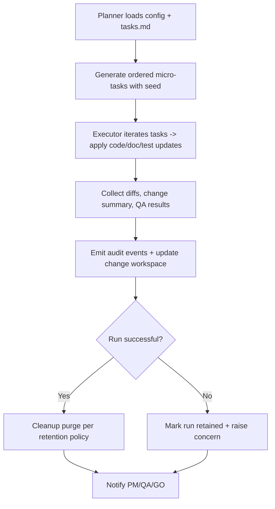

# 🧩 Requirement Elaboration — FR-29

## 1. Summary
Reimplement the Implementer micro-task loop using modular planner, executor, and cleanup components that deliver deterministic sequencing, evidence capture, and automatic cleanup once approvals complete.

## 2. Context & Rationale
The original Spec-Kit cadence inspired Codexa’s micro-loop; CR002 requires an in-house implementation integrated with change workspaces, retention policy, and audit logging. FR-29 defines the architecture and behaviours that guarantee reproducibility (seeded planner), observability (structured events), and cleanup (retention-aware purges).

## 3. Inputs
| Name | Type / Format | Example | Notes |
|------|----------------|---------|-------|
| `planner_config` | JSON (`artifacts/work/CH-###/planner_config.json`) | `{"seed":42,"strategy":"spec-like"}` | Configures deterministic planning. |
| `task_spec` | Markdown (`changes/CH-###/tasks.md`) | Implementation tasks | Input to planner. |
| `code_context` | Repo snapshot | Source files relevant to change | Executor runs against this. |
| `test_commands` | YAML (`configs/tests.yaml`) | `pytest`, `lint` | Executor steps. |
| `cleanup_policy` | YAML (`configs/retention.yaml`) | TTL thresholds | Guides cleanup module. |

### Edge & Error Inputs
- Planner fails to generate tasks → fallback to deterministic decomposition (split by file) and log warning.
- Executor step fails → record failure, mark run as retained, notify PM/IM for remediation.
- Cleanup encountering retention marker → skip purge and schedule review per FR-27.

## 4. Process Flow

## 5. Outputs
| Format | Example | Consumer |
|--------|---------|----------|
| JSON | `artifacts/work/CH-###/run-*/summary.json` | PM, Governance |
| Markdown | `changes/CH-###/impact.md` micro-task results | Stakeholders |
| JSONL | `audit/implementer_runs.jsonl` events with `{task_id, seed}` | Audit |
| Markdown | `docs/IMPLEMENTATION_PLAN.md` progress updates | PM, QA |

## 6. Mockups / UI Views (if applicable)
- `artifacts/mockups/FR-29/micro_task_flow.md` — Visual of planner/executor pipeline.
- `artifacts/mockups/FR-29/run_summary_cli.md` — CLI excerpt from run summary.

## 6.1 Change & Traceability Links
- `change_refs`: `CH-002`, plus each `CH-###` executed.
- `trace_sections`: `TRACEABILITY.md#ws-109-implementer-micro-loop--retention`, `TRACEABILITY.md#fr-29-spekkit-inspired-micro-task-loop`.
- `artifacts`: `artifacts/work/CH-###/run-*/`, `changes/CH-###/impact.md`.

## 7. Acceptance Criteria
* [ ] Planner outputs deterministic task list for identical inputs (same seed) and records hash in summary.
* [ ] Executor logs each task completion with `{task_id, duration_ms, files_touched, qa_result}`.
* [ ] Cleanup honours retention policy, updating audit logs and workspace status automatically.
* [ ] `/df.checklist` confirms latest run metadata present before approvals.

## 8. Dependencies
- FR-04 implementation governance, FR-27 retention policy.
- FR-21 Implementation Manager tasks, FR-18 Test Synthesizer for QA steps.
- FR-06 audit logging, FR-11 QA policy consumption.
- WS-109 Implementer Micro-Loop & Retention.

## 9. Risks & Assumptions
- Determinism requires stable planners; changes to algorithms must update seed and version metadata.
- Executor failures should prefer retry logic but avoid infinite loops; implement retry limit.
- Cleanup must be cautious to avoid deleting evidence still required for governance.

## 9.1 Retention Notes
- Runs that fail or remain pending approvals keep retained flag until GO/HR finalizes decision.
- Upon purge, record event in `audit/retention.jsonl` with reason `auto_success_ttl` or similar.

## 10. Review Status
| Field | Value |
|-------|-------|
| **Status** | Draft |
| **Reviewed By** | _Unassigned_ |
| **Date** | 2025-11-01 |
| **Linked Change** | CH-002 |
