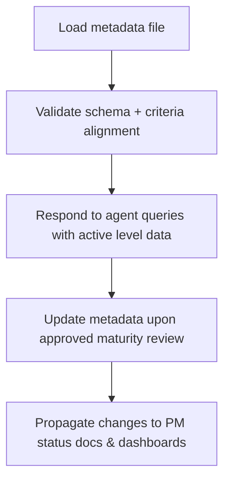

# 🧩 Requirement Elaboration — FR-32

## 1. Summary
Maintain `PROJECT_METADATA.md` (or `project.yaml`) as the single source for maturity levels, last reviews, criteria, and next target levels, supporting maturity-aware agent behaviour and reporting.

## 2. Context & Rationale
Maturity controls determine which agents participate, which approvals are mandatory, and what metrics appear in dashboards. FR-32 centralises this data so agents (PM, GO, QA, IM) adjust behaviour automatically and traceability reports stay accurate.

## 3. Inputs
| Name | Type / Format | Example | Notes |
|------|----------------|---------|-------|
| `metadata_file` | YAML (`PROJECT_METADATA.md`) | `projects: [...]` | Master record. |
| `agent_requests` | API/CLI (`agents/project_manager.py`) | Query for active phase | Consumer. |
| `maturity_criteria` | YAML (`configs/maturity_criteria.yaml`) | Level requirements | Template data. |
| `review_log` | Markdown (`docs/GOVERNANCE_REPORT.md`) | `### Maturity Review` | Updates fields. |
| `change_workspace` | Markdown (`changes/CH-###/status.md`) | `Maturity adjustments` | History. |

### Edge & Error Inputs
- Missing project entry → default to baseline maturity (M0) and raise governance alert.
- Conflicting maturity levels (metadata vs change workspace) → require Governance Officer reconciliation.
- Metadata file malformed → automation refuses to proceed and requests manual correction.

## 4. Process Flow

## 5. Outputs
| Format | Example | Consumer |
|--------|---------|----------|
| YAML | `PROJECT_METADATA.md` updated entry | All agents |
| JSON | `artifacts/metrics/maturity_state.json` | Dashboards |
| Markdown | `docs/PROCESS_MATURITY_GUIDE.md` cross-references | Stakeholders |
| JSONL | `audit/maturity_metadata.jsonl` | Audit trail |

## 6. Mockups / UI Views (if applicable)
- `artifacts/phase3/screenshots/maturity_metadata_view.md`
- `artifacts/phase3/screenshots/maturity_cli_status.md`

## 6.1 Change & Traceability Links
- `change_refs`: `CH-002`, plus maturity change `CH-###`.
- `trace_sections`: `TRACEABILITY.md#ws-304-maturity-metadata--guides`, `TRACEABILITY.md#fr-32-project-metadata-source`.
- `artifacts`: `PROJECT_METADATA.md`, `docs/PROCESS_MATURITY_GUIDE.md`, `audit/maturity_metadata.jsonl`.

## 7. Acceptance Criteria
* [ ] Metadata file lists all active projects/phases with `{maturity_level, last_review, next_target_level, criteria}`.
* [ ] Agents can query metadata via shared utility, falling back to defaults only when necessary.
* [ ] Maturity updates trigger change entry in `CHANGELOG.md` and update dashboards/status docs.
* [ ] `/df.checklist` confirms metadata entry exists for the change’s project/phase.

## 8. Dependencies
- FR-33 maturity guide, FR-34 gate reviews, FR-30 velocity metrics.
- FR-10/22 approvals referencing maturity levels.
- WS-304 Maturity Metadata & Guides.

## 9. Risks & Assumptions
- Manual edits without change tracking can derail automation; require changes to go through change objects.
- Multiple active projects need disambiguation; ensure agents specify project/phase context in requests.
- Keep metadata small but expressive; avoid repetitive data best stored elsewhere.

## 9.1 Retention Notes
- Metadata changes do not require run retention; log updates in audit file for historical tracking.

## 10. Review Status
| Field | Value |
|-------|-------|
| **Status** | Draft |
| **Reviewed By** | _Unassigned_ |
| **Date** | 2025-11-01 |
| **Linked Change** | CH-002 |
