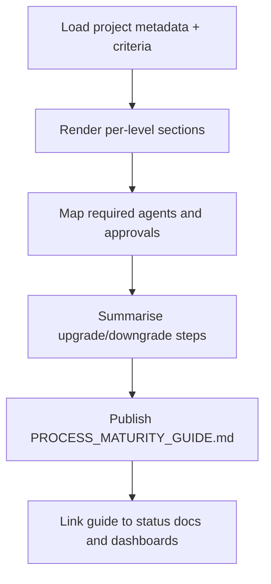

# 🧩 Requirement Elaboration — FR-33

## 1. Summary
Publish `docs/PROCESS_MATURITY_GUIDE.md` describing maturity expectations, criteria, and agent participation for each level, kept in sync with `PROJECT_METADATA.md`.

## 2. Context & Rationale
The maturity guide translates raw metadata into actionable guidance for humans and agents—defining which roles engage at each level, what approvals or metrics are required, and how to progress to the next stage. This ensures onboarding and governance decisions align with codified policy.

## 3. Inputs
| Name | Type / Format | Example | Notes |
|------|----------------|---------|-------|
| `project_metadata` | YAML (`PROJECT_METADATA.md`) | `projects: [{maturity_level: M2,...}]` | Source data. |
| `criteria_config` | YAML (`configs/maturity_criteria.yaml`) | `M2: {...}` | Additional details. |
| `agent_catalog` | Markdown (`docs/AGENTS_RACI.md`) | Role descriptions | For participation matrix. |
| `governance_reports` | Markdown (`docs/GOVERNANCE_REPORT.md`) | Past reviews | Provide examples. |
| `change_history` | Markdown (`CHANGELOG.md`) | Maturity change entries | Append to guide timeline. |

### Edge & Error Inputs
- Metadata change without guide update → validation fails; automation blocks until guide patched.
- Missing criteria for level → highlight incomplete section and raise governance alert.
- Outdated agent list → mark TODO and notify PM to refresh RACI matrix first.

## 4. Process Flow

## 5. Outputs
| Format | Example | Consumer |
|--------|---------|----------|
| Markdown | `docs/PROCESS_MATURITY_GUIDE.md` | All stakeholders |
| Markdown | `docs/PROJECT_OVERVIEW.md` links | PM, Governance |
| JSON | `artifacts/metrics/maturity_guide_index.json` | Automation |

## 6. Mockups / UI Views (if applicable)
- `artifacts/mockups/FR-33/maturity_guide_section.md`
- `artifacts/mockups/FR-33/maturity_matrix.md`

## 6.1 Change & Traceability Links
- `change_refs`: `CH-002`, plus maturity change `CH-###`.
- `trace_sections`: `TRACEABILITY.md#ws-304-maturity-metadata--guides`, `TRACEABILITY.md#fr-33-process-maturity-guide`.
- `artifacts`: `docs/PROCESS_MATURITY_GUIDE.md`, `PROJECT_METADATA.md`.

## 7. Acceptance Criteria
* [ ] Guide documents each maturity level with `{purpose, participating agents, required artifacts, upgrade prerequisites, downgrade handling}`.
* [ ] Automated check ensures guide version hash matches metadata version.
* [ ] Updates propagate to PM status docs and CLI help (`/status maturity`) within one cycle.
* [ ] Guide references relevant `CH-###` maturity changes and provides audit trail of updates.

## 8. Dependencies
- FR-32 metadata source, FR-34 maturity reviews, FR-35 maturity-aware prompts.
- Governance Officer responsible for updates (FR-22).
- WS-304 Maturity Metadata & Guides.

## 9. Risks & Assumptions
- Stale guide confuses operators; enforce CI rule to update whenever metadata changes.
- Too much detail may overwhelm readers; include quick-reference matrices with deep dives optional.
- Ensure localization/format accessibility if shared externally.

## 9.1 Retention Notes
- No runtime artifacts to retain; track version history via change objects and audit logs.

## 10. Review Status
| Field | Value |
|-------|-------|
| **Status** | Draft |
| **Reviewed By** | _Unassigned_ |
| **Date** | 2025-11-01 |
| **Linked Change** | CH-002 |
