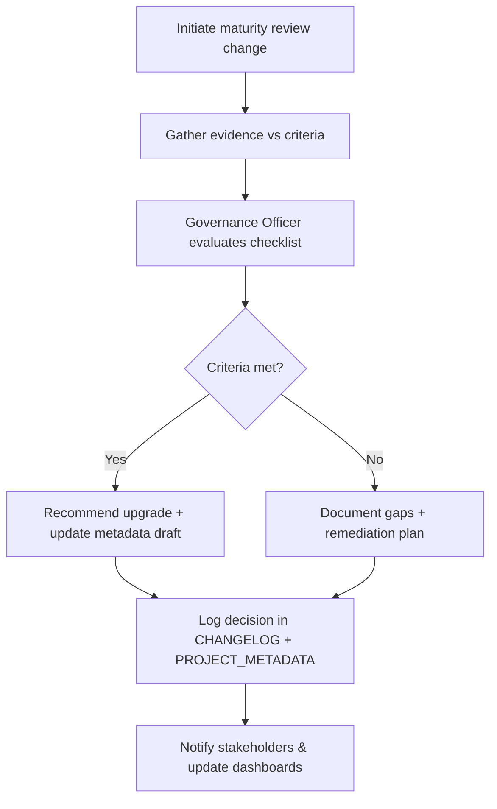

# 🧩 Requirement Elaboration — FR-34

## 1. Summary
Run maturity gate reviews, logging upgrade recommendations and outcomes as `CH-###` entries, ensuring governance artifacts capture decision context and follow-up tasks.

## 2. Context & Rationale
Codexa progresses through maturity levels when governance, QA, and operational criteria are satisfied. FR-34 codifies the review process: capturing evidence, running governance evaluation, and recording decisions as change objects, preserving auditing and traceability.

## 3. Inputs
| Name | Type / Format | Example | Notes |
|------|----------------|---------|-------|
| `review_request` | CLI/Markdown (`changes/CH-###/spec.md`) | `### Maturity Review` | Triggers process. |
| `project_metadata` | YAML (`PROJECT_METADATA.md`) | Current level & criteria | Baseline. |
| `maturity_guide` | Markdown (`docs/PROCESS_MATURITY_GUIDE.md`) | Expectations | Checklist. |
| `metrics` | JSON (`artifacts/metrics/velocity_weekly.json`) | Performance data | Evidence. |
| `governance_report` | Markdown (`docs/GOVERNANCE_REPORT.md`) | Compliance status | Input for decision. |

### Edge & Error Inputs
- Missing evidence (metrics, QA reports) → review postponed; change remains open with action items.
- Review attempt for already highest level → log informational note and close change.
- Conflicting reviewer votes → escalate to steering committee (recorded in change workspace).

## 4. Process Flow

## 5. Outputs
| Format | Example | Consumer |
|--------|---------|----------|
| Markdown | `docs/GOVERNANCE_REPORT.md` maturity section | Governance Officer |
| Markdown | `changes/CH-###/status.md` review timeline | Stakeholders |
| YAML | `PROJECT_METADATA.md` updated maturity level | Agents |
| JSON | `artifacts/metrics/maturity_reviews.json` | Analytics |

## 6. Mockups / UI Views (if applicable)
- `artifacts/phase3/screenshots/maturity_review_checklist.md`
- `artifacts/phase3/screenshots/maturity_decision_cli.md`

## 6.1 Change & Traceability Links
- `change_refs`: `CH-002`, plus dedicated maturity review `CH-###`.
- `trace_sections`: `TRACEABILITY.md#ws-204-governance--multi-gate-approvals`, `TRACEABILITY.md#fr-34-maturity-gate-reviews`.
- `artifacts`: `PROJECT_METADATA.md`, `docs/GOVERNANCE_REPORT.md`, `CHANGELOG.md`.

## 7. Acceptance Criteria
* [ ] Review records include `{criteria_met[], gaps[], recommended_actions, decision, next_review_date}`.
* [ ] Successful upgrades update metadata and maturity guide references in a single merged change.
* [ ] Unmet criteria produce remediation tasks assigned via Implementation Manager.
* [ ] `/status maturity` reflects latest decision and next planned review.

## 8. Dependencies
- FR-32 metadata, FR-33 guide, FR-30 metrics, FR-22 governance reporting.
- WS-204 Governance & Multi-Gate Approvals, WS-304 maturity documentation.

## 9. Risks & Assumptions
- Reviews require cross-functional participation; ensure scheduling and evidence collection is automated.
- Criteria drift must be version-controlled; tie each review to specific criteria revision.
- Avoid endless reviews—set cadence and track outstanding actions to completion.

## 9.1 Retention Notes
- Maturity review change objects may reference retained runs; document rationale and purge once review accepted.

## 10. Review Status
| Field | Value |
|-------|-------|
| **Status** | Draft |
| **Reviewed By** | _Unassigned_ |
| **Date** | 2025-11-01 |
| **Linked Change** | CH-002 |
