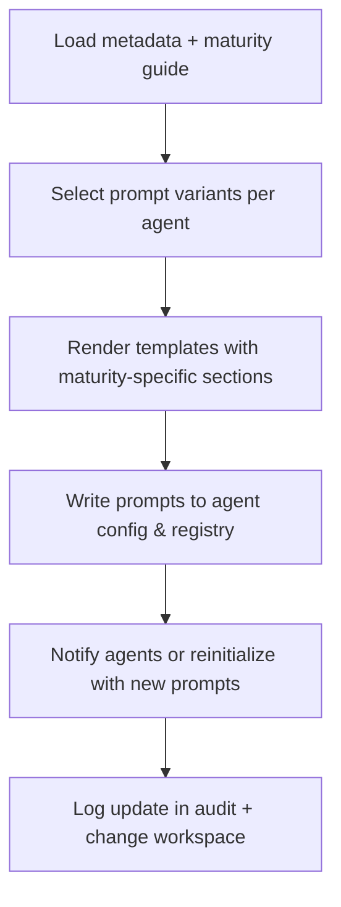

# 🧩 Requirement Elaboration — FR-35

## 1. Summary
Enable maturity-aware prompts and behaviours for key agents (PM, GO, Change Evaluator, IM, QA/TQA), tailoring enforcement level and messaging to the project’s maturity stage.

## 2. Context & Rationale
Different maturity levels require different rigor. At early stages, lightweight processes suffice; later stages demand comprehensive approvals and metrics. FR-35 ensures agent prompts incorporate the maturity guide (FR-33) and metadata (FR-32), adjusting instructions, required artifacts, and default responses automatically.

## 3. Inputs
| Name | Type / Format | Example | Notes |
|------|----------------|---------|-------|
| `project_metadata` | YAML (`PROJECT_METADATA.md`) | `maturity_level: M2` | Drives prompt selection. |
| `maturity_guide` | Markdown (`docs/PROCESS_MATURITY_GUIDE.md`) | Level-specific policies | Provides content snippets. |
| `agent_prompts` | Templates (`agents/prompts/*.md`) | `pm_prompt.md` | Base prompt files. |
| `raci_matrix` | Markdown (`docs/AGENTS_RACI.md`) | Ensures roles match maturity | Additional context. |
| `prompt_registry` | JSON (`artifacts/agents/prompts.json`) | Active prompt versions | Version tracking. |

### Edge & Error Inputs
- Metadata missing → fallback to default (M0) prompts and log warning.
- Prompt template missing maturity section → CI lint fails and blocks deployment.
- Guide and metadata disagree on required agents → raise governance alert.

## 4. Process Flow

## 5. Outputs
| Format | Example | Consumer |
|--------|---------|----------|
| Markdown | `agents/prompts/pm_prompt.md` updated text | PM agent runtime |
| JSON | `artifacts/agents/prompts.json` | Audit, change router |
| Markdown | `changes/CH-###/status.md` prompt update note | Governance Officer |

## 6. Mockups / UI Views (if applicable)
- `artifacts/mockups/FR-35/prompt_diff.md` — Diff of maturity-aware prompt changes.
- `artifacts/mockups/FR-35/prompt_registry.md` — Version list.

## 6.1 Change & Traceability Links
- `change_refs`: `CH-002`, plus change objects adjusting prompts.
- `trace_sections`: `TRACEABILITY.md#ws-305-maturity-aware-agent-prompts`, `TRACEABILITY.md#fr-35-maturity-aware-agent-prompts`.
- `artifacts`: `agents/prompts/`, `PROJECT_METADATA.md`, `docs/PROCESS_MATURITY_GUIDE.md`.

## 7. Acceptance Criteria
* [ ] Each critical agent prompt contains conditional sections keyed by maturity level and includes references to required artifacts (e.g., GO report at M2+).
* [ ] Prompt registry maintains `{agent, version, maturity_level, updated_at, change_id}` entries.
* [ ] Agents reload prompts automatically or on command (`/agent.reload`) after update.
* [ ] `/status maturity` reports prompt version alignment, warning when agents run outdated prompts.

## 8. Dependencies
- FR-32 metadata, FR-33 guide.
- FR-34 maturity reviews trigger prompt updates.
- WS-305 maturity-aware prompt adaptation.

## 9. Risks & Assumptions
- Prompt complexity could grow; maintain templates with partials to avoid duplication.
- Agents must support runtime reload or restart to pick up new prompts.
- Misalignment between prompts and governance requirements can cause enforcement gaps; integrate validation tests.

## 9.1 Retention Notes
- Prompt updates do not require run retention; record change history in prompt registry and change workspace.

## 10. Review Status
| Field | Value |
|-------|-------|
| **Status** | Draft |
| **Reviewed By** | _Unassigned_ |
| **Date** | 2025-11-01 |
| **Linked Change** | CH-002 |
