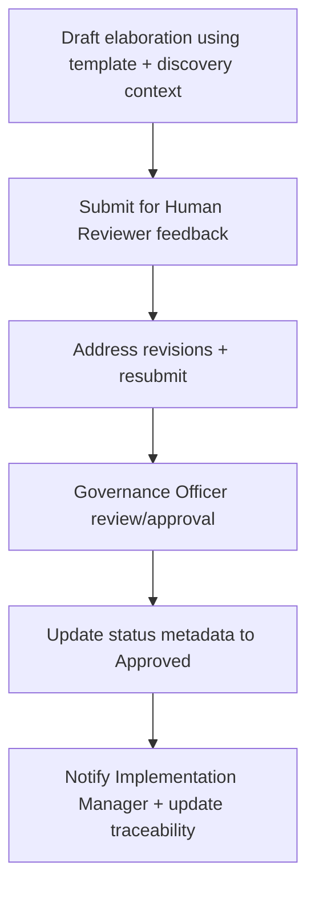

# 🧩 Requirement Elaboration — FR-37

## 1. Summary
Produce approved requirement elaboration files (`docs/requirements/elaborations/FR-###_elaboration.md`) before implementation; ensure Human Reviewer and Governance Officer approvals precede Implementation Manager workstream decomposition, and capture discovery manifest references so understanding context is locked before work begins.

## 2. Context & Rationale
Elaborations bridge intent and implementation. FR-37 formalises the process, requiring each FR to have an up-to-date elaboration with YAML metadata, change/traceability sections, and retention notes. Implementation Manager cannot spawn tasks until elaborations reach `Approved` status, keeping execution aligned with governance.

## 3. Inputs
| Name | Type / Format | Example | Notes |
|------|----------------|---------|-------|
| `elaboration_template` | Markdown (`docs/REQUIREMENTS_ELLABORATION.md`) | Standard structure | Guides creation. |
| `fr_definition` | Markdown (`docs/REQUIREMENTS_1_3.md`) | Requirement description | Primary content. |
| `change_context` | Markdown (`changes/CH-###/spec.md`) | Source change | Links elaboration to change. |
| `discovery_context` | YAML/MD (`analysis/system_manifest.yaml`, `analysis/change_zones.md`, `analysis/intent_map.md`) | Manifest excerpts | Embed understanding baseline and manifest hashes.
| `review_feedback` | Markdown/JSON (`artifacts/reviews/elaborations/*.json`) | Review notes | Drives revisions. |
| `traceability_matrix` | Markdown (`TRACEABILITY.md`) | Ensures linkage | Updated post-approval. |

### Edge & Error Inputs
- Elaboration missing YAML header → CI fails, RA agent flags for correction.
- Approval attempt without Governance Officer sign-off → automation rejects and notifies reviewers.
- Requirement update without elaboration change → RA agent raises discrepancy and blocks implementation.

## 4. Process Flow

## 5. Outputs
| Format | Example | Consumer |
|--------|---------|----------|
| Markdown | `docs/requirements/elaborations/FR-XX_elaboration.md` | Implementer, QA, PM |
| JSON | `artifacts/reviews/elaborations/FR-XX.json` | Audit of review cycle |
| Markdown | `TRACEABILITY.md` updated elaboration references | QA Auditor |
| CLI | `/status elaborations` summary | Stakeholders |

## 6. Mockups / UI Views (if applicable)
- `artifacts/mockups/FR-37/elaboration_review_cli.md`
- `artifacts/mockups/FR-37/elaboration_diff.md`

## 6.1 Change & Traceability Links
- `change_refs`: `CH-002`, plus specific `CH-###` producing the elaboration.
- `trace_sections`: `TRACEABILITY.md#ws-201-requirements-intelligence`, `TRACEABILITY.md#fr-37-requirement-elaboration-workflow`.
- `artifacts`: `docs/requirements/elaborations/`, `TRACEABILITY.md`, `changes/CH-###/status.md`.

## 7. Acceptance Criteria
* [ ] Every FR has an elaboration file with YAML header (`fr_id`, `ch_refs`, `trace_links`, `discovery_refs`, `status`) and sections per template.
* [ ] Implementation Manager refuses to create `WS-*` tasks if elaboration status ≠ Approved.
* [ ] Review cycle recorded with reviewer names, dates, linked changes, and manifest hash snapshot; automation validates presence.
* [ ] `/df.clarify` treats missing, unapproved, or discovery-invalid (stale manifest hash) elaborations as gaps, preventing approvals until resolved.

## 8. Dependencies
- FR-15 requirements analysis, FR-21 Implementation Manager workflow.
- FR-22 Governance approvals, FR-26 traceability updates, FR-38 discovery pipeline, FR-39 System Model Graph, FR-41 understanding metrics.
- Requirement Elaboration Guide (`docs/REQUIREMENTS_ELLABORATION.md`).

## 9. Risks & Assumptions
- Elaborations must stay current; stale documents can misguide implementation. RA agent must monitor for drift.
- Review bottlenecks could delay delivery; provide lightweight review tooling (CLI prompts).
- Ensure templates remain flexible enough for diverse requirement types (UI, API, infra).

## 9.1 Retention Notes
- Elaborations themselves are durable; when referencing retained runs or artifacts, include retention status and purge notes in relevant sections.

## 10. Review Status
| Field | Value |
|-------|-------|
| **Status** | Draft |
| **Reviewed By** | _Unassigned_ |
| **Date** | 2025-11-01 |
| **Linked Change** | CH-002 |
